<h1 style="text-align: center;"> Informe del Trabajo Final </h1>
<h3 style="text-align: center;"> Universidad Peruana de Ciencias Aplicadas </h3>

<h5 style="text-align: center"> Área: Ingeniería de Software </h5>

<h5 style="text-align: center"> Curso: Arquitecturas De Software Emergentes </h5>
<h5 style="text-align: center"> Sección: 7318 </h5>

<h5 style="text-align: center"> Docente: Royer Edelwer</h5>

<h5 style="text-align: center"> Startup: DocMind </h5>

<h5 style="text-align: center"> Producto: Docmind AI </h5>

## Team members:

|              Nombre               |   Código   |
| :-------------------------------: | :--------: |
| Alonso Garay, Diego Jesus         | U20221D014 |
| Cabanillas Gora Andrea            | U202211711 |
| Navarro Robles, Lorenzo Sebastian | U201713141 |
| Olivera Guerra, Santiago Mickelle | u20201a821 |
| Vasquez Requejo, Augusto Mathias  | U20221a955 |

<h5 style="text-align: center"> Ciclo 2025-02 </h5>

# Registro de Versiones del Informe

El objetivo de esta sección es resumir las modificaciones relevantes que se realizan al informe durante el ciclo de vida del proyecto. Esta sección inicia en una página nueva y se incluye un cuadro con la siguiente estructura:

| Versión | Fecha      | Autores                     | Descripción de Modificaciones |
|---------|------------|-----------------------------|-------------------------------|
| 1era    |  09/10/2025 | Cabanillas Gora Andrea Milagros, Olivera Guerra, Santiago Mickelle , Vasquez Requejo Augusto Mathias Leonardo, Navarro Lorenzo, Alonso Diego|Carátula, CapítuloI, Capítulo II, Capítulo III, Capítulo IV |
| 2da    |  10/10/2025 | Cabanillas Gora Andrea Milagros, Olivera Guerra, Santiago Mickelle , Vasquez Requejo Augusto Mathias Leonardo, Navarro Lorenzo, Alonso Diego |Mejora continua y Capitulos V y VI.|
| 3ra    |  16/11/2025 | Cabanillas Gora Andrea Milagros, Olivera Guerra, Santiago Mickelle , Vasquez Requejo Augusto Mathias Leonardo, Navarro Lorenzo, Alonso Diego |Mejora continua y Capitulos VI y VII.|

## Project Report Collaboration Insights

URL del repositorio para el reporte del proyecto:

https://github.com/Emergentes-7318/Final_Report

**TB1**

Para el desarrollo del informe perteneciente a la entrega TB1, se dividió la implementación de secciones de la siguiente forma para cada integrante del equipo:

| Integrante                               | Tareas Asignadas        |
| ---------------------------------------- | ----------------------- |
| Alonso Garay, Diego Jesus         | Capitulo IV |
| Cabanillas Gora Andrea            | Capitulo II |
| Navarro Robles, Lorenzo Sebastian | Capitulo III |
| Olivera Guerra, Santiago Mickelle | Capitulo IV |
| Vasquez Requejo, Augusto Mathias  | Capitulo I, II, III, IV |

**TP**

Para el desarrollo del informe perteneciente a la entrega TP, se dividió la implementación de secciones de la siguiente forma para cada integrante del equipo:

| Integrante                               | Tareas Asignadas        |
| ---------------------------------------- | ----------------------- |
| Alonso Garay, Diego Jesus         | Capitulo V |
| Cabanillas Gora Andrea            | Capitulo V y VI |
| Navarro Robles, Lorenzo Sebastian | Capitulo V y VI |
| Olivera Guerra, Santiago Mickelle | Capitulo V |
| Vasquez Requejo, Augusto Mathias  | Capitulo V y VI |

**TB2**

Para el desarrollo del informe perteneciente a la entrega TB2, se dividió la implementación de secciones de la siguiente forma para cada integrante del equipo:

| Integrante                               | Tareas Asignadas        |
| ---------------------------------------- | ----------------------- |
| Alonso Garay, Diego Jesus         | Desarrollo Web Application |
| Cabanillas Gora Andrea            | Desarrollo Web Application |
| Navarro Robles, Lorenzo Sebastian | Desarrollo Web Application |
| Olivera Guerra, Santiago Mickelle | Desarrollo Web Application |
| Vasquez Requejo, Augusto Mathias  | Desarrollo Web Application y Landing page|
 

## Contenido
## Índice

- [Capítulo I: Introducción](/docs/Chapter-01.md)
  - [1.1. StartUp Profile](/docs/Chapter-01.md#11-startup-profile)
    - [1.1.1. Descripción de la StartUp](/docs/Chapter-01.md#111-descripción-de-la-startup)
    - [1.1.2. Perfiles de Integrantes del equipo](/docs/Chapter-01.md#112-perfiles-de-integrantes-del-equipo)
  - [1.2. Solution Profile](/docs/Chapter-01.md#12-solution-profile)
    - [1.2.1. Antecedentes y Problemática](/docs/Chapter-01.md#121-antecedentes-y-problemática)
    - [1.2.2. Lean UX Process](/docs/Chapter-01.md#122-lean-ux-process)
      - [1.2.2.1. Lean UX Problem Statements](/docs/Chapter-01.md#1221-lean-ux-problem-statements)
      - [1.2.2.2. Lean UX Assumptions](/docs/Chapter-01.md#1222-lean-ux-assumptions)
      - [1.2.2.3. Lean UX Hypothesis Statements](/docs/Chapter-01.md#1223-lean-ux-hyphotesis-statements)
      - [1.2.2.4. Lean UX Canvas](/docs/Chapter-01.md#1224-lean-ux-canvas)
  - [1.3. Segmentos objetivo](/docs/Chapter-01.md#13-segmentos-objetivo)

- [Capítulo II: Requirements Elicitation & Analysis](/docs/Chapter-02.md)
  - [2.1. Competidores](/docs/Chapter-02.md#21-competidores)
    - [2.1.1. Análisis competitivo](/docs/Chapter-02.md#211-análisis-competitivo)
    - [2.1.2. Estrategias y tácticas frente a competidores](/docs/Chapter-02.md#212-estrategias-y-tácticas-frente-a-competidores)
  - [2.2. Entrevistas](/docs/Chapter-02.md#22-entrevistas)
    - [2.2.1. Diseño de entrevistas](/docs/Chapter-02.md#221-diseño-de-entrevistas)
    - [2.2.2. Registro de entrevistas](/docs/Chapter-02.md#222-registro-de-entrevistas)
    - [2.2.3. Análisis de entrevistas](/docs/Chapter-02.md#223-análisis-de-entrevistas)
  - [2.3. Needfinding](/docs/Chapter-02.md#23-needfinding)
    - [2.3.1. User Personas](/docs/Chapter-02.md#231-user-personas)
    - [2.3.2. User Task Matrix](/docs/Chapter-02.md#232-user-task-matrix)
    - [2.3.3. Empathy Mapping](/docs/Chapter-02.md#233-empathy-mapping)
    - [2.3.4. As-is Scenario Mapping](/docs/Chapter-02.md#234-as-is-scenario-mapping)
    - [2.3.5. Ubiquitous Language](/docs/Chapter-02.md#235-ubiquitous-language)

- [Capítulo III: Requirements Specification](/docs/Chapter-03.md)
  - [3.1. To-Be Scenario Mapping](/docs/Chapter-03.md#31-to-be-scenario-mapping)
  - [3.2. User Stories](/docs/Chapter-03.md#32-user-stories)
  - [3.3. Impact Mapping](/docs/Chapter-03.md#33-impact-mapping)
  - [3.4. Product Backlog](/docs/Chapter-03.md#34-product-backlog)

- [Capítulo IV: Solution Software Design](/docs/Chapter-04.md)
  - [4.1. Strategic-Level Attribute-Driven Design](/docs/Chapter-04.md#41-strategic-level-attribute-driven-design)
    - [4.1.1. Design Purpose](/docs/Chapter-04.md#411-design-purpose)
    - [4.1.2. Attribute-Driven Design Inputs](/docs/Chapter-04.md#412-attribute-driven-design-inputs)
      - [4.1.2.1. Primary Functionality (Primary User Stories)](/docs/Chapter-04.md#4121-primary-functionality-primary-user-stories)
      - [4.1.2.2. Quality Attribute Scenarios](/docs/Chapter-04.md#4122-quality-attribute-scenarios)
      - [4.1.2.3. Constraints](/docs/Chapter-04.md#4123-constraints)
    - [4.1.3. Architectural Drivers Backlog](/docs/Chapter-04.md#413-architectural-drivers-backlog)
    - [4.1.4. Architectural Design Decisions](/docs/Chapter-04.md#414-architectural-design-decisions)
    - [4.1.5. Quality Attribute Scenario Refinements](/docs/Chapter-04.md#415-quality-attribute-scenario-refinements)
  - [4.2. Strategic-Level Domain-Driven Design](/docs/Chapter-04.md#42-strategic-level-domain-driven-design)
    - [4.2.1. EventStorming](/docs/Chapter-04.md#421-eventstorming)
    - [4.2.2. Candidate Context Discovery](/docs/Chapter-04.md#422-candidate-context-discovery)
    - [4.2.3. Domain Message Flows Modeling](/docs/Chapter-04.md#423-domain-message-flows-modeling)
    - [4.2.4. Bounded Context Canvases](/docs/Chapter-04.md#424-bounded-context-canvases)
    - [4.2.5. Context Mapping](/docs/Chapter-04.md#425-context-mapping)
  - [4.3. Software Architecture](/docs/Chapter-04.md#43-software-architecture)
    - [4.3.1. System Landscape Diagram](/docs/Chapter-04.md#431-software-architecture-system-landscape-diagram)
    - [4.3.2. Context Level Diagrams](/docs/Chapter-04.md#432-software-architecture-context-level-diagrams)
    - [4.3.3. Container Level Diagrams](/docs/Chapter-04.md#433-software-architecture-container-level-diagrams)
    - [4.3.4. Deployment Diagrams](/docs/Chapter-04.md#434-software-architecture-deployment-diagrams)

- [Capítulo V: Tactical-Level Software Design](/docs/Chapter-05.md)
  - [5.1. Bounded Context: Document Management](/docs/Chapter-05.md#51-bounded-context-document-management)
    - [5.1.1. Domain Layer](/docs/Chapter-05.md#511-domain-layer)
    - [5.1.2. Interface Layer](/docs/Chapter-05.md#512-interface-layer)
    - [5.1.3. Application Layer](/docs/Chapter-05.md#513-application-layer)
    - [5.1.4. Infrastructure Layer](/docs/Chapter-05.md#514-infrastructure-layer)
    - [5.1.6. Component Level Diagrams](/docs/Chapter-05.md#516-bounded-context-software-architecture-component-level-diagrams)
    - [5.1.7. Code Level Diagrams](/docs/Chapter-05.md#517-bounded-context-software-architecture-code-level-diagrams)
  - [5.2. Bounded Context: Chat Service](/docs/Chapter-05.md#52-bounded-context-chat-service)
    - [5.2.1. Domain Layer](/docs/Chapter-05.md#521-domain-layer)
    - [5.2.2. Interface Layer](/docs/Chapter-05.md#522-interface-layer)
    - [5.2.3. Application Layer](/docs/Chapter-05.md#523-application-layer)
    - [5.2.4. Infrastructure Layer](/docs/Chapter-05.md#524-infrastructure-layer)
    - [5.2.6. Component Level Diagrams](/docs/Chapter-05.md#526-bounded-context-software-architecture-component-level-diagrams)
    - [5.2.7. Code Level Diagrams](/docs/Chapter-05.md#527-bounded-context-software-architecture-code-level-diagrams)

- [Capítulo VI: Product Design](/docs/Chapter-06.md)
  - [6.1. Style Guidelines](/docs/Chapter-06.md#61-style-guidelines)
    - [6.1.1. General Style Guidelines](/docs/Chapter-06.md#611-general-style-guidelines)
    - [6.1.2. Web, Mobile & Devices Style Guidelines](/docs/Chapter-06.md#612-web-mobile--devices-style-guidelines)
      - [6.1.2.1. iOS Mobile Style Guidelines](/docs/Chapter-06.md#6121-ios-mobile-style-guidelines)
      - [6.1.2.2. Android Mobile Style Guidelines](/docs/Chapter-06.md#6122-android-mobile-style-guidelines)
  - [6.2. Information Architecture](/docs/Chapter-06.md#62-information-architecture)
    - [6.2.2. Labeling Systems](/docs/Chapter-06.md#622-labeling-systems)
    - [6.2.3. Searching Systems](/docs/Chapter-06.md#623-searching-systems)
    - [6.2.4. SEO Tags and Meta Tags](/docs/Chapter-06.md#624-seo-tags-and-meta-tags)
    - [6.2.5. Navigation Systems](/docs/Chapter-06.md#625-navigation-systems)
  - [6.3. Landing Page UI Design](/docs/Chapter-06.md#63-landing-page-ui-design)
    - [6.3.1. Landing Page Wireframe](/docs/Chapter-06.md#631-landing-page-wireframe)
    - [6.3.2. Landing Page Mock-up](/docs/Chapter-06.md#632-landing-page-mock-up)
  - [6.6. Applications UX/UI Design](/docs/Chapter-06.md#66-applications-uxui-design)
    - [6.6.1. Applications Wireframes](/docs/Chapter-06.md#661-applications-wireframes)
    - [6.6.2. Applications Wireflow Diagrams](/docs/Chapter-06.md#662-applications-wireflow-diagrams)
    - [6.6.3. Applications Mock-ups](/docs/Chapter-06.md#663-applications-mock-ups)
    - [6.6.4. Applications User Flow Diagrams](/docs/Chapter-06.md#664-applications-user-flow-diagrams)
  - [6.5. Applications Prototyping](/docs/Chapter-06.md#65-applications-prototyping)

- [Conclusiones](/docs/Conclusions.md)
- [Bibliografía](/docs/Bibliography.md)
- [Anexos](/docs/Appendix.md)

# Student Outcome

| Criterio Específico | Acciones Realizadas | Conclusiones |
|-----------------|--------------------|---------------------|
|Actualiza conceptos y conocimientos necesarios para su desarrollo profesional y en especial para su proyecto en soluciones de software.|**Augusto Mathias Leonardo Vasquez Requejo**   TB1: Chapter 01 y aportes en los demas capitulos  TP1: Mejora continua del informe y desarrollo del capitulo 5 y 6. TB2: Mejora continua del informe y desarrollo del capitulo 6 y 7.   **Andrea Cabanillas Gora**   TB1: Chapter 02 y aportes en los demas capitulos.  TP1: Mejora continua del informe y desarrollo del capitulo 5 y 6. TB2: Mejora continua del informe y desarrollo del capitulo 6 y 7.    **Santiago Mickelle Olivera Guerra**   TB1: Chapter 03 y aportes en los demas capitulos.  TP1: Mejora continua del informe y desarrollo del capitulo 5 y 6. TB2: Mejora continua del informe y desarrollo del capitulo 6 y 7.    **Diego Jesus Alonso Garay**   TB1: Chapter 04 y aportes en los demas capitulos.  TP1: Mejora continua del informe y desarrollo del capitulo 5 y 6. TB2: Mejora continua del informe y desarrollo del capitulo 6 y 7.    **Navarro Robles, Lorenzo Sebastian**   TB1: Chapter 04 y aportes en los demas capitulos.  TP1: Mejora continua del informe y desarrollo del capitulo 5 y 6.  TB2: Mejora continua del informe y desarrollo del capitulo 6 y 7.   |El proyecto DocMind permite que los cinco integrantes actualicen y apliquen conocimientos clave para su desarrollo profesional en soluciones de software al integrar tecnologías emergentes de IA (LLMs, RAG, embeddings y bases vectoriales) dentro de una arquitectura cloud-native segura, escalable y orientada a microservicios; fortalecer prácticas ágiles mediante la definición y priorización de épicas, user stories, criterios de aceptación y estimación con story points; consolidar habilidades de desarrollo web y móvil con enfoque UX/UI y accesibilidad; practicar integración de servicios externos (OAuth de Google, lectura de Drive) con buenas prácticas de seguridad y privacidad; mejorar la ingeniería de calidad a través de versionado, testing, métricas y trazabilidad; y potenciar competencias transversales —comunicación, coordinación, liderazgo y resolución de problemas— al asumir roles complementarios (PO, Scrum Master, Dev, QA) y transformar un reto real (generar reportes confiables desde documentos) en entregables funcionales alineados con estándares de la industria.  |   El equipo llevó a cabo una amplia gama de actividades para comunicar de manera efectiva las ideas y resultados del proyecto de ingeniería. Esto incluyó la realización de entrevistas, la elaboración de Statements y Hypothesis Statements como parte del proceso Lean UX, la creación de User Personas y el mapeo de la experiencia del usuario. Además, se realizó un análisis competitivo, se desarrollaron User Stories y se establecieron estrategias frente a competidores. Se utilizaron herramientas visuales como Lean UX Canvas y Style Guidelines, y se llevaron a cabo actividades como Empathy Mapping para comprender las necesidades de los usuarios. Todo esto se complementó con la creación de Landing Page y el diseño de interfaces de usuario para transmitir la propuesta de valor del proyecto de manera efectiva.   Actualizar nuestros conocimientos técnicos como equipo nos permitió aplicar soluciones más eficientes en el desarrollo de la aplicación móvil, incorporando herramientas modernas como Flutter, Firebase y principios de arquitectura limpia, lo que fortaleció tanto la calidad del proyecto como nuestras competencias profesionales. |
|Capacidad de comunicarse efectivamente con un rango de audiencias|**Augusto Mathias Leonardo Vasquez Requejo**   TB1: Chapter 01 y aportes en los demas capitulos.   TP1: Mejora continua del informe y desarrollo del capitulo 5 y 6. TB2: Mejora continua del informe y desarrollo del capitulo 6 y 7.   **Andrea Cabanillas Gora**   TB1: Chapter 02 y aportes en los demas capitulos. TB2: Mejora continua del informe y desarrollo del capitulo 6 y 7.   TP1: Mejora continua del informe y desarrollo del capitulo 5 y 6.   **Santiago Mickelle Olivera Guerra**   TB1: Chapter 03 y aportes en los demas capitulos  TP1: Mejora continua del informe y desarrollo del capitulo 5 y 6. TB2: Mejora continua del informe y desarrollo del capitulo 6 y 7.    **Diego Jesus Alonso Garay**   TB1: Chapter 04 y aportes en los demas capitulos.  TP1: Mejora continua del informe y desarrollo del capitulo 5 y 6. TB2: Mejora continua del informe y desarrollo del capitulo 6 y 7.    **Navarro Robles, Lorenzo Sebastian**   TB1: Chapter 04 y aportes en los demas capitulos  TP1: Mejora continua del informe y desarrollo del capitulo 5 y 6. TB2: Mejora continua del informe y desarrollo del capitulo 6 y 7. |    El desarrollo de DocMind potencia la capacidad del equipo para comunicarse efectivamente con un rango de audiencias, ya que al definir épicas, user stories y criterios de aceptación deben expresar de manera clara y precisa requerimientos técnicos comprensibles tanto para programadores como para docentes, clientes potenciales o usuarios finales; al preparar el backlog y priorizar funcionalidades, aprenden a adaptar el lenguaje según la audiencia, utilizando términos ágiles y métricas de negocio para gerentes, explicaciones técnicas para desarrolladores y mensajes sencillos para usuarios; además, en la documentación, presentaciones y reportes del proyecto, el equipo practica cómo traducir ideas complejas de inteligencia artificial, seguridad y arquitectura cloud en explicaciones accesibles, lo que fortalece su competencia para interactuar en contextos académicos, profesionales y empresariales diversos.

# **Capítulo I: Introducción**

## **1.1 Startup Profile**

### **1.1.1 Descripción de la startup**

DocMind es una startup de base tecnológica dedicada a transformar la manera en que las personas interactúan con documentos complejos mediante inteligencia artificial. Nuestro producto principal, DocMind AI, permite cargar archivos PDF de cualquier índole —papers académicos, contratos legales, reportes técnicos o manuales empresariales— y realizar preguntas directas en lenguaje natural, obteniendo respuestas inmediatas, resúmenes claros y referencias exactas al documento.

La plataforma está diseñada para ser usada por profesionales de múltiples sectores —académico, legal, empresarial, tecnológico, sanitario—, ofreciendo una herramienta versátil que acelera la comprensión de información crítica, optimiza procesos de análisis y democratiza el acceso al conocimiento. De esta manera, DocMind busca cerrar la brecha entre el volumen de información y la capacidad humana de procesarla, mejorando la productividad y la toma de decisiones en distintas industrias.

### **Misión**  
Facilitar el acceso al conocimiento y aumentar la productividad profesional a través de una plataforma de inteligencia artificial que convierte documentos complejos en información clara, útil y accionable. Nuestro propósito es empoderar a estudiantes, investigadores, empresas y profesionales de diversas áreas con una herramienta confiable, segura y de fácil uso. 

### **Visión**  
Convertirnos en la plataforma líder a nivel global en análisis inteligente de documentos, reconocida por su precisión, velocidad y aplicabilidad transversal en múltiples industrias. Aspiramos a transformar la manera en que los profesionales leen, entienden y utilizan la información, posicionando a DocMind como un aliado indispensable en la era digital.

### **1.1.2 Perfiles de integrantes del equipo**
| Nombre Completo del integrante        | Descripcion de Carrera                                                                          | Fotografía                                                                                        | Conocimientos y Habilidades a apuntar                                                                                                                                                                                                                                               |     |
| ------------------------------------- | ----------------------------------------------------------------------------------------------- | ------------------------------------------------------------------------------------------------- | ----------------------------------------------------------------------------------------------------------------------------------------------------------------------------------------------------------------------------------------------------------------------------------- | --- |
| Augusto Mathias Vasquez Requejo       | Ingeniería de Software  7mo Ciclo 2025-2 Universidad Peruana de Ciencias Aplicadas     |             | - Conocimientos en lenguajes de programación como C++, JavaScript, HTML, CSS.  - Responsabilidad y dedicación con los trabajos grupales.                                                                                                                                         |     |
| Cabanillas Gora Andrea                | Ingeniería de Software  7mo Ciclo 2025-2 Universidad Peruana de Ciencias Aplicadas     | .jpg)                                                 | - Conocimientos en lenguajes de programacion como C++, C#, Python, JavaScript, etc. - Trabajo bien bajo presion y aporto con ideas óptimas para la solucion de diferentes problemas.                                                                                             |     |
| Santiago Mickelle Olivera Guerra    | Ingeniería de Software  6to Ciclo   2025-2   Universidad Peruana de Ciencias aplicadas |  | - Conocimientos en lenguajes de programación como C++, Python, Html y CSS.Considero que puedo aportar en el equipo, ya que soy responsable y trato de cumplir con las partes que se delegan en el equipo. A la vez, colaboro con ideas para poder lograr un buen trabajo en equipo. | .   |
| Diego Jesus Alonso Garay | Ingeniería de Software  7mo Ciclo 2025-2 Universidad Peruana de Ciencias Aplicadas     | ;">                                                | - Me gusta mucho el mundo de la informática, tecnología y los videojuegos. Me gustan los shooters y mobas. De vez en cuando diseño pequeños proyectos de juegos como replicar mecánicas o interfaces que me parecen interesantes.                                                   |     |
| Lorenzo Navarro                       | Ingenieria de software - 8vo ciclo                                                              |                                                                     | - Actualmente trabajo con arquitecturas de redes neuronales y desarrollo de sistemas basados en microservicios. Utilizo typescript y Python para mi trabajo. Considero que sera mi mayor aporte para el proyecto.                                                                   |

## **1.2 Solution Profile**

### **1.2.1 Antecedentes y problemática.**

En los últimos años, el mundo ha experimentado un crecimiento exponencial en la generación de información digital. Artículos académicos, contratos legales, reportes técnicos, normativas empresariales y manuales especializados se producen en volúmenes cada vez mayores. Estos documentos suelen ser extensos, complejos y requieren interpretación detallada para su uso práctico.

Sin embargo, los profesionales y organizaciones enfrentan una brecha creciente entre la cantidad de información disponible y el tiempo necesario para procesarla. En entornos académicos, leer y analizar múltiples papers puede consumir días de trabajo. En sectores legales y empresariales, revisar contratos o regulaciones críticas implica altos costos de tiempo y riesgo de omisiones.

A nivel global, la inteligencia artificial aplicada a la gestión de documentos ha demostrado ser una herramienta prometedora para la productividad: permite resumir textos, responder preguntas contextuales y extraer información clave en segundos. En países con alta digitalización, estas soluciones ya se aplican en universidades, despachos legales y corporaciones para reducir errores, acelerar procesos y optimizar la toma de decisiones.

En este contexto surge DocMind, con la misión de desarrollar una plataforma cloud-native capaz de analizar documentos complejos en tiempo real y transformarlos en información clara, accesible y accionable para cualquier profesional. Su producto insignia, DocMind AI, busca atender la creciente necesidad de herramientas confiables, escalables y seguras que apoyen a investigadores, abogados, consultores y empresas en la interpretación de textos críticos.  

---

### **Problemática (5Ws y 2Hs)**

#### **What (Qué)**  
**¿Cuál es el problema?**  
Existe una brecha significativa en la capacidad de procesar documentos extensos y técnicos de manera rápida y confiable. Profesionales de distintas áreas dependen de horas o días de lectura para encontrar información clave, lo que genera ineficiencias, errores de interpretación y pérdida de productividad. 

#### **When (Cuándo)**  
**¿Cuándo sucede el problema?**  
El problema ocurre de forma continua en múltiples contextos:
- Estudiantes e investigadores al preparar revisiones de literatura.
- Abogados al analizar contratos y normativas.
- Empresas al revisar reportes financieros, técnicos o de cumplimiento.
- La saturación de información se agudiza en momentos críticos, como auditorías, investigaciones, juicios o entregas académicas de corto plazo.  

#### **Where (Dónde)**  
**¿Dónde surge el problema?**  
La problemática se presenta en universidades, centros de investigación, despachos legales, consultoras y corporaciones de todo el mundo, donde los equipos requieren procesar grandes volúmenes de documentos con rapidez y precisión. En Latinoamérica, esta necesidad se intensifica por la escasez de herramientas locales que aceleren el análisis documental.  

#### **Who (Quién)**  
**¿Quiénes están involucrados?**  
- **Estudiantes e investigadores** que necesitan resumir y comprender múltiples fuentes en poco tiempo.
- **Profesionales legales y empresariales** que requieren identificar cláusulas, plazos y riesgos en contratos y regulaciones.
- **Gerentes y consultores** que deben extraer insights de reportes financieros y técnicos.
- **Organizaciones** que buscan reducir costos y aumentar eficiencia en el manejo de información. 

#### **Why (Por qué)**  
**¿Cuál es la causa del problema?**  
Las causas principales incluyen:

- **Volumen creciente de documentos digitales** que supera la capacidad humana de lectura.
- **Procesos manuales** de análisis documental, lentos y sujetos a errores.
- **Falta de herramientas transversales** que sirvan tanto para el sector académico como para el legal y empresarial.
- **Limitaciones de tiempo y recursos** en profesionales que requieren tomar decisiones basadas en información compleja.
---

### **Las 2H**  

#### **How (Cómo)**  
**¿Cómo se utilizará el producto?**  
El sistema se integrará mediante una plataforma web donde los usuarios podrán cargar documentos en PDF. El motor de IA procesará el archivo y permitirá realizar preguntas en lenguaje natural, devolviendo resúmenes, explicaciones y citas del documento en cuestión de segundos.

**¿Cómo se logrará resolver el problema?**  
Mediante el uso de modelos avanzados de lenguaje natural (NLP), arquitecturas cloud-native y un diseño escalable que permita manejar múltiples documentos al mismo tiempo. Además, el sistema garantizará seguridad, privacidad y trazabilidad de la información, adaptándose a distintos sectores profesionales.

#### **How Much (Cuánto)**  
**¿Cuál es la magnitud del problema?**  
De acuerdo con **un informe de IDC (2023)**, el 80% de los datos generados en el mundo se encuentra en formato no estructurado (documentos, PDFs, textos largos). Profesionales pueden gastar hasta el 30% de su jornada laboral buscando y procesando información, lo que representa pérdidas económicas y de productividad millonarias a nivel global.

**¿Quiénes serán los beneficiados?**  
- **Académicos e investigadores**, al ahorrar tiempo en la lectura de papers y tesis.
- **Abogados y empresas**, al optimizar la revisión de contratos y normativas.
- **Organizaciones de distintos sectores**, al mejorar la toma de decisiones mediante información más clara y accesible.

### **1.2.2 Lean UX Process.**
#### **1.2.2.1 Lean UX Problem Statements.**

DocMind busca acelerar y simplificar la comprensión de documentos complejos mediante IA. Si la plataforma no garantiza precisión en las respuestas, contexto verificable (citas dentro del documento) y facilidad de uso en distintos sectores, la adopción será limitada.

**¿Cómo podemos ofrecer resúmenes confiables, respuestas contextuales y navegación clara dentro de documentos extensos, disponibles en web/mobile, con mínima fricción en la experiencia del usuario?**

---

#### **1.2.2.2 Lean UX Assumptions.**

**User Assumptions**  

- **Quién es el usuario:** Investigadores, estudiantes, abogados, analistas, consultores y gerentes.

- **Dónde encaja el producto**: En el flujo de análisis documental (papers académicos, contratos, reportes financieros, manuales técnicos).

- **Problemas a resolver:** Reducir tiempos de lectura, facilitar acceso a información crítica, y evitar omisiones por sobrecarga de texto.

- **Cuándo y cómo se usa:** A diario; los usuarios cargan PDFs, hacen preguntas en lenguaje natural y obtienen resúmenes o citas clave.

- **Cómo debe verse y comportarse:** Interfaz intuitiva, accesible, con opciones claras de resumen, búsqueda y preguntas rápidas.

**Business Assumptions**  
- Los clientes necesitan extraer información clave de documentos de manera inmediata para mejorar productividad.
- Esto se logrará con una arquitectura cloud-native, escalable y segura.
- **Principal valor:** Ahorro de tiempo y aumento en la precisión de la toma de decisiones. 

- **Beneficios adicionales:**  
  - Adaptabilidad multisectorial (educación, legal, empresarial, técnico).
  - Experiencia de usuario ágil en web y móvil.
  - Cumplimiento de seguridad y privacidad en el manejo de documentos.
---

#### **1.2.2.3 Lean UX Hypothesis Statements.**

- **Creemos que** ofrecer resúmenes automáticos y preguntas-respuestas sobre documentos extensos **logrará** reducir el tiempo que los profesionales invierten en la lectura.
**Lo sabremos cuando veamos** que más del 60% de los usuarios utilicen la función de resumen en al menos tres documentos por semana.

- **Creemos que** mostrar citas textuales vinculadas a la respuesta logrará aumentar la confianza de los usuarios en el sistema.
**Lo sabremos cuando veamos** que más del 70% de los usuarios revisen la sección de “referencia al documento” al consultar respuestas.

- **Creemos que** habilitar interfaces web y móviles optimizadas logrará que los usuarios consulten documentos en diversos entornos (universidad, oficina, teletrabajo).
**Lo sabremos cuando veamos** que al menos el 50% de los accesos provengan desde dispositivos móviles o fuera de entornos corporativos.

- **Creemos que** integrar la opción de búsqueda avanzada y filtros dentro de los documentos logrará mejorar la precisión en el análisis de información clave.
**Lo sabremos cuando veamos** que los usuarios reduzcan en un 20% el tiempo promedio de búsqueda de información dentro de un documento.

- **Creemos que** ofrecer reportes de uso (tiempos de lectura ahorrados, documentos procesados, citas extraídas) logrará aumentar la percepción de valor en equipos académicos y corporativos.
**Lo sabremos cuando veamos** que al menos el 40% de los administradores o gestores descarguen reportes mensualmente.

- **Creemos que** permitir la carga de múltiples documentos y la comparación entre ellos logrará optimizar el trabajo en proyectos de investigación y análisis empresarial.
**Lo sabremos cuando veamos** que más del 30% de los usuarios usen la función de comparación en al menos dos sesiones mensuales.

#### **1.2.2.4 Lean UX Canvas.**

# 📌 Lean UX Canvas — DocMind

| **Problema de Negocio** | **Ideas de la Solución** | **Resultados Comerciales** |
|--------------------------|--------------------------|-----------------------------|
| Profesionales de distintos sectores (académico, legal, empresarial) enfrentan un volumen creciente de documentos complejos en PDF que requieren horas de lectura y análisis, lo que genera retrasos, errores de interpretación y pérdida de productividad.  **¿Cómo podríamos automatizar el análisis de documentos y la generación de reportes inteligentes en tiempo real para cerrar esta brecha de eficiencia y acceso a la información?** | Aplicación web y móvil que permita: - Cargar documentos PDF o importar desde Google Drive. - Generar resúmenes automáticos y responder preguntas en lenguaje natural. - Visualizar respuestas con citas enlazadas al texto fuente. - Exportar reportes ejecutivos y técnicos en formatos estándar (PDF/Word/Markdown). - Acceder a paneles de métricas de uso y calidad. | - Lograr una adopción inicial del 40% en universidades y despachos legales durante los primeros 6 meses. - Alcanzar que el 60% de los usuarios activos realicen ≥ 2 sesiones por semana. - Generar al menos 3 clientes corporativos (empresas/consultoras) en el primer año. |

| **Usuarios y Clientes** | **Beneficios del Usuario** |
|--------------------------|-----------------------------|
| - Investigadores y estudiantes universitarios. - Abogados y consultores. - Gerentes y profesionales de empresas que necesitan extraer datos clave de informes. - Hermanos o familiares que participan en proyectos académicos y legales colaborativos. | - **Ahorro de tiempo:** reducción del 50% en lectura y análisis. - **Mayor precisión:** disminución de errores gracias a respuestas con citas verificables. - **Confianza y seguridad:** control de acceso y trazabilidad. - **Productividad transversal:** aplicable a educación, derecho y negocios. |

| **Hipótesis** | **Lo más Importante que Necesitamos Aprender Primero** | **La Menor Cantidad de Trabajo para Aprenderlo** |
|---------------|---------------------------------------------------------|--------------------------------------------------|
| Creemos que, al implementar resúmenes automáticos y preguntas-respuestas con citas, aumentaremos el interés y confianza de los usuarios en adoptar DocMind.  Sabremos que hemos tenido éxito cuando al menos el 60% de los usuarios generen 3 resúmenes semanales y el 70% consulten citas dentro del visor. | - ¿Qué tan precisa y confiable es la IA para resumir y responder preguntas sobre documentos técnicos y legales? - ¿Qué formato de reporte (ejecutivo, técnico, académico) es más valorado por los distintos segmentos de usuarios? | - Prototipo funcional de carga de documentos y resumen básico con un LLM. - Prueba piloto con 5 usuarios académicos y 5 legales. - Métrica: lograr ≥ 80% de satisfacción en claridad de resúmenes y ≥ 85% de precisión percibida en respuestas con citas. |

## **1.3 Segmentos objetivo**

1. **Sector Académico y Científico**

  - Usuarios: investigadores, estudiantes de posgrado, profesores universitarios, médicos especialistas.
  - Problema: necesitan analizar papers, tesis y revisiones científicas extensas en poco tiempo.
  - Cómo ayuda DocMind: resume artículos, extrae citas, encuentra datos clave y permite preguntas directas al PDF (ej. “¿cuáles son las conclusiones del estudio?”).
  - Ejemplo de uso: un residente de anestesiología sube una guía clínica de 200 páginas y obtiene resúmenes rápidos de protocolos específicos en segundos.

  2. **Sector Legal y Empresarial**

  - Usuarios: abogados, consultores, analistas de compliance, gerentes de empresas.
  - Problema: los contratos, reportes financieros y normativas legales son densos y difíciles de revisar.
  - Cómo ayuda DocMind: identifica cláusulas críticas, plazos, riesgos y genera resúmenes claros de documentos extensos.
  - Ejemplo de uso: un abogado corporativo sube un contrato internacional y le pregunta a DocMind: “¿qué cláusula regula las penalidades por incumplimiento?” y obtiene la respuesta inmediata.

# Capítulo II: Requirements Elicitation & Analysis

## 2.1. Competidores.

- **ChatDOC** → Herramienta ágil para leer documentos complejos en minutos, con interfaz tipo chat y soporte para varios formatos.  
- **AskYourPDF** → Permite hacer preguntas a PDFs con búsqueda contextual y respuestas con referencias, útil para no perder datos clave.  
- **Upword** → Plataforma de resúmenes y notas inteligentes, pensada para estudiantes y profesionales que quieren ahorrar tiempo de lectura.

### 2.1.1. Análisis competitivo                                                              |

| **Competitive Analysis Landscape** |                                                                                                                                          |
|-----------------------------------|------------------------------------------------------------------------------------------------------------------------------------------|
| **¿Por qué llevar a cabo este análisis?** | Identificar fortalezas, debilidades, oportunidades y amenazas frente a competidores para definir mejor la propuesta de valor.         |
| **r1**                             | **r2**                                                                                                                                   |

| **Nombre del Competidor** | **Docmind**                                                                                                           | **ChatDOC**                                                                                                                                                                                        | **AskYourPDF**                                                                                                               | **Upword**                                                                                                       |
|----------------------------------|--------------------------------------------------------------------------------------------------------------------------|---------------------------------------------------------------------------------------------------------------------------------------------------------------------------------------------------------|-------------------------------------------------------------------------------------------------------------------------------|---------------------------------------------------------------------------------------------------------------------|
| **Overview**                     | Plataforma IA que resume, clasifica y responde preguntas sobre documentos extensos, orientada a empresas.                 | Herramienta ágil y accesible para cualquier profesional que necesite consultar rápidamente información clave dentro de documentos complejos, diferenciándose por su interfaz tipo chat y compatibilidad multi-formato. | Servicio IA para subir PDFs y consultarlos en lenguaje natural con búsqueda contextual.                                           | Plataforma IA para resumir documentos y generar notas inteligentes que optimizan el estudio y la lectura.           |
| **Ventaja competitiva / Valor**  | Procesa grandes volúmenes con filtros corporativos avanzados.                                                              | Reduce horas de lectura de documentos complejos a minutos, en una interfaz sencilla y rápida.                                                                                                            | Evita pasar por alto datos importantes gracias a búsquedas contextuales y respuestas con referencias.                             | Accesibilidad: no requiere conocimientos técnicos; se usa como un chat.                                             |
| **Mercado objetivo**             | Empresas medianas y grandes con alta carga documental.                                                                     | Profesionales y equipos con necesidad de lectura rápida (legal, salud, ingeniería, investigación).                                                                                                       | Startups, equipos distribuidos, soporte remoto.                                                                                  | Estudiantes, profesionales independientes, freelancers.                                                             |
| **Productos & Servicios**        | Clasificación documental, resúmenes, control de permisos y equipos.                                                        | Chat con documentos, exportación de datos clave, compatibilidad multi-formato.                                                                                                                           | Chat con PDFs, integraciones con Slack.                                                                                            | Resúmenes, notas inteligentes, exportación y colaboración ligera.                                                  |
| **Precios & Costos**             | Suscripción                                                                                          | Freemium con planes premium escalables.                                                                                                                                                                 | Freemium con pago por uso o suscripción mensual.                                                                                   | Suscripción mensual o anual para desbloquear funciones avanzadas.                                                  |
| **Canales de distribución**      | Ventas directas a empresas, integraciones con plataformas internas.                                                         | Web app abierta, versión beta móvil planeada, marketing digital.                                                                                                                                         | Web y Slack como principales canales.                                                                                              | Web y extensiones orientadas a productividad personal.                                                              |
| **Fortalezas**                   | Colaboración robusta, control de permisos, buen soporte.                                                                    | Simplicidad, curva de aprendizaje mínima, rapidez.                                                                                                                                                       | Integración con flujos de trabajo existentes.                                                                                       | Foco en productividad personal, notas editables.                                                                    |
| **Debilidades**                  | Menos atractivo para usuarios individuales, curva de uso más técnica.                                                        | Menos robusto para entornos corporativos grandes.                                                                                                                                                        | Funciones limitadas, sin análisis profundo.                                                                                          | No orientado a documentos técnicos complejos.                                                                      |
| **Oportunidades**                | Expansión a sectores regulados (banca, legal).                                                                                  | Versión móvil, colaboración en equipo.                                                                                                                                                                 | Crecimiento de equipos remotos.                                                                                                      | Integrarse con más fuentes de datos.                                                                                 |
| **Amenazas**                     | IA generalistas más baratas.                                                                                                 | Competidores con funciones más avanzadas.                                                                                                                                                               | Integraciones nativas de IA en plataformas populares.                                                                                 | Apps de productividad más completas con IA integrada.                                                                |

### 2.1.2. Estrategias y tácticas frente a competidores.

| **Estrategia / Táctica**                    | **Descripción**                                                                                      | **Objetivo**                                      |
|--------------------------------------------|------------------------------------------------------------------------------------------------------|---------------------------------------------------|
| **Diferenciación por velocidad**            | Optimizar el tiempo de análisis de documentos con IA para entregar respuestas en segundos.            | Superar a competidores en rapidez y eficiencia.   |
| **Experiencia de usuario simplificada**     | Ofrecer una interfaz intuitiva tipo “chat con PDF”, sin necesidad de conocimientos técnicos.          | Atraer usuarios no técnicos y aumentar adopción.  |
| **Modelo Freemium accesible**               | Permitir comenzar gratis, sin tarjeta de crédito, con planes premium escalables.                     | Facilitar la prueba y aumentar la base de clientes.|
| **Enfoque multi-sector**                    | Adaptar la herramienta para diferentes industrias (académico, legal, salud, corporativo).            | Ampliar el mercado objetivo y reducir dependencia de un solo nicho.|
| **Respuestas con referencias al documento** | Incluir citas exactas del PDF para aumentar la confianza en la información entregada.                 | Diferenciarse de resúmenes genéricos de IA.       |
| **Alianzas estratégicas**                   | Posible integración con plataformas de almacenamiento en la nube (Google Drive, Dropbox, etc.).      | Aumentar el alcance y la comodidad de uso.        |
| **Mejoras continuas de IA**                 | Entrenar modelos especializados por sector (legal, médico, técnico).                                 | Superar a competidores con resultados más precisos y relevantes. |

## 2.2. Entrevistas.
### 2.2.1. Diseño de entrevistas.

En esta sección se han definido todas las preguntas que se plantearán en el momento de realizar las entrevistas a los diferentes segmentos objetivos.

**Preguntas Generales**

- ¿Cuál es su nombre y cargo actual?  
- ¿En qué institución o centro de salud trabaja actualmente?  
- ¿Cuál es su especialidad o área de mayor actividad profesional?  
- ¿Qué nivel de familiaridad tiene con herramientas digitales o de inteligencia artificial?  
- ¿Qué principales retos identifica en el manejo y análisis de IA en su día a día?  
- ¿Qué expectativas tendría respecto al uso de nuevas tecnologías para mejorar en el trabajo?
- ¿Con qué frecuencia trabajas con documentos extensos o complejos? 

---

**Preguntas Segmento 1: Empresas y Startups**

- ¿Te toma mucho tiempo revisar reportes técnicos, manuales o documentos internos?
- ¿Usas actualmente alguna herramienta para ayudarte a resumir o buscar información dentro de PDFs?
- ¿Cómo impactaría en tu productividad el poder extraer la información clave de forma inmediata?
- Te resultaría útil una aplicación que pueda responder preguntas sobre tus documentos en segundos?

---

**Preguntas Segmento 2: Sector Salud y Clínico**

- ¿Qué beneficios esperaría obtener a corto y mediano plazo de una solución de este tipo?
- ¿Sueles analizar estudios médicos con mucha terminología compleja?
- ¿Te sería útil una app que te entregue resúmenes claros y datos clínicos extraídos automáticamente?
- ¿Revisas documentos normativos, leyes o planes de desarrollo con frecuencia?
- ¿Te interesaría una herramienta que te ayude a resumirlos y encontrar cifras clave más rápido?

### 2.2.2. Registro de entrevistas.

##   2.2.2 Registro de entrevistas
### Segmento: Sector Legal y Empresarial

    
#### Entrevista 1
| **Datos del entrevistado** | 
|--------------------------|
| **Nombre:**  Gael Dario Lopez Diaz |
| **Link del video:** 0:00 - 3:03 [Entrevista 1](https://upcedupe-my.sharepoint.com/:v:/g/personal/u20221a955_upc_edu_pe/EZVEhKKVWsdLnP9RZ2ZFk8cBhU_HbJFhK-hVkGF7zDJFqw?e=3ClqbT)  |
| **Edad:**  20 años |
| **Procedencia:**  Lima, Ate |
| |
| **Resumen:** .  Andres Muñoz es un joven que desempeña el cargo de gestor de documentacion SUV trabaja en Essalud pero en el area de gerencia, es ingeniero de sistemas pero por el momento se dedica a la documentacion de las tareas que se tienen que realizar, tiene conocimientos respecto al uso de IA pero que no es necesario para el trabajo que realiza actualmente aunque le gustaria que se pudieran automatizar muchas acciones que le quitan mucho tiempo.   |

#### Entrevista 2
| **Datos del entrevistado** | 
|--------------------------|
| **Nombre:**  Abraham Arana|
| **Minuto del video:** 3:04 - 14:25 [Entrevista 2](https://upcedupe-my.sharepoint.com/:v:/g/personal/u20221a955_upc_edu_pe/EZVEhKKVWsdLnP9RZ2ZFk8cBhU_HbJFhK-hVkGF7zDJFqw?e=3ClqbT)   |
| **Edad:**  20 años |
| **Procedencia:**  Lima, Lima |
| |
| **Resumen:** Abraham Arana es un estudiante de derecho, actualmente realiza sus practicas en un estudio de abogados, y cubre tambien varios proyectos personales, en su caso esta muy enterado de todo lo que la IA puede hacer para su sector y confirma que quiere poco a poco seguir estudiando para avanzar y conocer mas ese aspecto tecnologico, si bien cree que la IA puede automatizar muchos procesos de su actual trabajo y estudio considera que para la mayoria de acciones todavia deberia respetarse el accionar humano tanto como las decisiones que estos puedan tomar.|

#### Entrevista 3
| **Datos del entrevistado** | 
|--------------------------|
| **Nombre:** Jefrey Sanchez |
| **Edad:** 19 años |
| **Minuto del video:**  14:27 - 20.36 [Entrevista 3](https://upcedupe-my.sharepoint.com/:v:/g/personal/u20221a955_upc_edu_pe/EZVEhKKVWsdLnP9RZ2ZFk8cBhU_HbJFhK-hVkGF7zDJFqw?e=3ClqbT)| 
| **Procedencia:** San Miguel, Lima |
| |
| **Resumen:**  Estudiante de ingeniería de sistemas, actualmente participa en un laboratorio universitario de investigación y colabora en proyectos de software académico. Además de sus estudios, desarrolla iniciativas personales relacionadas con la automatización de flujos de trabajo y la implementación de herramientas colaborativas en la nube. Está convencido de que la inteligencia artificial representa una oportunidad única para optimizar procesos en la industria del software y la educación, por lo que dedica parte de su tiempo a capacitarse en modelos de lenguaje y aplicaciones de machine learning. No obstante, sostiene que el papel del profesional humano sigue siendo indispensable para garantizar la ética, la creatividad y la correcta interpretación de los resultados que ofrecen estas tecnologías. |

### Segmento: Sector Académico y Científico

#### Entrevista 4
| **Datos del entrevistado** | 
|--------------------------|
| **Nombre:** Liliana Requejo  |
| **Edad:** 48 años |
| **Link  del video:**  20:37 - 25:05 [Entrevista 4](https://upcedupe-my.sharepoint.com/:v:/g/personal/u20221a955_upc_edu_pe/EZVEhKKVWsdLnP9RZ2ZFk8cBhU_HbJFhK-hVkGF7zDJFqw?e=3ClqbT)  |
| **Procedencia:**  Lima |
|  |
| **Resumen:** Liliana Requejo es una médica de 48 años con amplia experiencia en el ámbito hospitalario y docente en una universidad de medicina. Actualmente participa en la revisión de protocolos clínicos y en la elaboración de reportes médicos para sus estudiantes y colegas. Al conocer el proyecto DocMind, destaca que una herramienta de este tipo puede ser de gran ayuda para agilizar la lectura de artículos científicos y guías clínicas, optimizando el tiempo que los profesionales de la salud destinan al análisis de literatura especializada. Considera que la inteligencia artificial puede convertirse en un soporte valioso para reducir la carga de información que reciben diariamente los médicos, siempre que los resultados se acompañen de transparencia, citas verificables y supervisión humana. Subraya que, aunque la tecnología puede acelerar procesos, las decisiones médicas deben seguir dependiendo de la experiencia y el criterio ético del profesional.   |

#### Entrevista 5
| **Datos del entrevistado** | 
|--------------------------|
| **Nombre:** Arwen Vasquez |
| **Edad:** 35 años |
| **Link del video:** 25:06 - 30:40  [Entrevista 5](https://upcedupe-my.sharepoint.com/:v:/g/personal/u20221a955_upc_edu_pe/EZVEhKKVWsdLnP9RZ2ZFk8cBhU_HbJFhK-hVkGF7zDJFqw?e=3ClqbT)   |
| **Procedencia:**  Perú |
|  |
| **Resumen:**  Arwen Vasquez es una médica de 35 años que trabaja en un hospital privado y, en paralelo, participa en proyectos de investigación clínica junto a su equipo académico. En su práctica diaria debe revisar múltiples artículos científicos y normativas de salud, lo que le demanda un tiempo considerable. Al conocer el proyecto DocMind, señala que la herramienta representa una oportunidad para simplificar la lectura y extracción de información clave de documentos extensos, permitiéndole concentrarse en la interpretación clínica y en la toma de decisiones. Reconoce que la inteligencia artificial puede ser un gran aliado para acelerar la investigación y la formación médica, aunque considera fundamental que los resultados se presenten con la mayor claridad posible y con enlaces directos a las fuentes, de modo que el médico pueda validar los hallazgos y mantener la rigurosidad científica. |

#### Entrevista 6
| **Datos del entrevistado** | 
|--------------------------|
| **Nombre:** Miguel Polo  |
| **Edad:** 35 años |
| **Link del video:** 30:40 - 35:28  [Entrevista 6](https://upcedupe-my.sharepoint.com/:v:/g/personal/u20221a955_upc_edu_pe/EZVEhKKVWsdLnP9RZ2ZFk8cBhU_HbJFhK-hVkGF7zDJFqw?e=3ClqbT)   |
| **Procedencia:**  Perú |
|  |
| **Resumen:**  Miguel Polo es un médico de 35 años que trabaja en una clínica especializada y participa activamente en congresos de actualización profesional. En su labor diaria debe analizar guías clínicas, papers internacionales y reportes técnicos para aplicar en la práctica médica y en la docencia con residentes más jóvenes. Al conocer el proyecto DocMind, destaca que la plataforma puede ser un recurso estratégico para reducir el tiempo invertido en la revisión de documentos extensos, permitiéndole acceder de forma rápida a resúmenes claros y citas verificables. Considera que la inteligencia artificial puede transformar positivamente la investigación médica y la educación, siempre que los resultados se presenten con transparencia y que el criterio humano siga siendo el eje central en la toma de decisiones clínicas. |

### 2.2.3. Análisis de entrevistas.

A partir de las entrevistas realizadas, se pudo identificar un patrón común entre los participantes: la mayoría recurre constantemente al uso de herramientas de inteligencia artificial para facilitar su trabajo diario. Las personas entrevistadas señalaron que, dentro de sus actividades cotidianas, dedican gran parte de su tiempo a la lectura, análisis y procesamiento de documentos extensos, lo que suele demandar un esfuerzo considerable y ralentiza otras tareas. Este hallazgo coincide con un estudio de IDC (2023), que indica que cerca del 30% de la jornada laboral de los profesionales del conocimiento se invierte en buscar, leer y organizar información, representando una pérdida significativa de productividad.

En este sentido, se evidencia una oportunidad importante para el desarrollo de una aplicación basada en inteligencia artificial que pueda optimizar este proceso. De acuerdo con un informe de PwC (2023), la adopción de soluciones de IA en entornos profesionales puede incrementar la productividad hasta en un 40% en sectores intensivos en información como la educación, el derecho y la salud. Una herramienta de este tipo no solo permitiría agilizar la comprensión y el manejo de grandes volúmenes de información, sino que también ayudaría a organizar mejor el flujo de trabajo, reducir la carga cognitiva y aumentar la productividad de manera transversal.

Asimismo, los entrevistados manifestaron que contar con un sistema que ofrezca resúmenes automáticos, sugerencias contextuales y apoyo en la redacción de informes les resultaría de gran valor. Esto se alinea con encuestas recientes de McKinsey (2023), que muestran que el 63% de los profesionales del sector legal y el 58% del sector académico consideran la automatización de la lectura y el análisis documental como la principal aplicación práctica de la IA en su ámbito laboral.

En conclusión, una aplicación con estas características se perfila como una solución clave para responder a las necesidades detectadas en las entrevistas, al mismo tiempo que se inserta en una tendencia global de transformación digital. Su implementación no solo beneficiaría a usuarios individuales, sino también a instituciones educativas, estudios legales y organizaciones empresariales que buscan reducir costos de operación y mejorar su capacidad de análisis estratégico.

## 2.3. Needfinding.

**1. Usuarios objetivo:**

- Investigadores / estudiantes

- Médicos o personal de salud

**2. Preguntas de Needfinding**

- ¿Qué tan seguido trabajas con documentos largos o complejos?

- ¿Qué partes del proceso te resultan más lentas o frustrantes?

- ¿Has perdido oportunidades o cometido errores por no entender un documento a tiempo?

- ¿Qué haces ahora para acelerar la lectura o análisis de documentos?

- ¿Qué sería “ideal” para ti al trabajar con documentos así?

**3. Ejemplos de insights posibles**

- Los abogados pierden tiempo buscando cláusulas específicas y comparando contratos.

- Los investigadores copian y pegan secciones para resumir manualmente.

- Los investigadores  deben revisar manuales técnicos densos para encontrar solo un par de datos clave.

**4. Traducción a oportunidades de diseño**

- Función de búsqueda por conceptos, no solo por palabras exactas.

- Chat interactivo que cite de dónde sacó la información.

- Resúmenes personalizables .

### 2.3.1. User Personas.

Este es el primer User persona que corresponde al primer segmento objetivo, el perfil de que una persona que trabaja en una clinica en la area administrativa o de reportes de historiales medicos, lo que es una extensa documentacion.
 

Este es el primer User persona que corresponde al segundo segmento objetivo, el perfil de que una persona que trabaja en una corporacion y su trabajo se desarrolla principalmente en documentacion.
 

### 2.3.2. User Task Matrix.

| **Tarea del Usuario**                      | **Perfil de Usuario #1 – Empresa** | **Perfil de Usuario #2 – Startup** | **Perfil de Usuario #3 – Sector Salud** |
|-------------------------------------------|-----------------------------------|------------------------------------|-----------------------------------------|
| Subir documentos PDF                       | Frecuente                         | Frecuente                          | Frecuente                                |
| Hacer preguntas sobre el contenido         | Múltiple                          | Múltiple                           | Múltiple                                 |
| Buscar cláusulas o términos específicos    | Múltiple                          | Múltiple                           | Raro                                    |
| Generar resúmenes rápidos                  | Múltiple                          | Múltiple                           | Múltiple                                |
| Extraer citas o referencias precisas       | Raro                              | Múltiple                           | Múltiple                                |
| Compartir o exportar resultados            | Múltiple                          | Múltiple                           | Múltiple                                |
| Consultar recomendaciones automáticas      | Raro                              | Múltiple                           | Múltiple                                |
| Analizar grandes volúmenes de documentos   | Múltiple                          | Raro                               | Múltiple                                |

### 2.3.3. Empathy Mapping.

El Empathy Mapping permite comprender a profundidad a los usuarios de DocMind, identificando qué piensan, sienten, dicen y hacen en su interacción diaria con grandes volúmenes de documentos. Esta herramienta ayuda a visualizar sus frustraciones, necesidades y motivaciones, permitiendo diseñar una experiencia centrada en el usuario que realmente resuelva el problema de sobrecarga de información mediante inteligencia artificial.

### 2.3.4. As-is Scenario Mapping.

El As-Is Scenario Mapping describe el flujo actual de trabajo que siguen los usuarios antes de utilizar DocMind. En este escenario, se analizan los pasos que realizan para leer, buscar y sintetizar información en documentos extensos, evidenciando los puntos de fricción, demoras y sobrecarga cognitiva. Este mapeo permite identificar las oportunidades de mejora que DocMind aprovechará al automatizar y optimizar este proceso con IA.

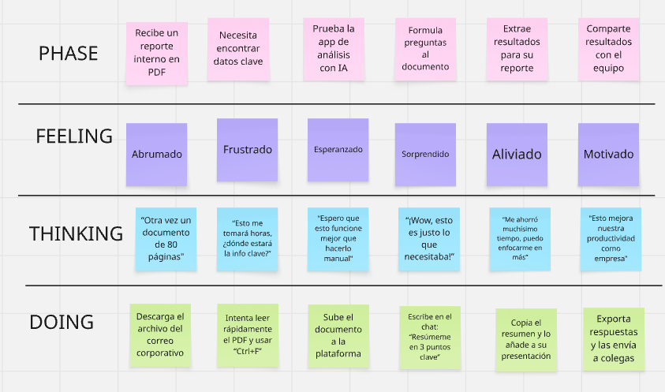

## 2.4. Ubiquitous Language.

| **Término**            | **Definición en el dominio**                                                                 |
|------------------------|-----------------------------------------------------------------------------------------------|
| **Documento**          | Archivo PDF cargado por el usuario que contiene la información a analizar.                    |
| **Carga**              | Acción de subir un PDF a la plataforma.                                                       |
| **Procesamiento**      | Análisis del contenido del PDF con IA para generar un modelo semántico.                       |
| **Chat**               | Interfaz de conversación entre el usuario y el contenido procesado.                           |
| **Consulta**           | Pregunta del usuario sobre el documento.                                                      |
| **Respuesta contextual**| Contestación de la IA que incluye datos y, cuando es posible, referencia a la sección del PDF.|
| **Resumen**            | Síntesis automática del contenido del documento según los parámetros del usuario.              |
| **Equipo**             | Grupo de usuarios (empresa, universidad, etc.) que utilizan la plataforma colaborativamente.   |
| **Sesión**             | Periodo en el que un usuario interactúa con uno o varios documentos.                          |

# Capítulo III: Requirements Specification

## 3.1. To-Be Scenario Mapping

### Segmento de Usuarios Finales (Investigadores, estudiantes, analistas)

| Phases              | Carga de Documentos                                                                                  | Análisis con IA                                                                                      | Visualización de Resultados                                                                                      | Exportación y Reportes                                                                                  | Personalización y Configuración                                                                                  |
|---------------------|------------------------------------------------------------------------------------------------------|------------------------------------------------------------------------------------------------------|------------------------------------------------------------------------------------------------------------------|----------------------------------------------------------------------------------------------------------|------------------------------------------------------------------------------------------------------------------|
| **Doing**          | El usuario inicia sesión y sube documentos PDF desde su PC o Google Drive.                           | Selecciona un documento y solicita un resumen o hace preguntas en lenguaje natural.                  | Navega por el visor interactivo con citas enlazadas y pasajes resaltados.                                       | Exporta el resumen en PDF, Word o Markdown para compartirlo o archivarlo.                                 | Ajusta idioma, tema oscuro y preferencias de notificación para personalizar su experiencia.                       |
| **Thinking**       | Es rápido y sencillo cargar mis archivos, incluso desde Drive.                                      | La IA entiende mis preguntas y me ofrece respuestas precisas y útiles.                               | Puedo identificar la fuente exacta de cada dato gracias a las citas vinculadas.                                 | Tener el reporte listo en PDF ahorra mucho tiempo en mi trabajo o investigación.                           | Me gusta que la plataforma se adapte a mis necesidades y hábitos de trabajo.                                     |
| **Feeling**        | Me siento seguro de que mis documentos están protegidos y organizados.                              | Estoy impresionado por la velocidad y precisión de la IA.                                           | Me siento confiado de que la información es confiable y fácil de entender.                                      | Estoy satisfecho y aliviado de no tener que generar reportes manualmente.                                   | Me siento cómodo y motivado al trabajar en un entorno amigable y personalizable.                                 |

---

### Segmento de Administradores / Analistas Internos

| Phases              | Configuración Inicial y Roles                                                                       | Monitoreo y Seguridad                                                                                  | Gestión de Permisos                                                                                       | Métricas y Auditoría                                                                                      | Mantenimiento y Soporte                                                                                  |
|---------------------|-----------------------------------------------------------------------------------------------------|--------------------------------------------------------------------------------------------------------|-----------------------------------------------------------------------------------------------------------|-----------------------------------------------------------------------------------------------------------|-----------------------------------------------------------------------------------------------------------|
| **Doing**          | Configuran la plataforma con integración de inicio de sesión con Google y definen roles de usuario.  | Supervisan logs y cifrado para proteger la información.                                               | Ajustan permisos para controlar quién puede ver, editar o exportar documentos.                           | Consultan paneles con métricas de uso, confianza de respuestas y actividad del sistema.                    | Gestionan actualizaciones de la plataforma y brindan soporte técnico.                                    |
| **Thinking**       | La configuración inicial es sencilla y compatible con sistemas externos.                             | La seguridad y el cifrado protegen adecuadamente los datos sensibles.                                 | Los permisos permiten mantener la confidencialidad y el orden jerárquico.                                | Las métricas ayudan a tomar decisiones estratégicas sobre recursos y desempeño.                           | Es tranquilizador saber que el sistema se mantiene actualizado y estable.                                 |
| **Feeling**        | Me siento tranquilo porque la plataforma es segura y robusta.                                       | Estoy confiado de que puedo detectar incidentes antes de que escalen.                                 | Me siento en control de la información y el acceso de los usuarios.                                      | Estoy satisfecho al tener visibilidad completa del rendimiento y la seguridad del sistema.                 | Me siento respaldado al contar con un equipo de soporte que responde rápidamente ante problemas críticos. |

## 3.2. User Stories

Tabla de épicas establecidas para las historias de usuarios de DocMind AI.

| **Epic / Story ID** | **Título**                                   | **Descripción**                                                                                                                                  | 
|---------------------|----------------------------------------------|--------------------------------------------------------------------------------------------------------------------------------------------------|
| EPIC001             | Gestión de Documentos | Como usuario, quiero poder cargar, organizar y administrar documentos PDF para que la plataforma pueda analizarlos y generar información a partir de ellos. | 
| EPIC002             | Análisis Inteligente con IA  | Como usuario, quiero realizar preguntas y obtener resúmenes automáticos de mis documentos para ahorrar tiempo y acceder a información clave fácilmente.           | 
| EPIC003             | Visualización y Reporte de Resultados   | Como usuario, quiero ver los resultados del análisis en un formato claro y descargable (resúmenes, citas, reportes) para utilizarlos en mis investigaciones o proyectos.    |
| EPIC004             | Interacción del Usuario en Plataforma   | Como usuario, quiero una interfaz web/móvil simple e intuitiva que me permita interactuar con mis documentos y la IA sin fricción. |
| EPIC005             | Seguridad y Control de Acceso   | Como usuario, quiero que mis documentos estén protegidos con autenticación y permisos adecuados para garantizar la privacidad y confidencialidad de mi información. |

| Epic / Story ID | Título                             | Descripción                                                                                                                                   | Criterios de Aceptación                                                                                                                                                                                                                                                    | Relacionado con (Epic ID) |
|-----------------|------------------------------------|-----------------------------------------------------------------------------------------------------------------------------------------------|----------------------------------------------------------------------------------------------------------------------------------------------------------------------------------------------------------------------------------------------------------------------------|----------------------------|
| EPIC001         | Gestión de Documentos              | Como usuario, quiero poder cargar, organizar y administrar documentos PDF para que la plataforma los procese y analice.                       | Dado que un usuario accede a la sección "Mis Documentos", cuando sube, organiza o elimina archivos, entonces el sistema debe reflejar los cambios de forma inmediata y mantener la trazabilidad de los documentos.                                                         | N/A                        |
| US001           | Carga de documentos PDF            | Como usuario, quiero subir archivos PDF para que la plataforma los procese y analice.                                                         | **Escenario 1:** Dado que el usuario está en “Mis documentos”, cuando hace clic en “Subir” y selecciona un PDF válido, entonces el sistema guarda el archivo y muestra confirmación. **Escenario 2:** Dado que intenta subir un formato no permitido, entonces el sistema rechaza la carga y muestra el motivo. | EPIC001                    |
| US002           | Organización por carpetas/proyectos| Como usuario, quiero agrupar documentos en carpetas/proyectos para mantenerlos organizados.                                                   | **Escenario 1:** Dado que el usuario tiene documentos cargados, cuando crea una carpeta y mueve archivos, entonces la vista se actualiza mostrando su nueva ubicación. **Escenario 2:** Dado que el usuario renombra una carpeta, cuando confirma, entonces el cambio se guarda correctamente.                  | EPIC001                    |
| US003           | Importación desde Google Drive     | Como usuario, quiero vincular una carpeta de Drive para importar documentos sin descargarlos localmente.                                       | **Escenario 1:** Dado que el usuario autorizó Drive, cuando selecciona una carpeta, entonces la plataforma lista los archivos disponibles. **Escenario 2:** Dado que el usuario quita la autorización, cuando vuelve a la vista de Drive, entonces no se muestran archivos y se solicita reconectar.         | EPIC001                    |
| US004           | Eliminación y restauración         | Como usuario, quiero enviar documentos a la papelera y restaurarlos si fue un error.                                                           | **Escenario 1:** Dado un documento activo, cuando lo envío a la papelera, entonces deja de aparecer en búsquedas y queda en “Papelera”. **Escenario 2:** Dado un documento en papelera, cuando lo restauro, entonces vuelve a su carpeta original con metadatos intactos.                                       | EPIC001                    |
| US005           | Metadatos y estado de ingesta      | Como usuario, quiero ver metadatos (tamaño, fecha, fuente) y el estado de procesamiento/ingesta de cada documento.                             | **Escenario 1:** Dado un documento recién subido, cuando consulto su tarjeta, entonces veo “Procesando” hasta que finaliza. **Escenario 2:** Dado un documento procesado, cuando abro detalles, entonces visualizo metadatos y la fecha de última reindexación.                                                 | EPIC001                    |

| Epic / Story ID | Título                             | Descripción                                                                                                                                   | Criterios de Aceptación                                                                                                                                                                                                                                                    | Relacionado con (Epic ID) |
|-----------------|------------------------------------|-----------------------------------------------------------------------------------------------------------------------------------------------|----------------------------------------------------------------------------------------------------------------------------------------------------------------------------------------------------------------------------------------------------------------------------|----------------------------|
| EPIC002         | Análisis Inteligente con IA        | Como usuario, quiero realizar preguntas y obtener resúmenes automáticos de mis documentos para ahorrar tiempo y acceder a información clave.  | Dado que un usuario accede a un documento cargado, cuando solicita un análisis, entonces el sistema debe permitir consultas en lenguaje natural y entregar resúmenes estructurados.                                                                                          | N/A                        |
| US006           | Resumen automático del documento   | Como usuario, quiero generar un resumen automático para entender el contenido rápidamente.                                                     | **Escenario 1:** Dado un documento procesado, cuando solicito “Generar resumen”, entonces se crea un resumen y se guarda en el historial. **Escenario 2:** Dado un resumen existente, cuando lo re-genero, entonces se versiona con marca de tiempo.                                                            | EPIC002                    |
| US007           | Preguntas y respuestas en lenguaje natural | Como usuario, quiero hacer preguntas al documento y recibir respuestas precisas con contexto.                                                 | **Escenario 1:** Dado el chat del documento, cuando pregunto “¿Cuáles son las conclusiones?”, entonces recibo una respuesta con citas. **Escenario 2:** Dado una pregunta ambigua, cuando no se alcanza un umbral de confianza, entonces el sistema sugiere reformular o ver pasajes relacionados.              | EPIC002                    |
| US008           | Búsqueda semántica con filtros     | Como usuario, quiero buscar conceptos clave dentro del documento con filtros (sección, fecha, autor).                                          | **Escenario 1:** Dado un término, cuando lo busco, entonces obtengo pasajes relevantes ordenados por similitud. **Escenario 2:** Dado filtros aplicados, cuando refino la búsqueda, entonces los resultados se actualizan sin recargar la página.                                                                | EPIC002                    |
| US009           | Comparación entre múltiples documentos | Como usuario, quiero comparar dos o más documentos para identificar coincidencias y discrepancias.                                           | **Escenario 1:** Dado dos documentos seleccionados, cuando inicio “Comparar”, entonces veo un resumen de diferencias con citas por cada fuente. **Escenario 2:** Dado hallazgos comparativos, cuando exporto, entonces obtengo un reporte consolidado con referencias por documento.                          | EPIC002                    |
| US010           | Extracción de entidades y datos clave | Como usuario, quiero extraer entidades (fechas, cifras, cláusulas, nombres) para acelerar el análisis.                                        | **Escenario 1:** Dado un documento legal, cuando ejecuto “Extraer entidades”, entonces obtengo una lista categorizada con ubicación en el texto. **Escenario 2:** Dado la lista de entidades, cuando hago clic en una, entonces navego al pasaje original resaltado.                                             | EPIC002                    |

| Epic / Story ID | Título                             | Descripción                                                                                                                                   | Criterios de Aceptación                                                                                                                                                                                                                                                    | Relacionado con (Epic ID) |
|-----------------|------------------------------------|-----------------------------------------------------------------------------------------------------------------------------------------------|----------------------------------------------------------------------------------------------------------------------------------------------------------------------------------------------------------------------------------------------------------------------------|----------------------------|
| EPIC003         | Visualización y Reporte de Resultados | Como usuario, quiero ver los resultados del análisis en un formato claro y descargable para utilizarlos en mis investigaciones o proyectos.   | Dado que un usuario accede a un documento procesado, cuando solicita visualizarlo, entonces el sistema debe mostrar respuestas claras con citas y permitir exportación en distintos formatos.                                                                                | N/A                        |
| US011           | Visor con citas ancladas           | Como usuario, quiero visualizar respuestas con citas enlazadas al texto fuente dentro del visor.                                               | **Escenario 1:** Dado una respuesta, cuando hago clic en la cita, entonces el visor salta al fragmento resaltado. **Escenario 2:** Dado múltiples citas, cuando las recorro, entonces el visor mantiene el contexto de cada pasaje.                                                                             | EPIC003                    |
| US012           | Plantillas de reporte              | Como usuario, quiero generar reportes en plantillas predefinidas (ejecutivo, técnico, legal).                                                 | **Escenario 1:** Dado que selecciono “Reporte Ejecutivo”, cuando genero, entonces se produce un documento con secciones y KPIs. **Escenario 2:** Dado una plantilla, cuando personalizo secciones, entonces el sistema guarda mi variante para reutilizar.                                                      | EPIC003                    |
| US013           | Exportación de reportes            | Como usuario, quiero exportar resultados en formatos estándar (PDF/Word/Markdown).                                                            | **Escenario 1:** Dado un reporte, cuando elijo “Exportar PDF”, entonces se descarga con estilo y numeración de citas. **Escenario 2:** Dado la opción Markdown, cuando exporto, entonces obtengo un archivo con encabezados y referencias.                                                                       | EPIC003                    |
| US014           | Panel de métricas de uso           | Como usuario, quiero ver métricas (tiempo ahorrado, documentos procesados, cobertura de citas, confianza).                                     | **Escenario 1:** Dado mi espacio de trabajo, cuando abro “Métricas”, entonces veo gráficos por periodo. **Escenario 2:** Dado un pico de baja confianza, cuando exploro, entonces accedo a los documentos y respuestas involucradas.                                                                             | EPIC003                    |
| US015           | Historial y versionado de reportes | Como usuario, quiero consultar el historial de reportes con versiones y cambios.                                                              | **Escenario 1:** Dado varios reportes, cuando abro un historial, entonces veo versiones con hora y autor. **Escenario 2:** Dado una versión anterior, cuando la restauro, entonces pasa a ser la versión activa sin perder el historial.                                                                        | EPIC003                    |

| Epic / Story ID | Título                             | Descripción                                                                                                                                   | Criterios de Aceptación                                                                                                                                                                                                                                                    | Relacionado con (Epic ID) |
|-----------------|------------------------------------|-----------------------------------------------------------------------------------------------------------------------------------------------|----------------------------------------------------------------------------------------------------------------------------------------------------------------------------------------------------------------------------------------------------------------------------|----------------------------|
| EPIC004         | Interacción del Usuario en Plataforma | Como usuario, quiero una interfaz web/móvil simple e intuitiva para interactuar con mis documentos y la IA sin fricción.                      | Dado que un usuario interactúa en la plataforma, cuando navega entre secciones, entonces el sistema debe ser accesible, claro y con soporte a personalización de la experiencia.                                                                                            | N/A                        |
| US016           | Onboarding guiado                  | Como usuario, quiero un recorrido inicial para aprender a subir, preguntar y generar reportes.                                                 | **Escenario 1:** Dado primer inicio de sesión, cuando activo el tour, entonces veo pasos con tooltips hasta completar. **Escenario 2:** Dado que omito el tour, cuando lo reabra desde Ayuda, entonces se inicia desde el primer paso.                                                                           | EPIC004                    |
| US017           | Accesibilidad (WCAG)               | Como usuario, quiero que la interfaz sea accesible (navegación por teclado, lector de pantalla, contraste).                                    | **Escenario 1:** Dado navegación por teclado, cuando recorro elementos, entonces los focos son visibles y operables. **Escenario 2:** Dado alto contraste, cuando lo activo, entonces todos los textos mantienen legibilidad.                                                                                    | EPIC004                    |
| US018           | Preferencias personales            | Como usuario, quiero configurar idioma, zona horaria y tema claro/oscuro.                                                                     | **Escenario 1:** Dado idioma español, cuando lo cambio a inglés, entonces la interfaz y mensajes se traducen. **Escenario 2:** Dado tema oscuro, cuando alterno a claro, entonces se persiste para próximas sesiones.                                                                                            | EPIC004                    |
| US019           | Atajos y comandos rápidos          | Como usuario, quiero atajos para acciones frecuentes (subir, buscar, preguntar, exportar).                                                     | **Escenario 1:** Dado el editor de preguntas, cuando presiono `Ctrl+K`, entonces abro la búsqueda global. **Escenario 2:** Dado un documento abierto, cuando uso `Ctrl+E`, entonces se inicia exportación del reporte activo.                                                                                     | EPIC004                    |
| US020           | Feedback y soporte in-app          | Como usuario, quiero reportar problemas o sugerencias desde la app.                                                                           | **Escenario 1:** Dado un error, cuando envío feedback, entonces se genera un ticket con contexto técnico. **Escenario 2:** Dado una respuesta inesperada, cuando marco “inexacta”, entonces se registra para revisión de calidad.                                                                                | EPIC004                    |

| Epic / Story ID | Título                             | Descripción                                                                                                                                   | Criterios de Aceptación                                                                                                                                                                                                                                                    | Relacionado con (Epic ID) |
|-----------------|------------------------------------|-----------------------------------------------------------------------------------------------------------------------------------------------|----------------------------------------------------------------------------------------------------------------------------------------------------------------------------------------------------------------------------------------------------------------------------|----------------------------|
| EPIC005         | Seguridad y Control de Acceso      | Como usuario, quiero que mis documentos estén protegidos con autenticación y permisos adecuados para garantizar la privacidad.                | Dado que un usuario maneja documentos sensibles, cuando inicia sesión o comparte contenido, entonces el sistema debe garantizar confidencialidad mediante autenticación, roles y cifrado.                                                                                   | N/A                        |
| US021           | Autenticación con Google           | Como usuario, quiero iniciar sesión con Google para acceder a mis documentos y permisos.                                                       | **Escenario 1:** Dado que no estoy autenticado, cuando inicio con Google, entonces accedo al panel si la validación es correcta. **Escenario 2:** Dado que deniego permisos, cuando regreso, entonces la app explica qué permisos necesita y por qué.                                                            | EPIC005                    |
| US022           | Roles y permisos                   | Como administrador, quiero asignar roles para controlar quién puede ver, editar o exportar.                                                    | **Escenario 1:** Dado un espacio de trabajo, cuando asigno “miembro”, entonces solo puede ver y preguntar. **Escenario 2:** Dado un usuario “admin”, cuando cambia permisos, entonces los cambios se aplican y quedan auditados.                                                                                  | EPIC005                    |
| US023           | Auditoría de acciones              | Como auditor, quiero revisar un log de acciones (subidas, preguntas, exportaciones).                                                           | **Escenario 1:** Dado el panel de auditoría, cuando filtro por usuario/fecha, entonces veo eventos con hora y detalle. **Escenario 2:** Dado un incidente, cuando abro un evento, entonces veo payloads mínimos y referencias a documentos.                                                                       | EPIC005                    |
| US024           | Retención y borrado seguro         | Como administrador, quiero configurar retención y eliminación segura de datos.                                                                 | **Escenario 1:** Dado una política de 30 días, cuando expira, entonces los datos se eliminan y se registra en auditoría. **Escenario 2:** Dado una solicitud manual de borrado, cuando confirmo, entonces se purga contenido y embeddings asociados.                                                               | EPIC005                    |
| US025           | Cifrado y privacidad               | Como usuario, quiero que mis documentos y respuestas estén cifrados en tránsito y en reposo.                                                    | **Escenario 1:** Dado la transferencia de un archivo, cuando se sube, entonces viaja por TLS y se almacena cifrado. **Escenario 2:** Dado una exportación, cuando la descargo, entonces el enlace expira y requiere sesión activa.                                                                                | EPIC005                    |

## 3.3. Impact Mapping

| **GOAL** | **ACTORS** | **IMPACT** | **DELIVERABLES** |
|-----------|------------|------------|-------------------|
| Mejorar la eficiencia y precisión en la gestión documental mediante una plataforma impulsada por **IA**, que automatice la clasificación, búsqueda y análisis de documentos, reduciendo tiempos operativos y errores humanos. | **Usuarios finales (empleados):** Requieren una manera rápida y confiable de encontrar y gestionar documentos sin perder tiempo en búsquedas manuales.  **Gerentes y supervisores:** Necesitan reportes precisos sobre la documentación procesada para tomar decisiones estratégicas y asegurar cumplimiento normativo.  **Equipo de TI:** Busca una solución escalable, segura e integrable con sistemas existentes (ERP, CRM, etc.). | **Incremento de la productividad:** Reduce significativamente el tiempo invertido en búsqueda y gestión manual de documentos.  **Mejora en la precisión y reducción de errores:** Clasificación automática y análisis inteligente, minimizando inconsistencias.  **Cumplimiento normativo y trazabilidad:** Garantiza que los documentos estén organizados y accesibles para auditorías y revisiones.  **Decisiones basadas en datos:** Los reportes y analíticas de la plataforma brindan información clave para optimizar procesos y flujos de trabajo. | **Plataforma DocMind con IA integrada:** Solución web con motor de inteligencia artificial para clasificación y análisis automático de documentos.  **Sistema de búsqueda inteligente:** Permite encontrar documentos por contexto, etiquetas y contenido semántico.  **Dashboard de reportes y métricas:** Visualización en tiempo real del estado documental y cumplimiento normativo.  **Integraciones seguras:** Conexiones con sistemas ERP, CRM y almacenamiento en la nube.  **Documentación técnica y manuales de usuario:** Guías detalladas para implementación y uso efectivo de la plataforma. |

## 3.4. Product Backlog

| Orden | User Story | Título                           | Descripción                                                                                                                                                 | Story Points |
|-------|------------|----------------------------------|-------------------------------------------------------------------------------------------------------------------------------------------------------------|--------------|
| 1     | US001      | Carga de Documentos PDF          | Como usuario, quiero subir archivos PDF para que la plataforma los procese y analice.                                                                       | 3            |
| 2     | US006      | Resumen Automático del Documento | Como usuario, quiero generar un resumen automático para entender el contenido rápidamente.                                                                   | 5            |
| 3     | US007      | Preguntas y Respuestas           | Como usuario, quiero hacer preguntas al documento y recibir respuestas precisas con contexto.                                                                | 8            |
| 4     | US011      | Visor con Citas Ancladas         | Como usuario, quiero visualizar respuestas con citas enlazadas al texto fuente dentro del visor.                                                             | 5            |
| 5     | US013      | Exportación de Reportes          | Como usuario, quiero exportar resultados en formatos estándar (PDF/Word/Markdown).                                                                          | 5            |
| 6     | US021      | Autenticación con Google         | Como usuario, quiero iniciar sesión con Google para acceder a mis documentos y permisos.                                                                    | 3            |
| 7     | US022      | Roles y Permisos                 | Como administrador, quiero asignar roles para controlar quién puede ver, editar o exportar.                                                                 | 5            |
| 8     | US018      | Preferencias Personales          | Como usuario, quiero configurar idioma, zona horaria y tema claro/oscuro.                                                                                   | 2            |
| 9     | US009      | Comparación de Documentos        | Como usuario, quiero comparar dos o más documentos para identificar coincidencias y discrepancias.                                                          | 8            |
| 10    | US014      | Panel de Métricas de Uso         | Como usuario, quiero ver métricas (tiempo ahorrado, documentos procesados, cobertura de citas, confianza).                                                   | 5            |

# CAPÍTULO IV: STRATEGIC-LEVEL SOFTWARE DESIGN

---

### 4.1. STRATEGIC-LEVEL ATTRIBUTE-DRIVEN DESIGN

#### 4.1.1. DESIGN PURPOSE

El propósito del diseño arquitectónico de DocMind es crear una plataforma de inteligencia artificial escalable, confiable y segura que transforme documentos complejos en información útil y accionable. La arquitectura debe soportar el análisis de grandes volúmenes de datos no estructurados, garantizando respuestas rápidas y precisas con una experiencia de usuario fluida. El diseño debe priorizar la **escalabilidad** y la **disponibilidad** para cumplir con la misión de ser una herramienta líder global en el análisis de documentos.

---

#### 4.1.2. ATTRIBUTE-DRIVEN DESIGN INPUTS

Esta sección inicia con un texto de introducción y contiene las secciones para los tres tipos de Input para el proceso de diseño con ADD.

##### 4.1.2.1. PRIMARY FUNCTIONALITY (PRIMARY USER STORIES)

| Epic / User Story ID | Título | Descripción | Criterios de Aceptación | Relacionado con (Epic ID) |
|---|---|---|---|---|
| US001 | Carga de documentos PDF | Como usuario, quiero subir archivos PDF para que la plataforma los procese y analice. | Escenario 1: Dado que el usuario está en “Mis documentos”, cuando hace clic en “Subir” y selecciona un PDF válido, entonces el sistema guarda el archivo y muestra confirmación. Escenario 2: Dado que intenta subir un formato no permitido, entonces el sistema rechaza la carga y muestra el motivo. | EPIC001 (Gestión de Documentos) |
| US003 | Importación desde Google Drive | Como usuario, quiero vincular una carpeta de Drive para importar documentos sin descargarlos localmente. | Escenario 1: Dado que el usuario autorizó Drive, cuando selecciona una carpeta, entonces la plataforma lista los archivos disponibles. Escenario 2: Dado que el usuario quita la autorización, cuando vuelve a la vista de Drive, entonces no se muestran archivos y se solicita reconectar. | EPIC001 (Gestión de Documentos) |
| US006 | Resumen automático del documento | Como usuario, quiero generar un resumen automático para entender el contenido rápidamente. | Escenario 1: Dado un documento procesado, cuando solicito “Generar resumen”, entonces se crea un resumen y se guarda en el historial. Escenario 2: Dado un resumen existente, cuando lo re-genero, entonces se versiona con marca de tiempo. | EPIC002 (Análisis Inteligente con IA) |
| US007 | Preguntas y respuestas en lenguaje natural | Como usuario, quiero hacer preguntas al documento y recibir respuestas precisas con contexto. | Escenario 1: Dado el chat del documento, cuando pregunto “¿Cuáles son las conclusiones?”, entonces recibo una respuesta con citas. Escenario 2: Dado una pregunta ambigua, cuando no se alcanza un umbral de confianza, entonces el sistema sugiere reformular o ver pasajes relacionados. | EPIC002 (Análisis Inteligente con IA) |
| US009 | Comparación entre múltiples documentos | Como usuario, quiero comparar dos o más documentos para identificar coincidencias y discrepancias. | Escenario 1: Dado dos documentos seleccionados, cuando inicio “Comparar”, entonces veo un resumen de diferencias con citas por cada fuente. Escenario 2: Dado hallazgos comparativos, cuando exporto, entonces obtengo un reporte consolidado con referencias por documento. | EPIC002 (Análisis Inteligente con IA) |
| US011 | Visor con citas ancladas | Como usuario, quiero visualizar respuestas con citas enlazadas al texto fuente dentro del visor. | Escenario 1: Dado una respuesta, cuando hago clic en la cita, entonces el visor salta al fragmento resaltado. Escenario 2: Dado múltiples citas, cuando las recorro, entonces el visor mantiene el contexto de cada pasaje. | EPIC003 (Visualización y Reporte de Resultados) |
| US013 | Exportación de reportes | Como usuario, quiero exportar resultados en formatos estándar (PDF/Word/Markdown). | Escenario 1: Dado un reporte, cuando elijo “Exportar PDF”, entonces se descarga con estilo y numeración de citas. Escenario 2: Dado la opción Markdown, cuando exporto, entonces obtengo un archivo con encabezados y referencias. | EPIC003 (Visualización y Reporte de Resultados) |
| US021 | Autenticación con Google | Como usuario, quiero iniciar sesión con Google para acceder a mis documentos y permisos. | Escenario 1: Dado que no estoy autenticado, cuando inicio con Google, entonces accedo al panel si la validación es correcta. Escenario 2: Dado que deniego permisos, cuando regreso, entonces la app explica qué permisos necesita y por qué. | EPIC005 (Seguridad y Control de Acceso) |
| US022 | Roles y permisos | Como administrador, quiero asignar roles para controlar quién puede ver, editar o exportar. | Escenario 1: Dado un espacio de trabajo, cuando asigno “miembro”, entonces solo puede ver y preguntar. Escenario 2: Dado un usuario “admin”, cuando cambia permisos, entonces los cambios se aplican y quedan auditados. | EPIC005 (Seguridad y Control de Acceso) |
| US025 | Cifrado y privacidad | Como usuario, quiero que mis documentos y respuestas estén cifrados en tránsito y en reposo. | Escenario 1: Dado la transferencia de un archivo, cuando se sube, entonces viaja por TLS y se almacena cifrado. Escenario 2: Dado una exportación, cuando la descargo, entonces el enlace expira y requiere sesión activa. | EPIC005 (Seguridad y Control de Acceso) |

##### 4.1.2.2. QUALITY ATTRIBUTE SCENARIOS

Esta sección incluye la especificación de la primera versión de los escenarios de atributos de calidad que tienen mayor impacto en la arquitectura de la solución.

| Atributo | Fuente | Estímulo | Artefacto | Entorno | Respuesta | Medida |
|---|---|---|---|---|---|---|
| **Rendimiento** | Usuario | Un usuario sube un PDF de 500 páginas. | Subsistema de procesamiento de documentos. | Carga normal de la plataforma. | El sistema procesa el documento y está listo para responder consultas. | El tiempo de procesamiento es menor a 2 minutos. |
| **Escalabilidad** | Alto volumen de usuarios. | 100 usuarios concurrentes suben documentos de gran tamaño. | Sistema completo. | Pico de usuarios simultáneos. | El sistema mantiene su tiempo de respuesta promedio. | La degradación del rendimiento es imperceptible. |
| **Confiabilidad** | Usuario | Un usuario experimenta una interrupción de conexión durante la carga. | Subsistema de carga de documentos. | Conexión inestable. | La plataforma reanuda la carga automáticamente al recuperar la conexión. | La pérdida de progreso es nula. |
| **Seguridad** | Atacante externo | Un atacante intenta acceder a los documentos privados de un usuario. | Capa de autenticación y de datos. | Operación del sistema. | El sistema impide el acceso no autorizado y los datos están cifrados. | El acceso no autorizado es bloqueado y la información no es visible. |
| **Usabilidad** | Nuevo usuario | Un nuevo usuario intenta subir su primer documento. | Interfaz de usuario. | Primer uso de la plataforma. | El usuario completa el proceso sin ayuda externa. | El tiempo para completar la tarea es menor a 30 segundos. |

---

##### 4.1.2.3. CONSTRAINTS

Esta sección incluye la especificación de restricciones, es decir, características que no pueden ser negociadas y son impuestas por el cliente o el propio negocio como guía para la elaboración de la solución.

| Technical Story ID | Título | Descripción | Criterios de Aceptación | Relacionado con (Epic ID) |
|---|---|---|---|---|
| TST-01 | Cloud-Native | La plataforma debe ser **Cloud-Native**, utilizando servicios de nube. | El 100% de los servicios se implementan en una infraestructura de nube. | EPIC-05 |
| TST-02 | Compatibilidad PDF | El sistema debe ser **compatible con archivos PDF** de hasta 500 páginas. | El sistema procesa correctamente archivos PDF hasta el límite de 500 páginas. | EPIC-01 |
| TST-03 | Integración Google Drive | La solución debe integrarse con **Google Drive** para la carga de documentos. | El usuario puede importar documentos directamente desde su cuenta de Google Drive. | EPIC-01 |
| TST-04 | Uso de NLP | El diseño debe utilizar **modelos de lenguaje natural (NLP)** para el procesamiento de texto. | Los modelos de NLP procesan con precisión el texto para generar respuestas y resúmenes. | EPIC-02 |

---

#### 4.1.3. ARCHITECTURAL DRIVERS BACKLOG

Esta sección establece el conjunto de Architectural Drivers que fueron acordados por el equipo, resultado del proceso iterativo.

| Driver ID | Título de Driver | Descripción | Importancia para Stakeholders | Impacto en Architecture Technical Complexity |
|---|---|---|---|---|
| DRV-01 | Procesamiento de documentos grandes | Capacidad para procesar documentos PDF de gran tamaño. | High | High |
| DRV-02 | Escalabilidad horizontal | El sistema debe ser capaz de escalar horizontalmente para 100+ usuarios. | High | High |
| DRV-03 | Respuestas rápidas y precisas | Respuestas rápidas y precisas a preguntas en lenguaje natural. | High | High |
| DRV-04 | Integración con servicios de nube | Integración con servicios de nube (Cloud-Native). | High | High |
| DRV-05 | Usabilidad de la interfaz | Interfaz intuitiva y fácil de usar para cargar documentos y chatear. | Medium | Medium |
| DRV-06 | Seguridad y privacidad | Garantizar la seguridad y privacidad de los documentos. | High | High |
| DRV-07 | Soporte de exportación | Soporte para la exportación de resultados. | Medium | Medium |

---

#### 4.1.4. ARCHITECTURAL DESIGN DECISIONS

En esta sección, el equipo redacta la explicación del proceso, resumiendo los Drivers considerados, las tácticas y patrones que se evaluaron y los criterios para sus decisiones de diseño.

| Decisión Arquitectónica | Racional |
|---|---|
| **Arquitectura de Microservicios** | Separar funcionalidades para permitir que cada servicio escale de forma independiente. |
| **Uso de Serverless Computing** | Optimizar costos y permitir la escalabilidad automática para el procesamiento de documentos. |
| **Base de Datos NoSQL** | Almacenar el contenido de los documentos procesados de manera eficiente. |
| **API Gateway para el Frontend** | Centralizar la seguridad, el enrutamiento y la gestión de las solicitudes. |
| **Cifrado de Datos (Data Encryption)** | Garantizar que los datos estén protegidos tanto en tránsito como en reposo. |

---

#### 4.1.5. QUALITY ATTRIBUTE SCENARIO REFINEMENTS

**Refinamiento de Escenario para Rendimiento**

| **Scenario Refinement for Scenario N** | |
|----------------------------------------|-----------------------------------|
| **Scenario(s):** | El sistema debe ser rápido al procesar documentos grandes. |
| **Business Goals:** | Acelerar el tiempo de procesamiento y respuesta para documentos grandes. |
| **Relevant Quality Attributes:** | Rendimiento |
| **Stimulus:** | Un usuario sube un PDF de 500 páginas. |

| **Scenario Components** | |
|--------------------------|-----------------------------------|
| **Stimulus Source:** | Usuario |
| **Environment:** | Carga normal de la plataforma |
| **Artifact (if Known):** | Subsistema de procesamiento de documentos |
| **Response:** | El sistema procesa el documento y está listo para responder consultas |
| **Response Measure:** | El tiempo de procesamiento es menor a 2 minutos |

| **Questions:** | ¿Qué sucede si se suben múltiples documentos grandes en paralelo? |
|----------------|-----------------------------------|
| **Issues:** | Posible saturación de memoria al manejar archivos muy grandes. |

**Refinamiento de Escenario para Escalabilidad**

| **Scenario Refinement for Scenario N** | |
|----------------------------------------|-----------------------------------|
| **Scenario(s):** | La plataforma debe manejar un alto volumen de usuarios simultáneos sin degradación. |
| **Business Goals:** | Soportar el crecimiento de la base de usuarios manteniendo el rendimiento. |
| **Relevant Quality Attributes:** | Escalabilidad |
| **Stimulus:** | 100 usuarios concurrentes suben documentos de gran tamaño. |

| **Scenario Components** | |
|--------------------------|-----------------------------------|
| **Stimulus Source:** | Alto volumen de usuarios |
| **Environment:** | Pico de usuarios simultáneos |
| **Artifact (if Known):** | Sistema completo |
| **Response:** | El sistema mantiene su tiempo de respuesta promedio |
| **Response Measure:** | La degradación del rendimiento es imperceptible |

| **Questions:** | ¿Cuál es el número máximo de usuarios que puede soportar sin pérdida de rendimiento? |
|----------------|-----------------------------------|
| **Issues:** | Riesgo de cuello de botella en la base de datos o el servidor principal. |

**Refinamiento de Escenario para Confiabilidad**

| **Scenario Refinement for Scenario N** | |
|----------------------------------------|-----------------------------------|
| **Scenario(s):** | El sistema debe recuperarse de fallas temporales. |
| **Business Goals:** | Asegurar la continuidad del servicio y la integridad de los datos. |
| **Relevant Quality Attributes:** | Confiabilidad |
| **Stimulus:** | Un usuario experimenta una interrupción de conexión durante la carga. |

| **Scenario Components** | |
|--------------------------|-----------------------------------|
| **Stimulus Source:** | Usuario |
| **Environment:** | Conexión inestable |
| **Artifact (if Known):** | Subsistema de carga de documentos |
| **Response:** | La plataforma reanuda la carga automáticamente al recuperar la conexión |
| **Response Measure:** | La pérdida de progreso es nula |

| **Questions:** | ¿Qué ocurre si la interrupción dura más de 10 minutos? |
|----------------|-----------------------------------|
| **Issues:** | Posible pérdida parcial de datos en conexiones extremadamente inestables. |

**Refinamiento de Escenario para Seguridad**

| **Scenario Refinement for Scenario N** | |
|----------------------------------------|-----------------------------------|
| **Scenario(s):** | Los datos de los usuarios deben estar protegidos de accesos no autorizados. |
| **Business Goals:** | Proteger la información confidencial de los usuarios. |
| **Relevant Quality Attributes:** | Seguridad |
| **Stimulus:** | Un atacante intenta acceder a los documentos privados de un usuario. |

| **Scenario Components** | |
|--------------------------|-----------------------------------|
| **Stimulus Source:** | Atacante externo |
| **Environment:** | Operación del sistema |
| **Artifact (if Known):** | Capa de autenticación y de datos |
| **Response:** | El sistema impide el acceso no autorizado y los datos están cifrados |
| **Response Measure:** | El acceso no autorizado es bloqueado y la información no es visible |

| **Questions:** | ¿Cómo se notifica al usuario y al administrador sobre intentos de intrusión? |
|----------------|-----------------------------------|
| **Issues:** | Dependencia en la fortaleza de la autenticación multifactor y cifrado. |

**Refinamiento de Escenario para Usabilidad**

| **Scenario Refinement for Scenario N** | |
|----------------------------------------|-----------------------------------|
| **Scenario(s):** | La interfaz de usuario debe ser fácil de usar. |
| **Business Goals:** | Reducir la curva de aprendizaje y mejorar la experiencia del usuario. |
| **Relevant Quality Attributes:** | Usabilidad |
| **Stimulus:** | Un nuevo usuario intenta subir su primer documento. |

| **Scenario Components** | |
|--------------------------|-----------------------------------|
| **Stimulus Source:** | Nuevo usuario |
| **Environment:** | Primer uso de la plataforma |
| **Artifact (if Known):** | Interfaz de usuario |
| **Response:** | El usuario completa el proceso sin ayuda externa |
| **Response Measure:** | El tiempo para completar la tarea es menor a 30 segundos |

| **Questions:** | ¿Se requieren tutoriales o ayudas contextuales para mejorar la experiencia? |
|----------------|-----------------------------------|
| **Issues:** | Riesgo de que la interfaz sea confusa en dispositivos móviles. |

## 4.2. Strategic-Level Domain-Driven Design
### 4.2.1. EventStorming

En esta fase, usamos un método visual y colaborativo para entender a fondo el negocio. Este proceso nos ayudó a definir los contextos clave, modelar los flujos de mensajes y crear los marcos de cada uno de esos contextos.

**Unstructured Exploration**
Es un taller gráfico donde todos los involucrados en el proyecto analizan cómo funciona el sistema. Usamos notas de diferentes colores para representar distintos componentes, lo que simplifica la conversación y ayuda a identificar lo que realmente se necesita.

**Pain Points**
Estos son los obstáculos y las dificultades que enfrentan los usuarios. Identificar estos problemas es vital para crear soluciones que resuelvan sus necesidades de forma efectiva.

**Timelines**
La línea de tiempo muestra la secuencia de eventos del sistema. Al definir este orden, entendemos mejor cómo se relacionan las acciones y su impacto en el flujo de trabajo.

**Pivotal Points**
Son los momentos cruciales que pueden cambiar el estado del sistema o afectar significativamente la experiencia del usuario. Reconocerlos nos permite concentrar nuestros esfuerzos en las partes más importantes del proceso.

**Commands**
Son las acciones o instrucciones que un usuario o el sistema ejecutan para cambiar su estado actual.

**Policies**
Son las reglas que guían la toma de decisiones dentro del sistema. Esto incluye normas de negocio que determinan cuándo se ejecutan ciertos comandos o cómo se manejan ciertos eventos.

### 4.2.2. Candidate Context Discovery

### 4.2.3. Domain Message Flows Modeling

### 4.2.4. Bounded Context Canvases

### 4.2.5. Context Mapping

Nuestros bounded context que corresponden al core de negocio son los que permiten el flujo de sesion para que el usuario pueda realizar consultas luego de seleccionar un documento. Una vez se vincula la cuenta a un provider(OneDrive), nuestro service de document accede a el mediante un enlace y obtiene los metadatos correspondientes y manda un evento de documento listo para procesamiento, nuestro servicio de IA realiza un parsing de documento y analisis mediante un modelo LLM pre entrenado y modificado con un proceso de fine tuning para el reporte de proyecto. Este mismo emite un evento de documento listo y permite que el servicio de chat inicie una sesion para el documento, donde el usuario puede realizar las consultas y basado en su membresia, acceder a la cantidad de consultas permitidas.

![[{1938DEDD-B1C9-45D8-B1AE-397B007EEC25}.png]]

Para poder definir la cantidad de consultas y la memoria de contexto para el chat, el usuario debe establecer un rol basado en suscripcion, por lo que para poder modificar su acceso luego de haber iniciado sesion, nuestra pasarela de pagos facilita que el usuario pueda ingresar sus datos de tarjeta y efectuar una compra, lo que emite luego una boleta al correo del usuario correspondiente.
![[{0183DC42-6F69-4324-A05D-7ACD0638B2E4}.png]]
## 4.3. Software Architecture
### 4.3.1. Software Architecture System Landscape Diagram
### 4.3.1. Software Architecture Context Level Diagrams

### 4.3.2. Software Architecture Container Level Diagrams

### 4.3.3. Software Architecture Deployment Diagrams

# CAPÍTULO V: TACTICAL-LEVEL SOFTWARE DESIGN

## 5.1. BOUNDED CONTEXT: DOCUMENT MANAGEMENT

El contexto delimitado de **DOCUMENT MANAGEMENT** es responsable de gestionar el ciclo de vida de los archivos, desde la **Carga** (US001) hasta la confirmación de su persistencia, y la emisión del evento que dispara el procesamiento por parte del AI Service, garantizando la **Escalabilidad** y el **Rendimiento** mediante el flujo asíncrono.

### 5.1.1. DOMAIN LAYER

La Capa de Dominio encapsula la identidad, el estado y las reglas de negocio primarias de un documento.

| Elemento | Descripción |
| :--- | :--- |
| **ENTIDAD (AGREGADO RAÍZ)** | **Documento:** La entidad principal que representa el archivo cargado. Contiene metadatos, estado y referencia de ubicación. |
| **OBJETOS DE VALOR** | **DocumentoId**: Identificador único e inmutable del documento. **OwnerId**: Referencia al usuario que realizó la carga. **StoragePath**: URL/URI que apunta a la ubicación física del archivo en el Cloud Storage. **Status**: Enum que define el estado actual del documento (`CARGADO`, `PROCESANDO`, `LISTO`, `FALLIDO`). |
| **AGREGADO** | **DocumentAggregate**: Agregado raíz que garantiza la consistencia transaccional del `Documento`. |
| **REPOSITORIO (INTERFACE)** | **IDocumentoRepository**: Define el contrato para persistir, actualizar y recuperar el estado de un `Documento` de la base de datos. |
| **SERVICIOS DE DOMINIO** | **IStorageProvider**: Interfaz para abstraer la interacción con el servicio de almacenamiento externo (Cloud Storage), clave para la **Confiabilidad** del almacenamiento. |

### 5.1.2. INTERFACE LAYER

Esta capa expone la funcionalidad de carga y gestión de metadatos del documento.

| Elemento | Descripción |
| :--- | :--- |
| **CONTROLADOR** | **DocumentController**: Controlador REST que gestiona las peticiones de los clientes. |
| **ENDPOINTS REST** | `POST /documents/upload`: Inicia el flujo de carga de un nuevo documento (US001). `GET /documents/{id}`: Consulta los metadatos y el estado de un documento específico. `GET /documents`: Lista los documentos asociados al `OwnerId`. |
| **DTOS (DATA TRANSFER OBJECTS)** | **UploadDocumentRequest**: Datos de entrada para la carga (ej. `file`, `source`). **DocumentMetadataResponse**: Estructura de salida que incluye `DocumentoId`, `FileName`, `Status` y `UploadDate`. |

### 5.1.3. APPLICATION LAYER

Esta capa orquesta el caso de uso de la Carga de Documentos, asegurando la persistencia y la emisión del evento clave para el procesamiento asíncrono.

| Elemento | Descripción |
| :--- | :--- |
| **COMANDO** | **UploadDocumentCommand**: Contiene la información necesaria (`OwnerId`, `FileName`, `FileLocation`) para el proceso de carga. |
| **MANEJADOR DE COMANDO** | **UploadDocumentHandler**: Procesa el comando. Utiliza el `IStorageProvider` para almacenar el archivo, crea y persiste el `DocumentAggregate` vía `IDocumentoRepository`. Si es exitoso, **emite el evento de dominio**. |
| **EVENTO DE DOMINIO** | **DocumentUploadedEvent**: Evento crucial de integración. Se emite tras la persistencia exitosa del documento y contiene el `DocumentoId` y el `StoragePath`. **Este evento es consumido por el AI Service.** |

### 5.1.4. INFRASTRUCTURE LAYER

La capa de infraestructura implementa los detalles técnicos para soportar la lógica de negocio, incluyendo la persistencia y la comunicación asíncrona.

| Elemento | Descripción |
| :--- | :--- |
| **IMPLEMENTACIÓN DE REPOSITORIO** | **PostgresDocumentoRepository**: Implementación concreta de `IDocumentoRepository` utilizando PostgreSQL. |
| **IMPLEMENTACIÓN DE ALMACENAMIENTO** | **CloudStorageProvider**: Implementación de `IStorageProvider` que maneja la comunicación con el servicio de almacenamiento en la nube (ej. AWS S3 o GCS). |
| **BROKER DE EVENTOS** | **KafkaEventBroker** (o equivalente): Componente para publicar el `DocumentUploadedEvent` en un canal asíncrono, desacoplando el **DOCUMENT MANAGEMENT** del **AI SERVICE** (Patrón Event-Driven). |

### 5.1.6. BOUNDED CONTEXT SOFTWARE ARCHITECTURE COMPONENT LEVEL DIAGRAMS

Este diagrama de componentes ilustra la arquitectura de alto nivel del contexto delimitado, con énfasis en la secuencia de carga y la emisión del evento.

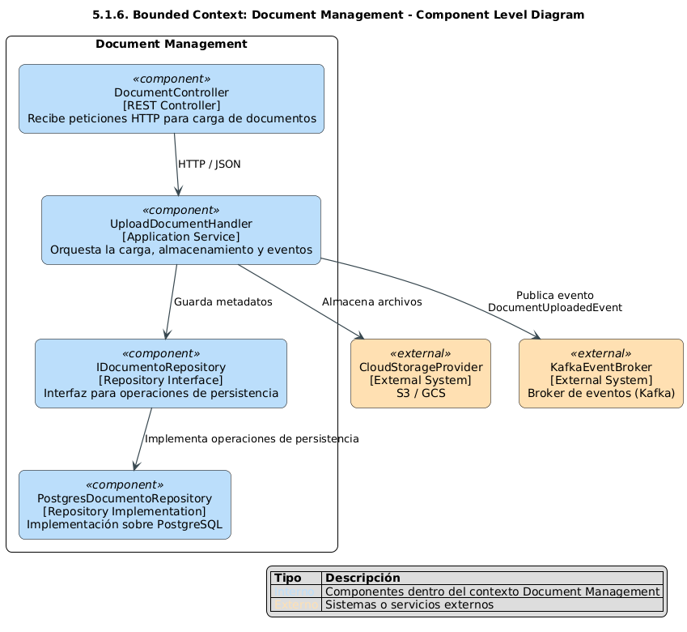

### 5.1.7. BOUNDED CONTEXT SOFTWARE ARCHITECTURE CODE LEVEL DIAGRAMS

#### 5.1.7.1. BOUNDED CONTEXT DOMAIN LAYER CLASS DIAGRAMS

Este diagrama de clases se centra en la estructura del Agregado Raíz `Documento` y sus componentes internos.

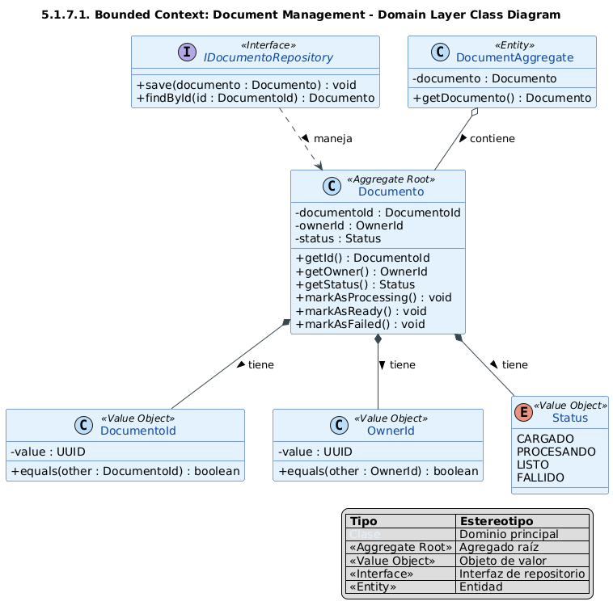

#### 5.1.7.2. BOUNDED CONTEXT DATABASE DESIGN DIAGRAM

Este diagrama se centra en la tabla de persistencia clave para la gestión de documentos.

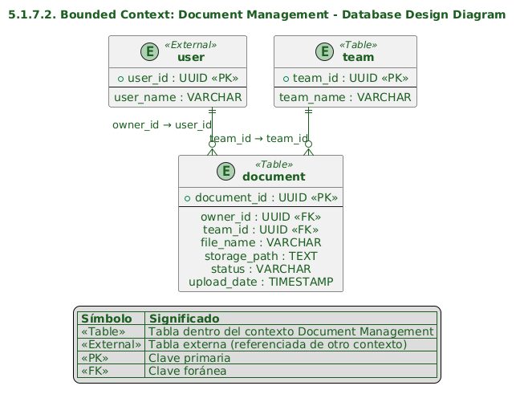

## 5.2. BOUNDED CONTEXT: CHAT SERVICE

El contexto delimitado de **CHAT SERVICE** maneja la interactividad del usuario (**Chat** y **Consulta**), el mantenimiento del **Contexto Conversacional** (memoria) y la comunicación **síncrona** con el servicio de IA para obtener **Respuestas Contextuales** con citas ancladas (US007). Se inicia asíncronamente al recibir el evento de documento procesado.

### 5.2.1. DOMAIN LAYER

La capa de dominio representa las reglas de negocio y las entidades relacionadas con la conversación sobre un documento.

| Elemento | Descripción |
| :--- | :--- |
| **ENTIDAD (AGREGADO RAÍZ)** | **SesionChat:** Entidad principal que representa una conversación única sobre un documento. Contiene la referencia al documento y gestiona el historial de interacciones. |
| **OBJETOS DE VALOR** | **SesionId**: Identificador único e inmutable de la sesión. **DocumentoId**: Referencia al documento que se está consultando. **UserId**: Identificador del usuario. **CitaAnclada**: Objeto de valor que incluye la referencia exacta al texto fuente (`pageNumber`, `snippetText`) (US007). |
| **AGREGADO** | **ChatSessionAggregate**: Agregado raíz que garantiza la consistencia del historial de la sesión, incluyendo la lista de mensajes. |
| **REPOSITORIO (INTERFACE)** | **IChatSessionRepository**: Define el contrato para persistir, recuperar y actualizar el estado de una `SesionChat`. |
| **SERVICIOS DE DOMINIO** | **IMembershipCheckService**: Abstracción para consultar el nivel de membresía del `UserId` (Epic de Pagos) y aplicar límites o extender la memoria de contexto (US007, US021). |

### 5.2.2. INTERFACE LAYER

Esta capa expone los *endpoints* necesarios para que la interfaz de usuario interactúe en tiempo real con la sesión de chat.

| Elemento | Descripción |
| :--- | :--- |
| **CONTROLADOR** | **ChatController**: Controlador REST que gestiona las peticiones del cliente relativas a la interacción conversacional. |
| **ENDPOINTS REST** | `POST /chat/sessions/{id}/query`: Envía una nueva consulta del usuario a la sesión específica. `GET /chat/sessions/{id}`: Recupera el historial completo de la sesión. `GET /chat/sessions`: Lista las sesiones activas del usuario. |
| **DTOS (DATA TRANSFER OBJECTS)** | **NewQueryRequest**: Datos de entrada para una nueva pregunta (ej. `queryText`). **ChatExchangeResponse**: Estructura de salida con la respuesta de la IA y la lista de `CitaAnclada`. |

### 5.2.3. APPLICATION LAYER

Esta capa maneja la orquestación, coordinando la creación de sesiones por eventos y el flujo de consulta/respuesta síncrono.

| Elemento | Descripción |
| :--- | :--- |
| **MANEJADOR DE EVENTOS** | **DocumentReadyEventHandler**: **Se suscribe** al `DocumentReadyEvent` (emitido por el AI Service). Al recibirlo, crea y persiste una nueva instancia de `SesionChat` lista para ser usada. |
| **COMANDO** | **ProcessUserQueryCommand**: Contiene la `SesionId`, el `queryText` y los datos necesarios para invocar al servicio de IA. |
| **MANEJADOR DE COMANDO** | **ProcessUserQueryHandler**: Orquesta la respuesta. Utiliza el `IChatSessionRepository` para recuperar la sesión (contexto), llama al `IAIQueryService` (Infraestructura) y, tras obtener la respuesta, actualiza el `ChatSessionAggregate` con la nueva interacción antes de devolver la respuesta al controlador. |
| **CONSULTAS (QUERIES)** | **GetChatHistoryQuery**: Solicita el historial de mensajes de una sesión específica. |

### 5.2.4. INFRASTRUCTURE LAYER

Implementa los mecanismos técnicos como la persistencia de sesiones y la comunicación con el servicio externo de IA/RAG.

| Elemento | Descripción |
| :--- | :--- |
| **IMPLEMENTACIÓN DE REPOSITORIO** | **PostgresChatSessionRepository**: Implementación concreta de `IChatSessionRepository` que gestiona las tablas `chat_session` y `chat_message` en PostgreSQL. |
| **SERVICIO DE CONSULTA EXTERNA (LLM)** | **IAIQueryService**: Implementa una interfaz para realizar la llamada **síncrona** al servicio de IA/RAG. Es el punto de contacto con el modelo LLM para obtener la `Respuesta Contextual` y las `CitasAncladas`. |
| **BROKER DE EVENTOS (CONSUMO)** | **KafkaEventConsumer**: Componente que se conecta al `KafkaEventBroker` para consumir el `DocumentReadyEvent` y pasarlo al `DocumentReadyEventHandler`. |

### 5.2.6. BOUNDED CONTEXT SOFTWARE ARCHITECTURE COMPONENT LEVEL DIAGRAMS

Este diagrama ilustra el flujo de creación de la sesión (asíncrono) y el flujo de consulta del usuario (síncrono).

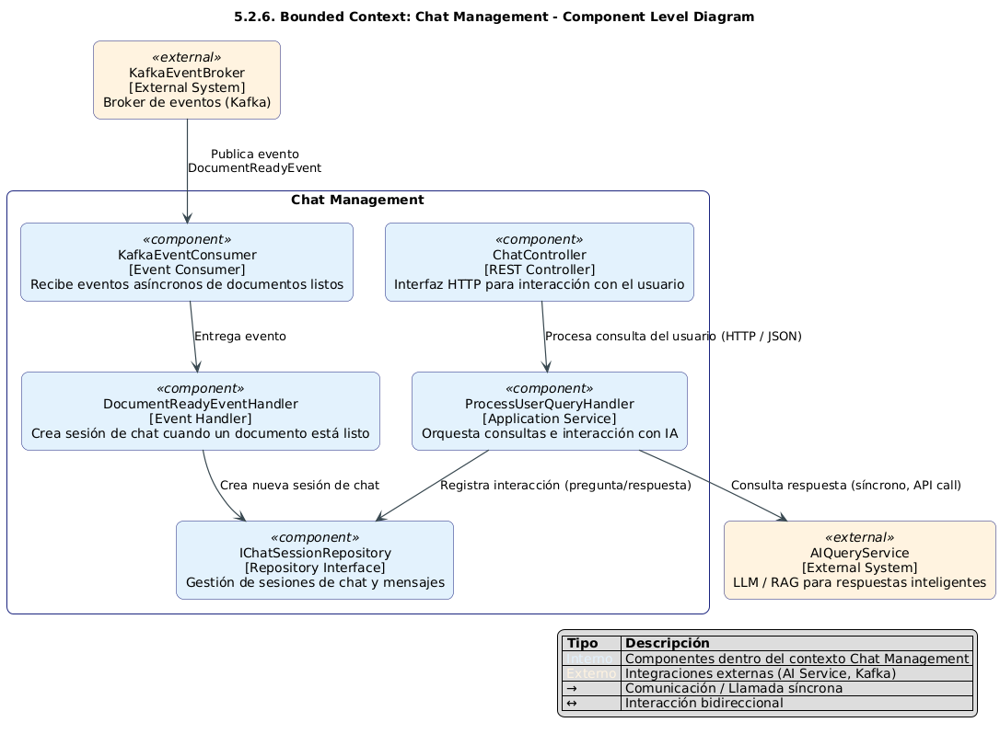

### 5.2.7. BOUNDED CONTEXT SOFTWARE ARCHITECTURE CODE LEVEL DIAGRAMS

#### 5.2.7.1. BOUNDED CONTEXT DOMAIN LAYER CLASS DIAGRAMS

Este diagrama de clases se centra en la estructura del Agregado Raíz y el historial de mensajes.

#### 5.2.7.2. BOUNDED CONTEXT DATABASE DESIGN DIAGRAM

Este diagrama ilustra las tablas necesarias para persistir el historial de la conversación.

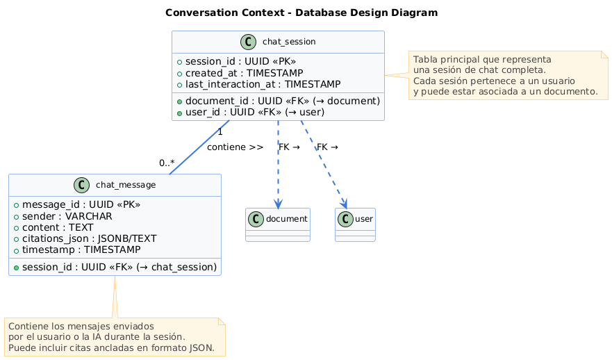

# **CAPÍTULO VI: PRODUCT DESIGN**

## 6.1. Style Guidelines

En esta sección se definen los lineamientos de estilo frontend que darán forma a la identidad visual de **DocMind**, considerando los principios de arquitectura de la información, accesibilidad y coherencia visual necesarios para su implementación en la **Landing Page** y la **Aplicación Web**.  
El objetivo es mantener una interfaz moderna, limpia y confiable que comunique profesionalismo, innovación y transparencia, valores centrales de una herramienta basada en inteligencia artificial.

### 6.1.1. General Style Guidelines

**Branding:**  
El branding de **DocMind** busca reflejar la unión entre la tecnología, el conocimiento y la confiabilidad. El logo representa una fusión entre el cerebro humano y un circuito digital, simbolizando el equilibrio entre inteligencia humana y artificial.  
La palabra **DocMind** utiliza una tipografía moderna, profesional y de bordes suaves, transmitiendo accesibilidad y precisión. Los tonos predominantes refuerzan una imagen tecnológica, ética y orientada a la productividad intelectual.  

**Typography:**  
La tipografía seleccionada para DocMind es **Roboto**, una familia moderna, legible y versátil que comunica claridad y equilibrio. Su uso mantiene consistencia visual en todos los dispositivos, asegurando una lectura óptima en textos técnicos y narrativos.  
Poppins combina excelente legibilidad en cuerpos de texto extensos con un estilo limpio en títulos y botones, transmitiendo innovación y confianza.  

**Colors:**  
La paleta de colores de DocMind combina tonos fríos y neutros que transmiten confianza, claridad y precisión.  
El color principal, **#10BEAE**, refuerza la identidad tecnológica y moderna, mientras los tonos blancos y grises equilibran la interfaz para favorecer la lectura prolongada.  
El negro se usa en textos de alto contraste para garantizar legibilidad y jerarquía visual.  

- Primario: **#10BEAE**  
- Secundario: **#00A896**  
- Fondo general: **#FFFFFF**  
- Texto principal: **#000000**  
- Detalles y bordes: **#EAEAEA**

---

### 6.1.2. Web, Mobile & Devices Style Guidelines

Para la interfaz web y móvil de **DocMind**, se ha diseñado un estilo visual minimalista y limpio, con prioridad en la legibilidad, la organización y la consistencia entre plataformas.  
El diseño busca reflejar una herramienta confiable, profesional y accesible, orientada a distintos tipos de profesionales (médicos, abogados, investigadores, ingenieros).

Los principios clave incluyen:

- Uso predominante de **Poppins** para mantener una lectura moderna y clara.  
- Aplicación estratégica de la paleta de colores:  
  - **#10BEAE** para botones, íconos interactivos y elementos destacados.  
  - **#FFFFFF** como fondo principal para crear amplitud visual.  
  - **#000000** para textos y elementos de contraste.  
- Espaciado generoso, alineaciones consistentes y márgenes equilibrados.  
- Íconos lineales minimalistas, representando funciones principales como “subir documento”, “resumen”, “responder” o “exportar”.  
- Adaptabilidad total a distintos tamaños de pantalla (responsive design).

#### 6.1.2.1. iOS Mobile Style Guidelines

En iOS se seguirán las pautas de **Apple Human Interface Guidelines**, personalizadas según la identidad de DocMind:

- **Tipografía:** Poppins Regular para cuerpo de texto, Poppins Medium para encabezados.  
- **Tamaño de fuente recomendado:**  
  - Título: 26 pt  
  - Subtítulo: 18 pt  
  - Cuerpo: 16 pt  
- **Colores:**  
  - Botones primarios: fondo **#10BEAE**, texto **#FFFFFF**  
  - Fondo general: **#FFFFFF**  
  - Textos: **#000000**  
- **Espaciado táctil:** mínimo de 66x66 pt por elemento interactivo.  
- **Bordes redondeados:** 6–8 pt para tarjetas, botones y modales.  
- **Navegación:** barras inferiores o pestañas jerarquizadas según secciones (Documentos, Chat, Reportes, Perfil).  

#### 6.1.2.2. Android Mobile Style Guidelines

En Android se seguirán las **Material Design Guidelines**, aplicadas al esquema visual de DocMind:

- **Tipografía:** Poppins Regular (texto) y Poppins Medium (encabezados).  
- **Tamaño de fuente recomendado:**  
  - Título: 22–26 sp  
  - Subtítulo: 16–18 sp  
  - Cuerpo: 16 sp  
- **Colores:**  
  - Botones primarios: **#10BEAE** con texto **#FFFFFF**  
  - Fondo general: **#FFFFFF**  
  - Texto: **#000000**  
- **Espaciado táctil:** mínimo 66x66 dp por elemento.  
- **Sombras suaves:** para botones flotantes (FAB) y tarjetas.  
- **Navegación:** Drawer y Bottom Navigation combinados para un acceso rápido a secciones.  
- **Animaciones:** suaves y breves al cargar resultados o transitar entre vistas.

---

## 6.2. Information Architecture

La arquitectura de información de **DocMind** se ha diseñado para que el usuario pueda acceder, analizar y exportar información de manera rápida y lógica, priorizando la claridad y la reducción de fricción cognitiva.  
El flujo principal se centra en tres acciones esenciales: **subir documento**, **consultar con IA** y **generar reporte**.

### 6.2.2. Labeling Systems

- **Sistemas de Organización Visual:**  
  Se aplicará una **organización jerárquica y secuencial**, permitiendo que el usuario avance paso a paso:  
  1. Cargar documentos o conectar con Google Drive.  
  2. Analizar el contenido mediante IA (resumen o preguntas).  
  3. Revisar resultados con citas verificables.  
  4. Exportar reportes personalizados.  

- **Esquemas de Categorización del Contenido:**  
  - Por función: *Inicio*, *Documentos*, *Análisis IA*, *Reportes*, *Perfil*.  
  - Por tipo de interacción: *Lectura*, *Consulta*, *Exportación*, *Configuración*.  
  Esto permitirá que el usuario ubique rápidamente la herramienta que necesita sin saturar la interfaz.

---

### 6.2.3. Searching Systems

En la **Landing Page**, se usarán etiquetas simples e intuitivas que guíen al visitante:

- **Home:** Presentación general de DocMind.  
- **Features:** Funciones principales (análisis, resumen, citas, reportes).  
- **Plans:** Planes y licencias disponibles.  
- **Testimonials:** Opiniones de profesionales y casos de uso.  
- **Contact:** Formulario de contacto y soporte técnico.  
- **Log In / Sign Up:** Acceso a la aplicación y registro de usuarios.

En la **Aplicación Web**, la búsqueda permitirá encontrar documentos, fragmentos o respuestas dentro del sistema de IA mediante **búsqueda semántica** (por tema o palabra clave).

---

### 6.2.4. SEO Tags and Meta Tags

Para optimizar la visibilidad de **DocMind** en buscadores web, se implementarán las siguientes etiquetas:

- **Title:** DocMind  
- **Meta Tags:**  
  - **Description:** Plataforma inteligente que genera resúmenes y reportes automáticos a partir de documentos, impulsada por IA.  
  - **Keywords:** inteligencia artificial, resúmenes automáticos, análisis documental, reportes, productividad, LLM.  
  - **Author:** DocMind AI Solutions.  

---

### 6.2.5. Navigation Systems

**Landing Page:**  
- *Home:* Introducción general y CTA hacia “Probar DocMind”.  
- *Features:* Sección informativa con capturas y ejemplos de análisis.  
- *Plans:* Comparativa de suscripciones (Free, Pro, Enterprise).  
- *Testimonials:* Casos de éxito y opiniones de profesionales.  
- *Contact:* Formulario y redes de soporte.  
- *Log In:* Botón de acción principal (CTA) que redirige a la aplicación web.

**Web Application:**  
- *Dashboard:* Vista principal con resumen de actividad reciente.  
- *My Documents:* Administración de documentos y carpetas conectadas.  
- *AI Analysis:* Chat o panel de interacción con el modelo de lenguaje.  
- *Reports:* Generación, descarga y edición de reportes personalizados.  
- *Profile & Settings:* Configuración de cuenta, idioma y preferencias.

**Mobile Application:**  
- Barra inferior con cinco íconos: *Inicio*, *Documentos*, *IA*, *Reportes*, *Perfil*.  
- Notificaciones contextuales para recordar análisis pendientes o reportes listos.  
- Transiciones fluidas entre vistas, manteniendo coherencia con el entorno web.

---

## 6.3. Landing Page UI Design

El desarrollo del UI Design de la Landing Page está en el siguiente link: https://www.figma.com/design/gNfFzd6YNyoKn9hXkA99vQ/wirefram-y-mock-up-emergentes?node-id=0-1&m=dev&t=ybndTfvrSpKFFRqs-1 

### 6.3.1. Landing Page Wireframe

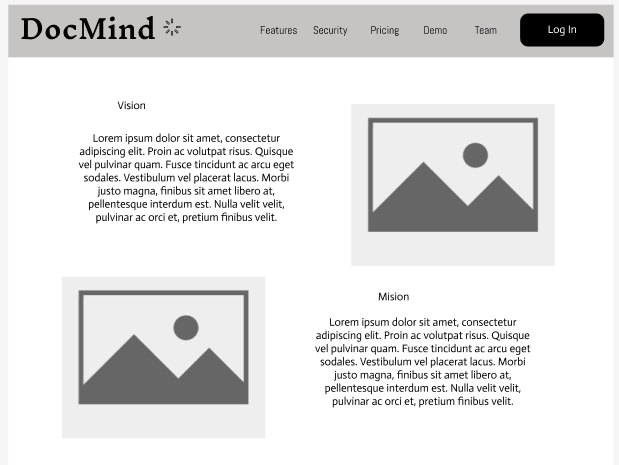
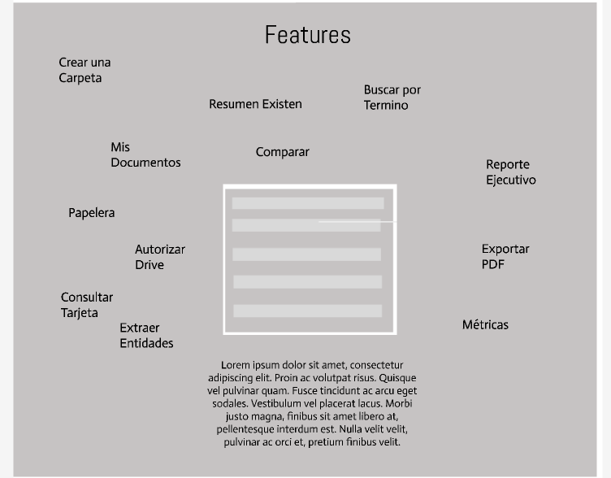
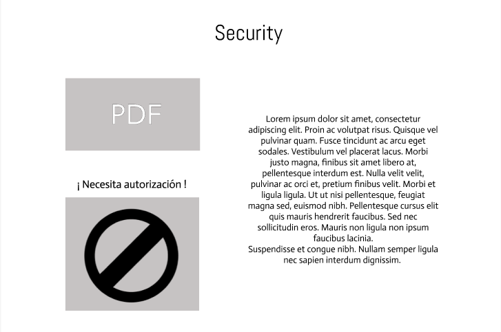
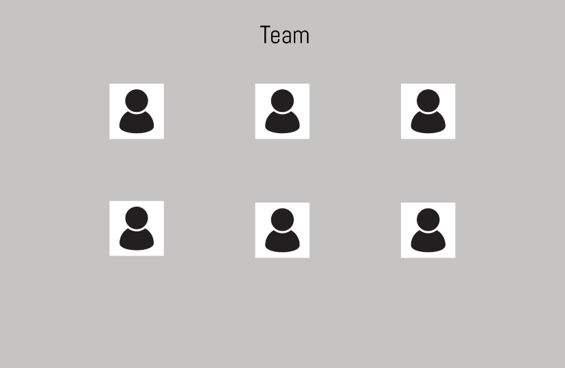

### 6.3.2. Landing Page Mock-up

## 6.6. Applications UX/UI Design.
### 6.6.1. Applications Wireframes.

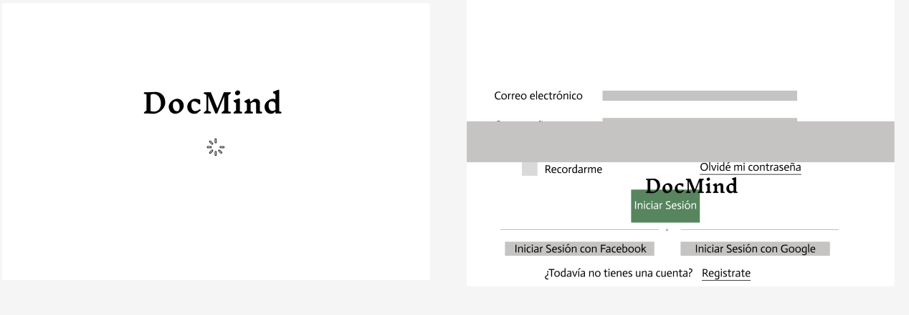

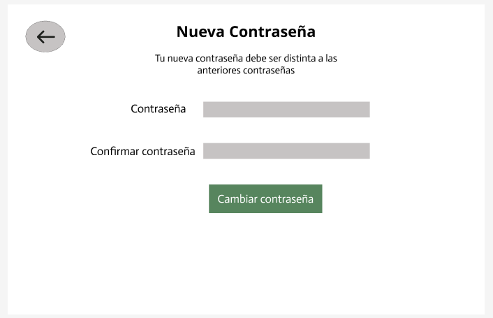
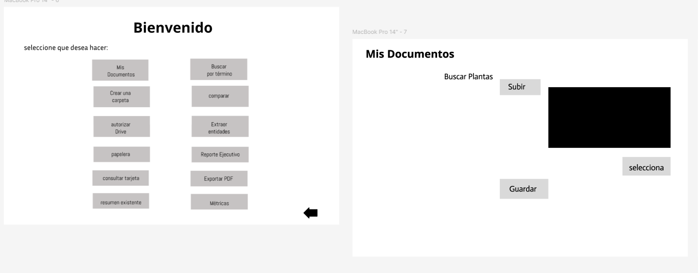
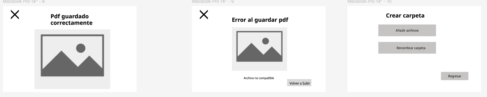
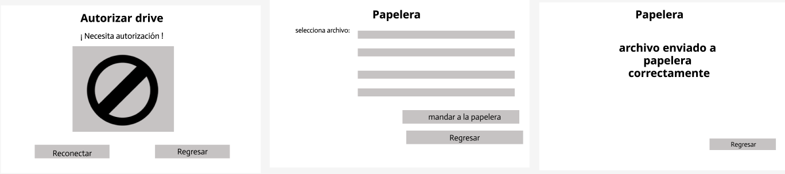
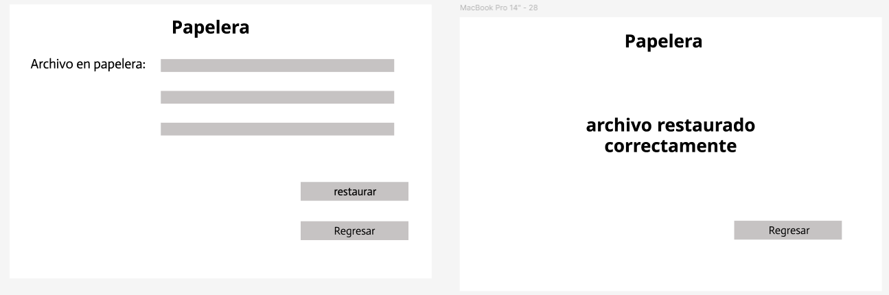
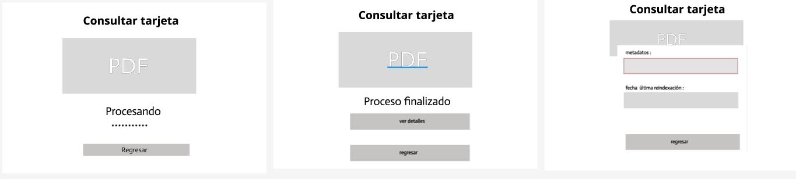
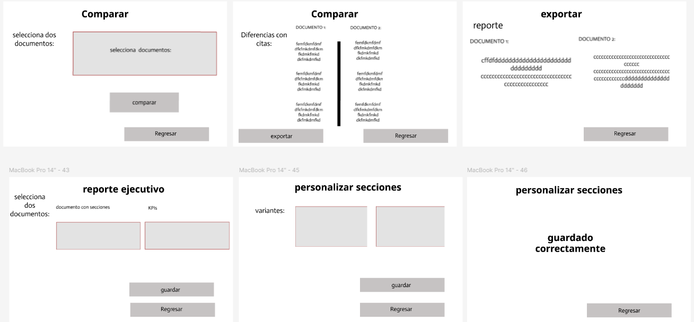

### 6.6.2. Applications Wireflow Diagrams.

Wireflow 1: Acceder a metricas e historial 
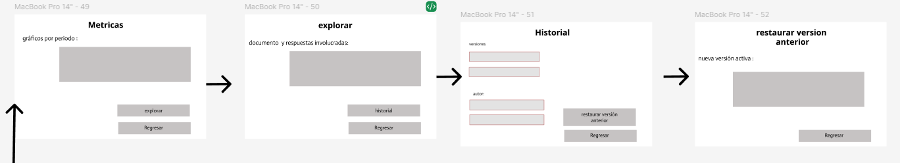

Wireflow 2: Creacion de carpetas, capacidad  de cambio de nombre y subir documentos en las mismas
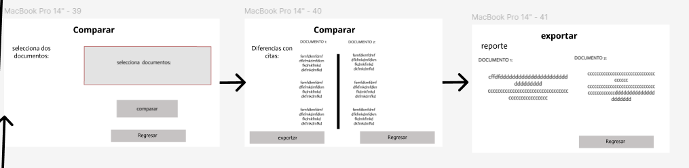

Wireflow 3: Chat con la IA para poder resolver dudas existentes respecto al documento y recibir conclusiones.

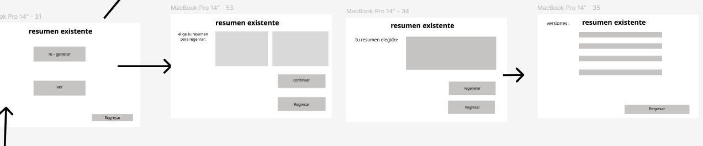

  
### 6.6.2. Applications Mock-ups.

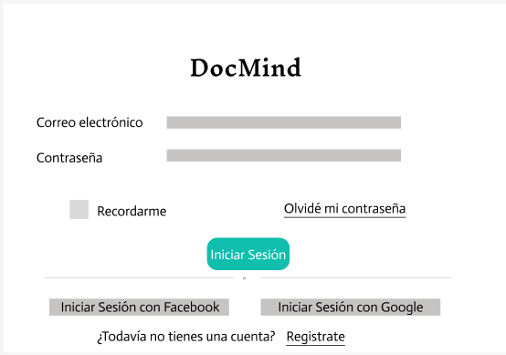
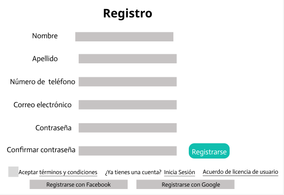
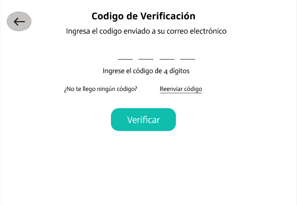
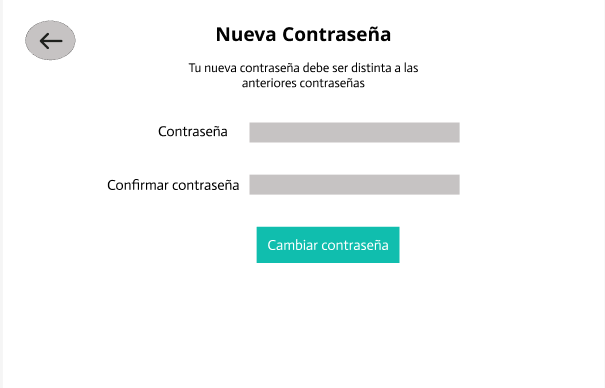

### 6.6.3. Applications User Flow Diagrams.

User goal 1: Como usuario quiero poder ingresar y logearme o registrarme en la pagina de DocMind.
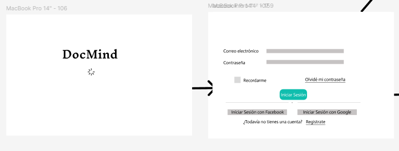

User goal 2: Como usuario una vez registrado, quisiera poder cambiar de contraseña como verificar mi cuenta para mayor seguridad
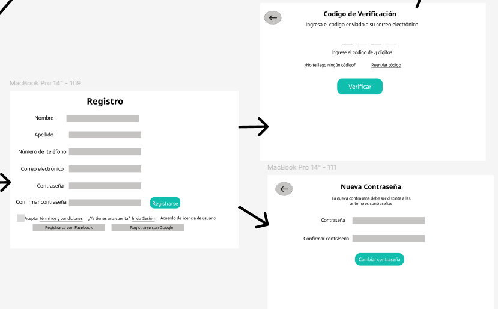

User goal 3: Como usuario una vez dentro de la aplicacion, puede elegir entre todas las funciones disponibles como ver mis documentos
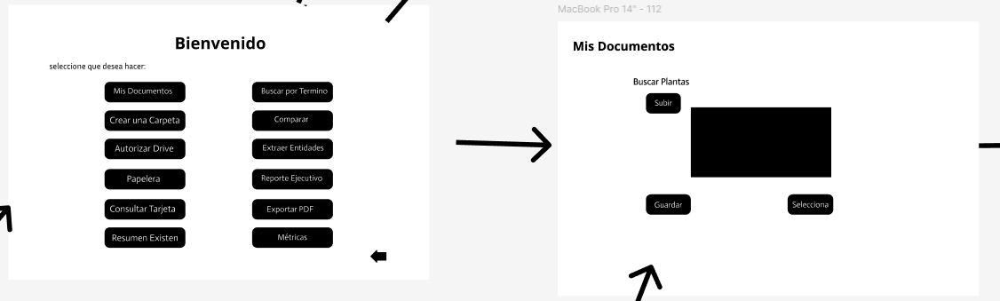

User goal 4: Como usuario quisiera poder crear una carpeta para agrupar los PDFs que necesite para tener una mayor facilidad de acceso.
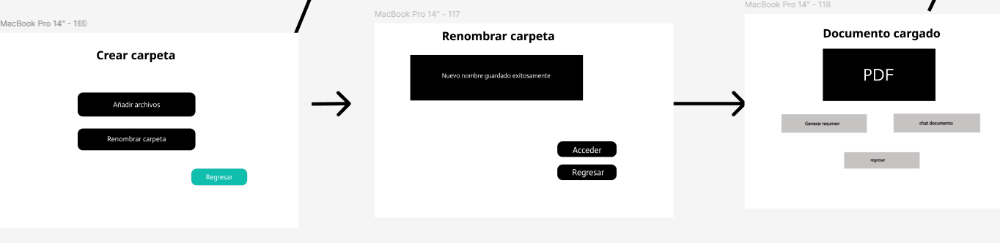

User goal 5: Como usuario quiero poder cargar mi PDF en la aplicacion, hacer un resumen del mismo y hacerle consultas, de tal forma que las consultas hechas se guarden en un historial.
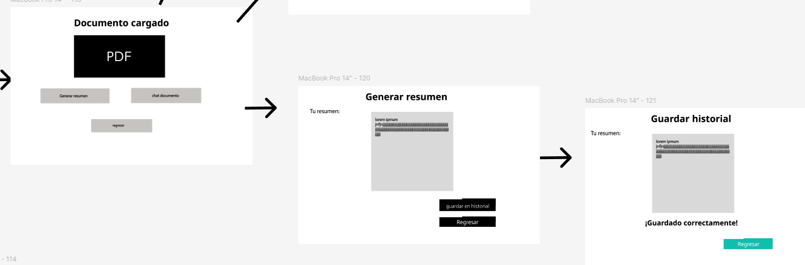

User goal 6: Como usuario quiero poder chatear con la IA para poder resolver duda que tenga respecto a mi documento.
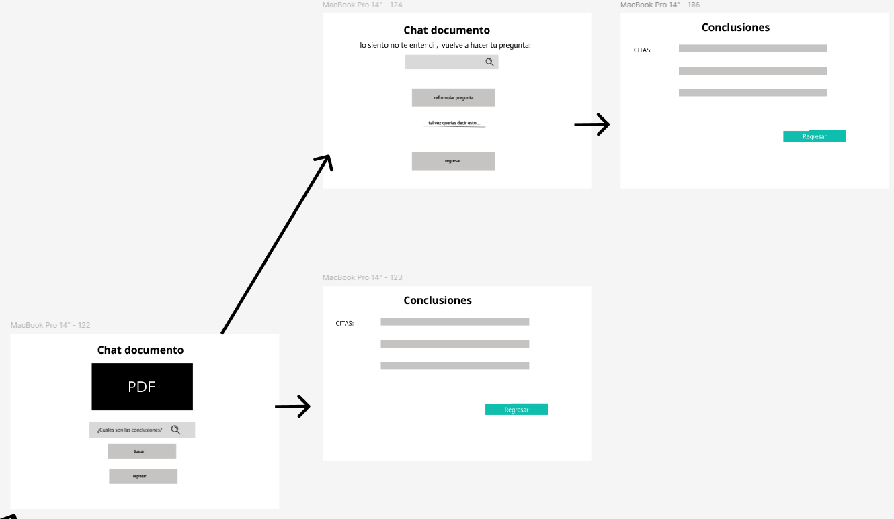

## 6.5. Applications Prototyping. 

Direccion del prototyping: https://youtu.be/2Cg4zA6XSVU 

# Capítulo VII: Product Implementation, Validation & Deployment

## 7.1 Software Configuration Management

Esta sección aborda de manera detallada la gestión de configuración del software, un componente clave en el desarrollo y mantenimiento de cualquier sistema tecnológico. Su propósito principal es asegurar la integridad y trazabilidad de todos los artefactos producidos a lo largo del ciclo de vida del software, permitiendo que el equipo de desarrollo pueda trabajar de manera coordinada y estructurada. A través de políticas claras de versionado, control de cambios, definición de entornos y procedimientos estandarizados, se garantiza que cada integrante tenga acceso a configuraciones consistentes y actualizadas. Además, se establecen mecanismos para documentar y validar las modificaciones realizadas, lo que reduce significativamente la posibilidad de errores o incompatibilidades en las etapas de integración y despliegue.

La correcta implementación de una estrategia de gestión de configuración no solo mejora la calidad del producto final, sino que también optimiza la colaboración entre equipos multidisciplinarios, agiliza la detección de problemas y fortalece la estabilidad del sistema en entornos de producción.

### 7.1.1 Software Development Environment Configuration

En esta sub-sección se describe la configuración técnica del entorno de desarrollo utilizado durante el proyecto. Se especifican las herramientas de software instaladas, sus versiones, rutas de acceso y cualquier dependencia necesaria para asegurar un entorno de trabajo homogéneo para todos los miembros del equipo. Esta documentación resulta esencial para prevenir discrepancias durante la ejecución de tareas, evitar conflictos entre versiones y facilitar la incorporación de nuevos integrantes al proyecto.

Asimismo, se detallan las configuraciones iniciales requeridas para compilar, ejecutar y probar el sistema, incluyendo ajustes en IDEs, variables de entorno, gestores de paquetes, y posibles contenedores o entornos virtualizados (como Docker). Este enfoque garantiza que el entorno de desarrollo se mantenga alineado con el entorno de producción, contribuyendo a una transición fluida entre etapas de desarrollo, pruebas y despliegue.

- **Visual Studio Code**: Editor de código utilizado para desarrollar la Landing Page. Su entorno ligero, personalizable y con soporte para múltiples lenguajes facilitó la colaboración entre desarrolladores y la implementación ágil de componentes web.

  

- **HTML5**: Lenguaje de marcado base para estructurar el contenido de la Landing Page. Permitió organizar la información de forma semántica y accesible, mejorando la navegación y la experiencia del usuario.

  

- **CSS3**: Utilizado para aplicar estilos visuales a la Landing Page. Ayudó a mantener una identidad gráfica coherente, responsiva y atractiva, lo cual es clave para captar la atención del usuario final.

  

- **JavaScript**: Lenguaje que permitió incorporar lógica e interactividad a la Landing Page, como animaciones, validaciones y mejoras en la experiencia dinámica del usuario.

  

- **GitHub**: Plataforma de control de versiones que centralizó el código del proyecto. Facilitó el trabajo colaborativo del equipo, permitió el seguimiento de cambios y mejoró la trazabilidad del desarrollo.

  

- **LucidChart**: Herramienta usada para crear diagramas de flujo, wireflows y modelos conceptuales. Contribuyó a la claridad en el diseño funcional y ayudó a definir la lógica de interacción entre pantallas y procesos.

  

- **Figma**: Plataforma de diseño colaborativo utilizada para la creación de wireframes y prototipos visuales de alta fidelidad. Permitió validar la interfaz gráfica con antelación y alinear al equipo de desarrollo con la visión de diseño.

  

- **Android Studio**: Entorno de desarrollo para la aplicación móvil. Proporcionó las herramientas necesarias para programar, depurar, probar y empaquetar la app en dispositivos Android.

  

- **Kotlin**: Lenguaje de programación moderno utilizado para desarrollar la aplicación móvil. Su sintaxis clara y concisa mejoró la eficiencia del código y la productividad del equipo, alineándose con las mejores prácticas de desarrollo en Android.

  

- **Trello**: Plataforma de gestión de tareas basada en tableros y tarjetas, utilizada para organizar y hacer seguimiento del progreso del equipo durante el desarrollo del proyecto. Facilitó la planificación de sprints, la asignación de responsabilidades y la visualización del avance en tiempo real, promoviendo una colaboración efectiva y una mejor administración del tiempo.

  

- **Angular**: Framework de desarrollo web basado en TypeScript, empleado para construir la interfaz del panel administrativo. Su arquitectura modular, compatibilidad con APIs REST y componentes reutilizables facilitaron el desarrollo de un entorno web responsivo, escalable y mantenible.

  

- **NestJS**: Framework progresivo de Node.js utilizado para el desarrollo del backend de la plataforma. Permite estructurar los microservicios de manera modular y escalable, integrando MQTT para la comunicación IoT, REST APIs para el consumo desde Angular y Flutter, y PostgreSQL como base de datos principal.

  

- **Node.js y npm**: Entorno de ejecución de JavaScript y su gestor de paquetes, utilizados para instalar dependencias y ejecutar scripts de desarrollo y despliegue tanto del frontend (Angular) como del backend (NestJS).

  

- **Postman**: Herramienta de testing de APIs utilizada para validar la comunicación entre el backend y los clientes web/móvil. Permitió automatizar peticiones HTTP, gestionar entornos y realizar pruebas de integración antes del despliegue.

  

- **Git**: Sistema de control de versiones distribuido utilizado para el seguimiento de cambios y la colaboración en el código fuente del proyecto. Permitió mantener ramas independientes por módulo (web, móvil, backend) y facilitar la integración continua.

  

Cada una de estas herramientas fue seleccionada estratégicamente para cumplir con los objetivos del proyecto, asegurando una solución tecnológica robusta, escalable y centrada en la experiencia del usuario.

### 7.1.2 Source Code Management

**Repositorio de la Landing Page:**  
Durante el desarrollo de la Landing Page, utilizamos un repositorio centralizado en GitHub para almacenar y gestionar el código fuente del proyecto. Esto permitió el trabajo colaborativo, el control de versiones y la trazabilidad de cambios en el desarrollo.

**Implementación de GitFlow:**  
Para nuestra estrategia de gestión de versiones con Git, nos basamos en el modelo de ramificación propuesto en el artículo _“A successful Git branching model”_ de Vincent Driessen. Adoptamos el enfoque **GitFlow**, el cual proporciona una estructura clara y organizada para el desarrollo colaborativo, facilitando la integración y el mantenimiento del código.

- **Rama Principal (`main`)**: Contiene la versión estable en producción.
- **Rama de Desarrollo (`develop`)**: Integra los últimos avances y funcionalidades en desarrollo. Actúa como entorno de integración continua.
- **Rama de Lanzamiento (`release`)**: Utilizada para preparar una nueva versión del producto, permitiendo ajustes finales antes de su despliegue.
    - Deriva de: `develop`
    - Se fusiona con: `develop` y `main`
- **Rama de Características (`feature`)**: Destinada al desarrollo de nuevas funcionalidades específicas del producto.
    - Deriva de: `develop`
    - Se fusiona con: `develop`
- **Rama de Corrección Rápida (`hotfix`)**: Diseñada para aplicar soluciones urgentes a errores críticos detectados en producción.
    - Deriva de: `main`
    - Se fusiona con: `develop` y `main`
- **Rama de Alcance (`scope`)**: Rama personalizada creada para gestionar desarrollos relacionados con un módulo o funcionalidad específica de gran tamaño o impacto. Su objetivo es permitir el aislamiento de tareas que abarquen múltiples ramas `feature`, mejorando la organización y facilitando su integración progresiva.
    - Deriva de: `develop`
    - Puede actuar como contenedor de varias `feature`
    - Se fusiona con: `develop` o `release`, según el caso

**Conventional Commits:**  
Para mantener claridad y consistencia en los mensajes de confirmación (`commits`), adoptamos la convención **Conventional Commits**, la cual estandariza la estructura semántica de cada mensaje, permitiendo una mejor comprensión del historial de cambios y una posible automatización en la generación de changelogs.

**Tipos de mensajes utilizados:**

- `feat`: Incorporación de nuevas funcionalidades.
- `fix`: Corrección de errores o bugs.
- `docs`: Cambios relacionados con la documentación.
- `style`: Ajustes de formato sin impacto funcional.
- `refactor`: Reestructuración del código sin alterar su comportamiento.
- `test`: Adición o modificación de pruebas automatizadas.
- `chore`: Tareas de mantenimiento y configuraciones del entorno.
- `perf`: Mejoras orientadas al rendimiento del sistema.

### 7.1.3 Source Code Style Guide & Conventions

Para garantizar un código legible, consistente y de fácil mantenimiento, se adoptaron las convenciones propuestas por Google en sus guías oficiales de estilo para HTML/CSS, JavaScript y Kotlin. La aplicación de estos lineamientos facilita el trabajo colaborativo, mejora la comprensión del código entre distintos desarrolladores y reduce significativamente la probabilidad de errores durante el desarrollo y mantenimiento del sistema.

#### Convenciones para HTML/CSS (Google HTML/CSS Style Guide)

Durante la implementación de la Landing Page, se aplicaron las siguientes buenas prácticas recomendadas:

- Declarar siempre el tipo de documento (`<!DOCTYPE html>`) al inicio.
- Usar minúsculas para los nombres de los elementos HTML (`
`, `<h1>`, `<section>`, etc.).
- Cerrar correctamente todos los elementos HTML (por ejemplo, `

`).
- Colocar entre comillas los valores de los atributos (por ejemplo, `
`).
- Incluir los atributos `alt`, `width` y `height` en las imágenes para accesibilidad y rendimiento.
- Evitar líneas de código excesivamente largas para facilitar la lectura.
- No omitir el elemento `<title>` dentro del `<head>`.
- Incluir `meta tags` relevantes al inicio del documento, como codificación, viewport y descripciones.

Estas convenciones aseguran una estructura semántica clara y una mejor interpretación por parte de navegadores y motores de búsqueda, además de contribuir a una experiencia de usuario coherente.

#### Convenciones para JavaScript (Google JavaScript Style Guide)

Para el desarrollo de funcionalidades interactivas con JavaScript, se aplicaron las siguientes convenciones:

- Usar notación **camelCase** para nombrar variables y funciones (por ejemplo: `numberArray`, `calculateSum()`).
- Emplear **comillas simples** para definir cadenas de texto (`'Este es un string'`).
- Finalizar todas las sentencias con punto y coma (`;`) para evitar errores de interpretación.
- Evitar el uso de `var` para declarar variables, priorizando `let` o `const` según la necesidad de reasignación.

Estas prácticas ayudan a mantener un estilo uniforme en el código fuente y previenen errores comunes relacionados con el scope, la redeclaración de variables o la gestión de valores dinámicos.

#### Convenciones para Kotlin (Google Kotlin Style Guide)

En el desarrollo de la aplicación móvil, se utilizó **Android Studio** como entorno de desarrollo, y se siguieron las convenciones oficiales para Kotlin propuestas por Google, que permiten escribir código más limpio, expresivo y seguro. Las principales directrices aplicadas fueron:

- Usar **camelCase** para variables, funciones y nombres de métodos (`userName`, `getUserData()`).
- Declarar constantes con `val` y variables mutables con `var` solo cuando sea estrictamente necesario.
- Utilizar nombres significativos, claros y descriptivos para funciones y clases.
- Omitir el punto y coma (`;`) al final de las sentencias, dado que no es necesario en Kotlin.
- Aplicar sangrías de 4 espacios y mantener una estructura clara de bloques.
- Utilizar funciones de extensión, lambdas y expresiones funcionales donde sea apropiado, siguiendo el estilo idiomático de Kotlin.
- Dividir clases largas en archivos separados para mejorar la mantenibilidad y legibilidad del código.

Estas convenciones permitieron desarrollar una aplicación Android robusta, con código fácilmente entendible y adaptable por cualquier miembro del equipo. Además, se favoreció el uso de buenas prácticas modernas en el entorno Android, alineándose con los estándares actuales de la industria.

La aplicación sistemática de estas convenciones fortaleció la calidad del código entregado en todas las capas del proyecto, promoviendo la claridad, la eficiencia y la colaboración efectiva entre los integrantes del equipo.

### 7.1.4 Software Deployment Configuration

#### Landing Page Deplyment
La Landing Page de DocMind está desarrollada con el framework Angular, utilizando componentes modulares y estilos en Angular Material. El código fuente se mantiene dentro del repositorio `DocMind-LandingPage` en la organización `DocMind` (GitHub).
El despliegue se realiza mediante GitHub Actions y GitHub Pages, asegurando una publicación continua (CI/CD) cada vez que se realizan cambios en la rama `main`.

#### Resultado del despliegue
Una vez finalizado el flujo, GitHub Pages publica automáticamente la última versión compilada del sitio en la siguiente URL:  
🔗 [Enlace de landing page desplegada]: https://emergentes-7318.github.io/DocMind-Landingpage

Este proceso elimina la necesidad de desplegar manualmente, garantizando que cada modificación aprobada en la rama `develop` se refleje directamente en la versión pública.

## 7.2 Solution Implementation

En esta sección se detalla el proceso completo de implementación, pruebas, documentación y despliegue de la Landing Page y de la Web Application de DocMind. Abarca desde la planificación inicial hasta la entrega visible del Sprint 1, asegurando que cada componente cumpla con los requisitos establecidos y funcione correctamente en el flujo principal de uso: que un profesional de la salud o del derecho pueda entender rápidamente qué hace DocMind, confiar en la propuesta de valor y acceder al entorno web de análisis de documentos.

## 7.2.1 Sprint 1
En esta sección se registra y explica el avance en términos de producto y trabajo colaborativo para el Sprint 1. Durante este sprint, el equipo se enfocó en la implementación de la Landing Page y del primer incremento funcional de la Web Application, asegurando que ambos componentes cumplan con los requisitos establecidos (usabilidad básica, responsividad, accesibilidad mínima y mensajes claros orientados a responsabilidad médico-legal).

### 7.2.1.1 Sprint Planning 1
En esta sección se especifican los aspectos principales del Sprint Planning Meeting. Este encuentro es fundamental para definir los objetivos y tareas del Sprint 1, asegurando que todos los miembros del equipo estén alineados y preparados para comenzar el trabajo. A continuación, se presenta un cuadro resumen del Sprint Planning Meeting, que incluye los puntos clave discutidos y las decisiones tomadas.

| **Sprint #**                       | Sprint 1                                                                                                                                                                                                                                                                                                                                                                                                                                                                                                                                                                                                                                                                      |
|------------------------------------|-------------------------------------------------------------------------------------------------------------------------------------------------------------------------------------------------------------------------------------------------------------------------------------------------------------------------------------------------------------------------------------------------------------------------------------------------------------------------------------------------------------------------------------------------------------------------------------------------------------------------------------------------------------------------------|
| **Sprint Planning Background**     |                                                                                                                                                                                                                                                                                                                                                                                                                                                                                                                                                                                                                                                                               |
| Date                               | 2025-11-15                                                                                                                                                                                                                                                                                                                                                                                                                                                                                                                                                                                                                                                                    |
| Time                               | 16:00 PM                                                                                                                                                                                                                                                                                                                                                                                                                                                                                                                                                                                                                                                                      |
| Location                           | Google Meet Reunion                                                                                                                                                                                                                                                                                                                                                                                                                                                                                                                                                                                                                                                           |
| Prepared by                        | Augusto Vasquez                                                                                                                                                                                                                                                                                                                                                                                                                                                                                                                                                                                                                                                           |
| Attendees (to planning meeting)    | Diego, Andrea, Lorenzo, Santiago y Augusto                                                                                                                                                                                                                                                                                                                                                                                                                                                                                                                                                                                     |
| Sprint n - 1 Review  Summary       | Se completó la definición de los épicos, el Product Backlog inicial y los artefactos de arquitectura (drivers, escenarios de calidad y diseño de alto nivel) para DocMind. Además, se construyó un primer prototipo navegable en Figma que permitió validar los flujos esenciales: carga de documentos, resumen asistido por IA y visualización de recomendaciones médico-legales. A partir de esa base, se priorizaron las User Stories US021, US022, US023, US024, US025, US026, US027, US028 y US029 (23 SP en total) para ser abordadas en el Sprint 1, centradas en la presencia web (Landing Page) y la primera integración visual con la Web Application.                                                                                                                                                                                                                                                                                                                                                                                                                                                                                                                                                                                                                                                   |
| Sprint n - 1 Retrospective Summary | Lo que salió bien: Comunicación diaria breve, alineamiento claro en la visión de DocMind, uso disciplinado de Trello para el Product y Sprint Backlog, y prototipos tempranos que facilitaron la discusión con potenciales usuarios (médicos y abogados). Por mejorar:Aumentar la cobertura de pruebas sobre flujos críticos (CTA de “Probar DocMind” y formulario de contacto), documentar mejor el playbook de deploy/rollback y refinar estimaciones de UI/UX cuando hay iteraciones de copia legal. Acciones para Sprint 1: Definir Definition of Done específica para la Landing Page (responsive ≥320px, SEO semántico básico, accesibilidad mínima y tiempos de carga aceptables). Ajustar microcopys de la propuesta de valor para que reflejen con claridad “asesoramiento médico-legal asistido por IA”.Acordar convenciones de ramas y PR para el repositorio de la Landing y de la Web Application.                                                                                                                                                                                                                                                                                                                                                                                                                                                                                                                                                                                                                                             |
| **Sprint Goal & User Stories**     |                                                                                                                                                                                                                                                                                                                                                                                                                                                                                                                                                                                                                                                                               |
| Sprint 1 Goal                      | Our focus is on delivering the initial web presence and analysis interface for the DocMind platform, including a responsive landing page and a functional web module so that physicians and health-law professionals can quickly understand the value proposition, upload test documents and see an initial AI-assisted medico-legal summary. |
| Sprint 1 Velocity                  |           23                                                                                                                                                                                                                                                                                                                                                                                                                                                                                                                                                                                                                                                                    |
| Sum of Story Points                |      23                                                                                                                                                                                                                                                                                                                                                                                                                                                                                                                                                                                                                                                                         |

### 7.2.1.2 Sprint Backlog 1
En esta sección se presenta el Sprint Backlog del Sprint 1, que incluye las tareas y actividades planificadas para el desarrollo de la Landing Page y el avance de nuestro Web Application. Cada tarea está asociada a una User Story específica, lo que permite al equipo realizar un seguimiento del progreso y asegurarse de que se cumplan los objetivos del sprint.

| Sprint # | User Story Id | Title                          | Work Item Id | Task Title                                   | Description                                                                                                       | Estimation (Hours) | Assigned To | Status |
|---------:|---------------|-------------------------------|--------------|----------------------------------------------|-------------------------------------------------------------------------------------------------------------------|-------------------:|-------------|--------|
| Sprint 1 | US021         | Página inicial                | WI01         | Diseñar la estructura de la Landing Page     | Crear un esquema básico de la Landing (hero, header, secciones) y propuesta de valor inicial.                    |                1.0 | Lorenzo   | Done   |
| Sprint 1 | US021         | Página inicial                | WI01A        | Implementar hero + navegación básica         | Maquetar hero con CTA y header con anclas a secciones y scroll suave.                                            |                2.0 | Lorenzo   | To Do  |
| Sprint 1 | US022         | Sección Proyecto              | WI02         | Diseñar la sección “¿Qué es DocMind?”        | Incluir descripción de funcionalidades clave (automatización, dashboard, sensores).                              |                1.0 | Mathias     | Done   |
| Sprint 1 | US022         | Sección Proyecto              | WI02A        | Maquetar sección con iconografía             | Implementar layout responsive con íconos/ilustraciones y copy aprobado.                                          |                2.0 | Mathias     | To Do  |
| Sprint 1 | US025         | Llamada a la acción (CTA)     | WI03         | Implementar botón de "Probar ahora"          | Crear un botón que lleve a la app web o al sign-up si no hay sesión.                                             |                1.0 | Santiago     | Done   |
| Sprint 1 | US025         | Llamada a la acción (CTA)     | WI03A        | Analítica y accesibilidad del CTA            | Enviar evento de clic a métricas y asegurar foco visible/ARIA en el botón.                                       |                1.0 | Santiago     | To Do  |
| Sprint 1 | US026         | Sección “About the Product”   | WI04         | Diseñar la sección "About the product"       | Incluir una descripción resumida del producto y beneficios.                                                       |                1.0 | Andrea      | Done   |
| Sprint 1 | US026         | Sección “About the Product”   | WI04A        | Diagrama + enlace a documentación            | Agregar diagrama/arquitectura (SVG) y enlaces a documentación en nueva pestaña.                                  |                2.0 | Andrea      | To Do  |
| Sprint 1 | US027         | Sección “About the Team”      | WI05         | Diseñar la sección "About the team"          | Incluir una breve presentación del equipo y roles principales.                                                    |                1.0 | Diego      | Done   |
| Sprint 1 | US027         | Sección “About the Team”      | WI05A        | Grid de tarjetas con fotos y roles           | Implementar tarjetas con nombre, rol y foto (lazy-load) en layout responsive.                                    |                2.0 | Diego      | To Do  |
| Sprint 1 | US024         | Sección de planes             | WI06         | Diseñar la sección "Planes de Pago"          | Incluir dos o más planes con precios y características.                                                           |                1.0 | Diego      | Done   |
| Sprint 1 | US024         | Sección de planes             | WI06A        | Implementar cards y CTA por plan             | Maquetar cards comparables y redirección de cada CTA al flujo correspondiente.                                    |                2.0 | Miguel      | To Do  |
| Sprint 1 | US028         | Sección “Miembros del grupo”  | WI07         | Diseñar la sección "Miembros del grupo"      | Incluir fotos y nombres de los miembros del equipo de desarrollo.                                                 |                1.0 | Lorenzo   | Done   |
| Sprint 1 | US028         | Sección “Miembros del grupo”  | WI07A        | Perfiles con enlaces y texto alternativo     | Añadir enlaces a redes, ofuscación de correos y `alt` descriptivo en imágenes.                                    |                1.5 | Lorenzo   | To Do  |
| Sprint 1 | US023         | Sección de contacto           | WI08         | Diseñar la sección "Contacto"                | Incluir un formulario con campos: nombre, correo, teléfono y mensaje.                                             |                1.0 | Mathias     | Done   |
| Sprint 1 | US023         | Sección de contacto           | WI08A        | Validaciones + envío (mock/API)              | Validar campos en frontend y conectar envío a mock/API con manejo de respuesta y errores.                        |                2.0 | Mathias     | To Do  |
| Sprint 1 | US029         | Footer                        | WI09         | Diseñar el footer                            | Incluir un aviso de derechos de autor.                                                                            |                1.0 | Santiago     | Done   |
| Sprint 1 | US029         | Footer                        | WI09A        | Enlaces legales y comportamiento de apertura | Añadir enlaces a privacidad/términos y abrir en nueva pestaña con `rel="noopener noreferrer"`.                   |                0.5 | Santiago     | To Do  |

Screenshot del Sprint Backlog del Sprint 1 en Trello:

Enlace al Sprint Backlog del Sprint 1 en Trello: https://trello.com/invite/b/691aa4f6c23e9730532ec672/ATTIcfa25809352bbad8598723d329126bc6F7EB4654/emergentes

### 7.2.1.3 Development Evidence for Sprint Review
En esta sección se explican y presentan los avances en la implementación de los productos de la solución según el alcance del Sprint 1. Durante este sprint, el equipo se ha enfocado en la creación y despliegue de la Landing Page, asi como el avance de nuestra Web Application.

| Repository                          | Branch  | Commit Id | Commit Message                                                                      | Commit Message Body                                                                                                                                                            | Commited on (Date) |
|-------------------------------------|---------|-----------|-------------------------------------------------------------------------------------|--------------------------------------------------------------------------------------------------------------------------------------------------------------------------------|--------------------|
| Emergentes-7318/DocMind-Landingpage        | main    | 5597c25   | update and finish landing page                                                                      | feat: update landing page                                                                                                                  | 2025-11-16         |                                                                                                                                    

Enlace al repositorio: https://github.com/Emergentes-7318/DocMind-Landingpage

### 7.2.1.4 Testing Suite Evidence for Sprint Review

Para este Sprint 1, no se han implementado todavía pruebas automatizadas formales. Sin embargo, se realizaron pruebas manuales estructuradas para asegurar que la Landing Page y la Web Application funcionen correctamente y cumplan con los requisitos establecidos:

Flujos probados en la Landing Page:

- Navegación entre secciones (Home, Proyecto, About the Product, About the Team, Planes, Contacto, Footer).
- Funcionamiento del CTA principal (“Probar DocMind”) y su redirección al entorno web.
- Validaciones básicas del formulario de contacto (campos obligatorios, formato de correo, mensajes de error).

Flujos probados en la Web Application:

- Acceso a la ruta de login y visualización de mensajes ante credenciales inválidas (mock).
- Acceso a la vista inicial de dashboard una vez autenticado el usuario de prueba.

En sprints futuros se prevé incorporar pruebas automatizadas (por ejemplo, E2E con Cypress o Selenium) sobre los flujos de CTA, contacto y carga de documentos, pero por el momento el equipo ha optado por pruebas manuales guiadas con checklist para asegurar la calidad del producto.

### 7.2.1.5 Execution Evidence for Sprint Review
En este Sprint 1, el equipo ha desarrollado y desplegado la Landing Page y la primera version de nuestra Web Application, asegurando que cumpla con los requisitos establecidos y funcione correctamente. A continuación, se presentan las evidencias de ejecución del Sprint 1, que incluyen capturas de pantalla y descripciones de las funcionalidades implementadas.

 **Hero Section**: La sección principal de la Landing Page, que incluye una barra de navegación, un título
atractivo, una imagen llamativa y un botón de llamada a la acción.
  

 **About Section**: La sección que proporciona información sobre la aplicación y sus características principales.
Incluye un título, una descripción y una imagen representativa. Además, tiene uan sección sobre el equipo de
desarrollo.
   
  
  **About the team Section**: La sección que muestra los diferentes planes de suscripción disponibles para los
usuarios. Incluye un título, una descripción y nuestros dos planes con precios y características.
  
 **Footer Section**: La sección que incluye un aviso de derechos de autor.
  

Y respecto a la Web Application aqui se puede evidenciar parte del avance que hemos realizado para esta entrega:

### 7.2.1.6 Services Documentation Evidence for Sprint Review

Este Sprint 1 tuvo como enfoque principal la implementación de la Landing Page y el primer incremento de la Web Application, por lo que aún no se han desarrollado Web Services productivos ni se ha documentado la API pública. La documentación de endpoints con OpenAPI (por ejemplo, para carga de PDFs, consulta de resúmenes y gestión de casos) será relevante en sprints futuros cuando se aborde la implementación y documentación de estos servicios de backend y de integración con el motor de IA.

### 7.2.1.7 Software Deployment Evidence for Sprint Review
#### Software Deployment Evidence – Landing Page
Durante este Sprint se realizó el despliegue de la Landing Page oficial de la plataforma DocMind, cuya finalidad es presentar la solución al público objetivo (médicos, abogados especialistas en responsabilidad médica, gestores de riesgo clínico y directores de clínicas) y proporcionar una primera interacción digital con la marca.

El despliegue se efectuó utilizando GitHub Pages como servicio de hosting estático y GitHub Actions como herramienta de automatización continua (CI/CD). Este proceso permite garantizar que cada actualización en la rama principal se publique automáticamente en el entorno productivo, manteniendo una entrega continua y trazable del producto.
Pasos del proceso de Deployment

Creación y configuración del repositorio

Se creó el repositorio público DocMind_Landing_Page en GitHub (utilizado como repositorio de la Landing Page de DocMind durante esta iteración).

La rama principal (develop/main, según configuración de flujo de trabajo) se configuró como fuente oficial de despliegue.

Se añadieron los archivos esenciales del proyecto (Angular / HTML-CSS / assets / configuración).

Configuración de GitHub Pages

En la sección Settings → Pages, se seleccionó la rama gh-pages (generada automáticamente por la acción de despliegue) como fuente del sitio.

Se habilitó el dominio del proyecto, generando la URL pública:
https://emergentes-7318.github.io/DocMind-Landingpage

La visibilidad se configuró como pública para permitir el acceso de stakeholders y usuarios de prueba (médicos y abogados contactados para entrevistas).

Automatización mediante GitHub Actions (CI/CD)

Se creó un archivo de flujo de trabajo (.github/workflows/deploy.yml) con la siguiente función principal:

Compilar automáticamente la landing page al hacer push en la rama configurada de despliegue.

Generar la carpeta dist/ optimizada para producción.

Publicar el contenido en la rama gh-pages de manera automática.

Este flujo garantiza que cada cambio aprobado vía Pull Request se refleje en la versión pública sin pasos manuales adicionales.

Verificación del despliegue

Se validó el acceso público a la landing desde el navegador.

Se comprobó la correcta carga de recursos (imágenes, estilos y scripts).

Se realizaron pruebas rápidas de responsividad (320px, 768px, 1024px) y de rendimiento básico en red simulada 4G.

Los resultados de validación fueron satisfactorios: el sitio se muestra correctamente, con texto legible, imágenes optimizadas y tiempos de carga adecuados para el alcance del Sprint 1.

#### Pasos del proceso de Deployment
1. **Creación y configuración del repositorio**
    - Se creó el repositorio público DocMind_Landing_Page en GitHub para centralizar el código fuente de la landing.
    - La rama principal (develop) fue configurada como la fuente oficial de despliegue.
    - Se añadieron los archivos esenciales del proyecto (Angular / HTML-CSS / assets / config).
    - Estructura del repositorio: 
2. **Configuración de GitHub Pages**
    - En la sección Settings → Pages, se seleccionó la rama gh-pages (generada automáticamente por la acción de despliegue) como fuente del sitio.
    - Se habilitó el dominio del proyecto, generando la URL pública: https://emergentes-7318.github.io/DocMind-Landingpage
    - La visibilidad se configuró como pública para permitir el acceso de los stakeholders y usuarios de prueba.
3. **Automatización mediante GitHub Actions (CI/CD)**
    - Se creó un archivo de flujo de trabajo (.github/workflows/deploy.yml) con la siguiente función:
        - Compilar automáticamente la landing page al hacer push en la rama develop.
        - Generar la carpeta dist/ optimizada para producción.
        - Publicar el contenido en la rama gh-pages de manera automática.
4. **Verificación del despliegue**
    - Se validó el acceso público a la landing desde el navegador.
    - Se comprobó la correcta carga de recursos (imágenes, estilos y scripts).
    - Los resultados de validación fueron satisfactorios: el sitio se muestra correctamente y con tiempo de carga óptimo.
    - Landing Page desplegada: 

### 7.2.1.8 Team Collaboration Insights during Sprint
Para el desarrollo de este sprint, el equipo designó a un integrante para el desarrollo de las actividades de implementación de la Landing Page.

GitHub insights del landing page y Web Application:

## 7.3 Validation Interviews  
### 7.3.1 Diseño de Entrevistas  
#### 1. Preguntas para Profesionales de la salud (médicos/as y jefes clínicos)

| **Categoría**                                | **Preguntas**                                                                                                                                                          |
| -------------------------------------------- | ---------------------------------------------------------------------------------------------------------------------------------------------------------------------- |
| **Perfil profesional**                       | - ¿Podrías indicarme tu especialidad, años de experiencia y el tipo de institución donde trabajas (MINSA, EsSalud, privada, etc.)?                                     |
|                                              | - ¿Participas habitualmente en cirugías de alto riesgo, guardias de emergencia o comités de calidad/seguridad del paciente?                                            |
| **Experiencia en conflictos médico-legales** | - En los últimos 5 años, ¿has enfrentado quejas formales, reclamos o procesos por presunta mala praxis (propios o de tu servicio)?                                     |
|                                              | - ¿Cuáles consideras que son los puntos más débiles cuando se presenta un conflicto (documentación, comunicación con el paciente/familia, tiempos de atención, etc.)?  |
| **Gestión actual de documentos**             | - ¿Cómo gestionas hoy historias clínicas, consentimientos informados y otros documentos críticos en casos complejos (papel, HCE, archivos personales, etc.)?           |
|                                              | - ¿Utilizas alguna herramienta digital para revisar retrospectivamente casos de riesgo, o todo se hace de forma manual y fragmentada?                                  |
| **Percepción del riesgo**                    | - ¿Qué tan fácil te resulta identificar a tiempo un caso con alto riesgo médico-legal antes de que se convierta en demanda o queja formal?                             |
|                                              | - ¿En qué momento del proceso de atención te gustaría recibir alertas o resúmenes de riesgo (antes de la cirugía, durante la hospitalización, al alta, en auditorías)? |

#### 1.2 Evaluación del Landing Page y Aplicaciones

| **Categoría**                         | **Preguntas**                                                                                                                                                                            |
| ------------------------------------- | ---------------------------------------------------------------------------------------------------------------------------------------------------------------------------------------- |
| **Navegación y facilidad de uso**     | - ¿Qué tan fácil encontraste navegar en el landing page y entender rápidamente qué es DocMind y para qué sirve?                                                                          |
|                                       | - ¿Hubo alguna sección que te costara trabajo localizar o cuyo contenido no quedara del todo claro (por ejemplo, “About the product”, “Planes”, “Contacto”)?                             |
| **Claridad de la propuesta de valor** | - Después de ver la Landing Page, ¿cómo describirías DocMind en una frase a otro colega médico?                                                                                          |
|                                       | - ¿Consideras que el mensaje refleja adecuadamente que DocMind apoya la prevención de riesgos y no reemplaza tu criterio profesional?                                                    |
| **Funcionalidades clave**             | - Según lo que viste, ¿qué funcionalidades de la plataforma te resultan más útiles (resumen de historias, checklist de documentación, línea de tiempo probatoria, panel de casos, etc.)? |
|                                       | - ¿Hay alguna funcionalidad crítica para tu práctica que no hayas visto reflejada y te gustaría que se incorpore en futuras versiones?                                                   |
| **Experiencia de flujo CTA → App**    | - ¿Te resultó claro el botón o sección para “probar” DocMind desde la Landing Page?                                                                                                      |
|                                       | - ¿El acceso a la Web Application (login y primer panel) te pareció lógico e intuitivo desde el punto de vista de tu trabajo diario?                                                     |
| **Confianza y privacidad**            | - ¿La información mostrada en la Landing Page te genera suficiente confianza respecto a la privacidad de las historias clínicas y documentos cargados?                                   |
|                                       | - ¿Qué mensajes adicionales sobre seguridad y confidencialidad consideras necesarios para sentirte cómodo usando DocMind con casos reales?                                               |

### 2. Preguntas para Huéspedes
| **Categoría**                      | **Preguntas**                                                                                                                                                                        |
| ---------------------------------- | ------------------------------------------------------------------------------------------------------------------------------------------------------------------------------------ |
| **Perfil profesional**             | - ¿Cuál es tu área de especialización (derecho médico, seguros, gestión de riesgos, responsabilidad civil, etc.) y cuántos años de experiencia tienes?                               |
|                                    | - ¿Trabajas principalmente con clínicas privadas, aseguradoras, hospitales públicos o estudios jurídicos independientes?                                                             |
| **Experiencia con casos médicos**  | - En tu práctica, ¿qué parte del análisis de un expediente médico te resulta más compleja (volumen de documentos, legibilidad, inconsistencias, tiempos, cadena de custodia, otros)? |
|                                    | - ¿Con qué frecuencia enfrentas casos donde la documentación clínica incompleta o desordenada afecta la estrategia de defensa o la probabilidad de éxito?                            |
| **Uso actual de tecnología**       | - ¿Qué herramientas tecnológicas utilizas hoy para organizar expedientes, generar escritos o evaluar probabilidad de éxito de un caso?                                               |
|                                    | - ¿Has utilizado antes herramientas con inteligencia artificial para análisis documental? Si es así, ¿qué limitaciones encontraste?                                                  |
| **Percepción del riesgo jurídico** | - ¿Qué tan importante consideras contar con resúmenes y alertas automáticas sobre posibles brechas de documentación, consentimiento o trazabilidad en un caso médico-legal?          |
|                                    | - ¿En qué momento del ciclo del caso (pre-demanda, mediación, juicio) te sería más útil una herramienta como DocMind?                                                                |

### Conclusión de la Entrevista

| **Categoría**      | **Pregunta**                                                                                                                                                         |
| ------------------ | -------------------------------------------------------------------------------------------------------------------------------------------------------------------- |
| **Pregunta Final** | - ¿Hay algo más que consideres relevante compartir sobre tu experiencia interactuando con el landing page y el prototipo de DocMind, o sobre su uso en casos reales? |

### 7.3.2 Registro de Entrevistas  

#### Entrevista 1
| **Datos del entrevistado**                                                                                                                                                                                                                                            |
| ------------------------------------------------------------------------------------------------------------------------------------------------------------------------------------------------------------------------- |
| **Nombre:**  Miguel Polo                                                                                                                                                                    |
| **Link del video:**  [https://youtu.be/DMiguelPoloDocMind](https://youtu.be/DMiguelPoloDocMind)                                                                                                                                                                                                                                                                                                   |
| **Edad:**  41 años                                                                                                                                                                                                      |
| **Procedencia:**  Lima, San Borja                                                                                                                                                                                                                                                                   |
|                                                                                                                                                                                                                                      |
| **Resumen:** Miguel es anestesiólogo pediatra en un hospital especializado de alta complejidad, con doce años de experiencia en cirugías de alto riesgo. Refiere que los casos que terminan en queja o proceso casi siempre están asociados a documentación incompleta (consentimientos sin firma, notas operatorias muy breves) y a fallas de comunicación con la familia. Tras revisar el landing page de DocMind, resume la solución como “un asistente que me ayuda a revisar el expediente y ver dónde estoy flojo antes de que estalle el problema”. Valora positivamente la claridad del hero y de la sección “About the product”, aunque sugiere incluir un ejemplo explícito de un caso pediátrico. Considera que el flujo de CTA hacia la Web Application es sencillo y le gustaría que en futuras versiones se añada un checklist de documentación crítica por tipo de cirugía, así como mensajes más visibles sobre privacidad y cifrado de los datos clínicos. |

#### Entrevista 2
| **Datos del entrevistado** | 
|--------------------------|
| **Nombre:**  Aarón Castañeda |
| **Link del video:**  https://youtu.be/DAaronCastanedaDocMind|
| **Edad:**  35 años |
| **Procedencia:**  Lima, Villa Salvador |
| |
| **Resumen:** Aarón es médico emergenciólogo en un hospital público de alta demanda, con ocho años de experiencia. Señala que el servicio de emergencia es “el lugar donde más se judicializa” por tiempos de espera y fallas de comunicación, y que reconstruir la línea de tiempo de atención cuando el expediente está incompleto es muy complicado. Tras interactuar con la Landing Page y el prototipo de DocMind, valora especialmente la idea de una línea de tiempo probatoria automatizada. Percibe la Landing como clara, pero comenta que está más orientada a casos planificados y sugiere añadir ejemplos de urgencias. Indica que la versión móvil se ve bien aunque haría más visible el menú hamburguesa. Recomienda ajustar el texto del CTA a algo como “Probar con un caso real” y propone un plan institucional enfocado en servicios de emergencia, con énfasis en prevención de eventos adversos antes de que lleguen a la vía legal. |

### Segmento de profesionales legales

#### Entrevista 3
| **Datos del entrevistado** | 
|--------------------------|
| **Nombre:**  Jéssica Shuan   |
| **Link del video:** https://youtu.be/DJessicaShuanDocMind |
| **Edad:**  38 años |
| **Procedencia:**  Lima, Callao |
| |
| **Resumen:** Jéssica es abogada especialista en responsabilidad civil médica y asesora a clínicas privadas y aseguradoras desde hace diez años. Comenta que el mayor problema en los casos complejos es la dispersión y el volumen de documentación (historias clínicas, consentimientos, informes periciales), y que “nadie revisa todo desde el día uno”. Después de revisar el landing page de DocMind, describe la herramienta como “un lector inteligente de historias clínicas orientado a riesgo jurídico”. Considera adecuado el lenguaje general, pero sugiere evitar expresiones que puedan interpretarse como promesa de resultado. Destaca como muy valioso que se mencione trazabilidad y explicabilidad de la IA, aunque le gustaría ver ejemplos concretos de cómo se justifica cada alerta de riesgo. Recomienda incluir en el footer un breve disclaimer sobre el carácter orientador de las recomendaciones y resalta el potencial de DocMind como herramienta interna de estudios jurídicos y aseguradoras para priorizar casos y optimizar la estrategia de defensa. |

#### Entrevista 4
| **Datos del entrevistado** | 
|--------------------------|
| **Nombre:**  Gael Díaz López |
| **Link del video:**  https://youtu.be/DGaelDiazDocMind|
| **Edad:**  32 años |
| **Procedencia:**  Lima, San Miguel |
| |
| **Resumen:** Gael es médico internista con formación adicional en gestión de riesgos clínicos y trabaja como enlace entre la oficina de calidad y la asesoría legal de una clínica privada. Tiene siete años de experiencia y participa en comités de mortalidad y auditorías de historias clínicas. Tras navegar por la Landing Page de DocMind, considera que la estructura de secciones (problema, solución, beneficios y planes) está bien organizada y que el mensaje se alinea con la realidad de la judicialización en salud. Comenta que el formulario de contacto es sencillo, pero sugiere agregar un campo para especificar el rol (clínico, gestor, legal) a fin de personalizar mejor las demos. Le parece útil el concepto de panel de casos con métricas de riesgo, y propone que la Web Application incorpore filtros por servicio, tipo de procedimiento y nivel de severidad. En general, percibe DocMind como una herramienta con alto potencial para la gestión proactiva del riesgo médico-legal, siempre que se refuercen los mensajes de confidencialidad y se aclaren los límites legales de uso en la interfaz.|

### 7.3.3 Evaluaciones segun heuristicas

- Escala de Severidad

| Escala | 1             | 2     | 3         | 4     | 5         |
|--------|---------------|-------|-----------|-------|-----------|
| Nivel  | No tan grave  | Leve  | Moderado  | Grave | Muy grave |

--------------------------------------------------------
| #Orden | Problema                                                                                                                                                                    | Escala de Severidad | Heurística / Principio violado(a)                  |
| ------ | --------------------------------------------------------------------------------------------------------------------------------------------------------------------------- | ------------------- | -------------------------------------------------- |
| #1     | Al cargar un documento PDF en la Web Application, no aparece ningún estado de progreso ni mensaje de “Procesando documento…”. El usuario cree que la aplicación se congeló. | 4                   | Visibilidad del estado del sistema                 |
| #2     | En el resumen médico-legal generado por DocMind, varios íconos (alertas, banderas de riesgo, secciones destacadas) no tienen etiquetas ni explicaciones breves.             | 3                   | Reconocimiento antes que recuerdo                  |
| #3     | No existe una opción para deshacer una acción reciente como eliminar un caso o retirar un documento del panel de análisis.                                                  | 3                   | Control y libertad del usuario                     |
| #4     | La línea de tiempo probatoria no explica claramente la razón detrás de ciertos eventos marcados como “riesgosos”; solo se resalta en rojo sin contexto.                     | 4                   | Correspondencia entre el sistema y el mundo real   |
| #5     | El sistema permite enviar un caso para “Revisión Legal” sin mostrar un mensaje de confirmación ni advertir que esa acción genera un registro permanente.                    | 5                   | Prevención de errores                              |
| #6     | El historial de casos previamente analizados está oculto en un submenú y no cuenta con buscador, filtros por especialidad ni fecha, dificultando auditorías rápidas.        | 3                   | Flexibilidad y eficiencia en el uso (recuperación) |

**Heurísticas y Recomendaciones:**

- **Problema #1: Falta de retroalimentación al cargar un documento en DocMind**
  - *Heurística:* Visibilidad del estado del sistema
  - *Recomendación:* Implementar un indicador de carga (“Procesando documento…”) con barra de progreso o animación, y mensajes intermedios como “Extrayendo texto”, “Clasificando secciones clínicas”. Esto evita la percepción de bloqueo y ayuda a los médicos/abogados a entender qué está haciendo el sistema.
 

- **Problema #2: Íconos de alertas sin etiquetas claras en el resumen médico-legal**
  - *Heurística:* Reconocimiento antes que recuerdo
  - *Recomendación:* Incluir etiquetas visibles (“Alerta crítica”, “Riesgo moderado”, “Información faltante”) y tooltips con explicaciones breves. Esto facilita que el usuario entienda el significado de cada marca sin memorizar códigos visuales.
 

- **Problema #3: No se puede deshacer acciones como eliminar un caso reciente**
  - *Heurística:* Control y libertad del usuario
  - *Recomendación:* Añadir un botón “Deshacer” visible durante los primeros segundos tras la acción, además de un historial de actividades con opción de revertir cambios. Esto evita pérdidas de información clínica o legal importantes.
 

- **Problema #4: Eventos riesgosos sin explicación clara en la línea de tiempo probatoria**
  - *Heurística:* Correspondencia entre el sistema y el mundo real
  - *Recomendación:* Incorporar textos cortos explicando el motivo del riesgo: “Nota de evolución ausente”, “Consentimiento incompleto”, “Tiempo prolongado en emergencia”, “Brecha en comunicación”. Al contextualizar, el usuario comprende mejor la recomendación.
 

- ¨**Problema #5: Enviar un caso a ‘Revisión Legal’ sin advertencias ni confirmación**
  - *Heurística:* Prevención de errores
  - *Recomendación:* Mostrar un cuadro de diálogo de confirmación indicando las implicancias: “Esta acción envía el caso al área legal y genera un registro permanente. ¿Deseas continuar?”. Incluir botones Confirmar / Cancelar. Reduce errores y protege la trazabilidad jurídica.
 

- **Problema #6: Historial de casos difícil de localizar y sin opciones de búsqueda/filtrado**
  - *Heurística:* Flexibilidad y eficiencia en el uso
  - *Recomendación:* Colocar un acceso directo al historial en el menú principal y añadir filtros por fecha, servicio clínico, especialidad, nivel de riesgo y tipo de documento. Incluir un buscador que permita encontrar casos por nombre, ID o diagnóstico. Esto acelera auditorías internas y revisiones legales.
 
- - -

## 7.4 Video About-the-Product

Enlace al video de About the product: https://youtu.be/RTo2_SW8ntw 

# Conclusiones

- El desarrollo del proyecto DocMind ha permitido consolidar una propuesta tecnológica sólida, orientada a resolver una necesidad real detectada en distintos sectores profesionales: la optimización del tiempo y la comprensión en el análisis de documentos extensos mediante inteligencia artificial. A través de las entrevistas realizadas, se identificó un patrón común de uso creciente de herramientas digitales, pero también una demanda insatisfecha por soluciones más precisas, trazables y adaptadas al contexto profesional de cada usuario.
 
- Durante el proceso de diseño y conceptualización, se estructuraron los lineamientos de marca, la arquitectura de información y las guías de estilo que garantizan una experiencia de usuario coherente y accesible tanto en la versión web como móvil. El trabajo de definición de épicas, historias de usuario y backlog permitió traducir las necesidades identificadas en funcionalidades medibles y priorizadas, sentando las bases para un desarrollo ágil y escalable. Asimismo, la elaboración del Lean UX Canvas facilitó la alineación entre los objetivos de negocio, los comportamientos del usuario y los resultados esperados, reforzando la visión estratégica del producto.
 
- DocMind se posiciona como una plataforma innovadora, capaz de combinar procesamiento de lenguaje natural, análisis documental y visualización de resultados de forma intuitiva y confiable. Su potencial de impacto abarca ámbitos académicos, legales, médicos y empresariales, demostrando que la aplicación de la inteligencia artificial puede integrarse de manera ética y responsable en los flujos de trabajo cotidianos. En conjunto, este trabajo refleja una comprensión integral del proceso de diseño de soluciones basadas en IA, desde la identificación del problema hasta la planificación de su implementación técnica y visual, consolidando una base firme para las siguientes etapas de desarrollo del proyecto.

# Bibliografia 

- Cooper, A., Reimann, R., Cronin, D., Noessel, C., Csizmadi, J., & LeMoine, D. (2014). About Face: The Essentials of Interaction Design (4th ed.). Wiley.

- Gothelf, J., & Seiden, J. (2013). Lean UX: Applying Lean Principles to Improve User Experience. O’Reilly Media.

- Nielsen, J., & Budiu, R. (2012). Mobile Usability. New Riders.

- Norman, D. A. (2013). The Design of Everyday Things: Revised and Expanded Edition. Basic Books.

- Pressman, R. S., & Maxim, B. R. (2020). Software Engineering: A Practitioner’s Approach (9th ed.). McGraw-Hill Education.

- Shneiderman, B., Plaisant, C., Cohen, M., Jacobs, S., Elmqvist, N., & Diakopoulos, N. (2017). Designing the User Interface: Strategies for Effective Human-Computer Interaction (6th ed.). Pearson.

- World Wide Web Consortium (W3C). (2023). Web Content Accessibility Guidelines (WCAG) 2.1. Recuperado de https://www.w3.org/TR/WCAG21/

- McKinsey & Company. (2023). The Economic Potential of Generative AI: The Next Productivity Frontier. Recuperado de https://www.mckinsey.com/

- PwC. (2023). AI Predictions 2023: Time to Accelerate. PwC Global Artificial Intelligence Report.

- International Organization for Standardization. (2019). ISO 9241-210: Ergonomics of Human-System Interaction — Human-Centred Design for Interactive Systems. ISO.