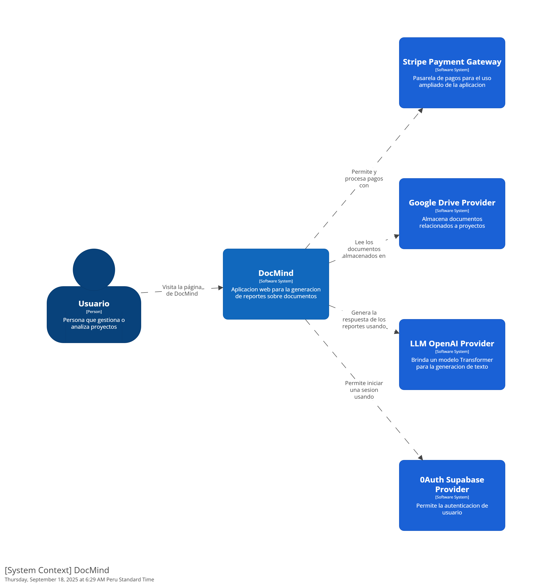

# CAPÍTULO IV: STRATEGIC-LEVEL SOFTWARE DESIGN

---

### 4.1. STRATEGIC-LEVEL ATTRIBUTE-DRIVEN DESIGN

#### 4.1.1. DESIGN PURPOSE

El propósito del diseño arquitectónico de DocMind es crear una plataforma de inteligencia artificial escalable, confiable y segura que transforme documentos complejos en información útil y accionable. La arquitectura debe soportar el análisis de grandes volúmenes de datos no estructurados, garantizando respuestas rápidas y precisas con una experiencia de usuario fluida. El diseño debe priorizar la **escalabilidad** y la **disponibilidad** para cumplir con la misión de ser una herramienta líder global en el análisis de documentos.

---

#### 4.1.2. ATTRIBUTE-DRIVEN DESIGN INPUTS

Esta sección inicia con un texto de introducción y contiene las secciones para los tres tipos de Input para el proceso de diseño con ADD.

##### 4.1.2.1. PRIMARY FUNCTIONALITY (PRIMARY USER STORIES)

| Epic / User Story ID | Título | Descripción | Criterios de Aceptación | Relacionado con (Epic ID) |
|---|---|---|---|---|
| US001 | Carga de documentos PDF | Como usuario, quiero subir archivos PDF para que la plataforma los procese y analice. | Escenario 1: Dado que el usuario está en “Mis documentos”, cuando hace clic en “Subir” y selecciona un PDF válido, entonces el sistema guarda el archivo y muestra confirmación. Escenario 2: Dado que intenta subir un formato no permitido, entonces el sistema rechaza la carga y muestra el motivo. | EPIC001 (Gestión de Documentos) |
| US003 | Importación desde Google Drive | Como usuario, quiero vincular una carpeta de Drive para importar documentos sin descargarlos localmente. | Escenario 1: Dado que el usuario autorizó Drive, cuando selecciona una carpeta, entonces la plataforma lista los archivos disponibles. Escenario 2: Dado que el usuario quita la autorización, cuando vuelve a la vista de Drive, entonces no se muestran archivos y se solicita reconectar. | EPIC001 (Gestión de Documentos) |
| US006 | Resumen automático del documento | Como usuario, quiero generar un resumen automático para entender el contenido rápidamente. | Escenario 1: Dado un documento procesado, cuando solicito “Generar resumen”, entonces se crea un resumen y se guarda en el historial. Escenario 2: Dado un resumen existente, cuando lo re-genero, entonces se versiona con marca de tiempo. | EPIC002 (Análisis Inteligente con IA) |
| US007 | Preguntas y respuestas en lenguaje natural | Como usuario, quiero hacer preguntas al documento y recibir respuestas precisas con contexto. | Escenario 1: Dado el chat del documento, cuando pregunto “¿Cuáles son las conclusiones?”, entonces recibo una respuesta con citas. Escenario 2: Dado una pregunta ambigua, cuando no se alcanza un umbral de confianza, entonces el sistema sugiere reformular o ver pasajes relacionados. | EPIC002 (Análisis Inteligente con IA) |
| US009 | Comparación entre múltiples documentos | Como usuario, quiero comparar dos o más documentos para identificar coincidencias y discrepancias. | Escenario 1: Dado dos documentos seleccionados, cuando inicio “Comparar”, entonces veo un resumen de diferencias con citas por cada fuente. Escenario 2: Dado hallazgos comparativos, cuando exporto, entonces obtengo un reporte consolidado con referencias por documento. | EPIC002 (Análisis Inteligente con IA) |
| US011 | Visor con citas ancladas | Como usuario, quiero visualizar respuestas con citas enlazadas al texto fuente dentro del visor. | Escenario 1: Dado una respuesta, cuando hago clic en la cita, entonces el visor salta al fragmento resaltado. Escenario 2: Dado múltiples citas, cuando las recorro, entonces el visor mantiene el contexto de cada pasaje. | EPIC003 (Visualización y Reporte de Resultados) |
| US013 | Exportación de reportes | Como usuario, quiero exportar resultados en formatos estándar (PDF/Word/Markdown). | Escenario 1: Dado un reporte, cuando elijo “Exportar PDF”, entonces se descarga con estilo y numeración de citas. Escenario 2: Dado la opción Markdown, cuando exporto, entonces obtengo un archivo con encabezados y referencias. | EPIC003 (Visualización y Reporte de Resultados) |
| US021 | Autenticación con Google | Como usuario, quiero iniciar sesión con Google para acceder a mis documentos y permisos. | Escenario 1: Dado que no estoy autenticado, cuando inicio con Google, entonces accedo al panel si la validación es correcta. Escenario 2: Dado que deniego permisos, cuando regreso, entonces la app explica qué permisos necesita y por qué. | EPIC005 (Seguridad y Control de Acceso) |
| US022 | Roles y permisos | Como administrador, quiero asignar roles para controlar quién puede ver, editar o exportar. | Escenario 1: Dado un espacio de trabajo, cuando asigno “miembro”, entonces solo puede ver y preguntar. Escenario 2: Dado un usuario “admin”, cuando cambia permisos, entonces los cambios se aplican y quedan auditados. | EPIC005 (Seguridad y Control de Acceso) |
| US025 | Cifrado y privacidad | Como usuario, quiero que mis documentos y respuestas estén cifrados en tránsito y en reposo. | Escenario 1: Dado la transferencia de un archivo, cuando se sube, entonces viaja por TLS y se almacena cifrado. Escenario 2: Dado una exportación, cuando la descargo, entonces el enlace expira y requiere sesión activa. | EPIC005 (Seguridad y Control de Acceso) |

##### 4.1.2.2. QUALITY ATTRIBUTE SCENARIOS

Esta sección incluye la especificación de la primera versión de los escenarios de atributos de calidad que tienen mayor impacto en la arquitectura de la solución.

| Atributo | Fuente | Estímulo | Artefacto | Entorno | Respuesta | Medida |
|---|---|---|---|---|---|---|
| **Rendimiento** | Usuario | Un usuario sube un PDF de 500 páginas. | Subsistema de procesamiento de documentos. | Carga normal de la plataforma. | El sistema procesa el documento y está listo para responder consultas. | El tiempo de procesamiento es menor a 2 minutos. |
| **Escalabilidad** | Alto volumen de usuarios. | 100 usuarios concurrentes suben documentos de gran tamaño. | Sistema completo. | Pico de usuarios simultáneos. | El sistema mantiene su tiempo de respuesta promedio. | La degradación del rendimiento es imperceptible. |
| **Confiabilidad** | Usuario | Un usuario experimenta una interrupción de conexión durante la carga. | Subsistema de carga de documentos. | Conexión inestable. | La plataforma reanuda la carga automáticamente al recuperar la conexión. | La pérdida de progreso es nula. |
| **Seguridad** | Atacante externo | Un atacante intenta acceder a los documentos privados de un usuario. | Capa de autenticación y de datos. | Operación del sistema. | El sistema impide el acceso no autorizado y los datos están cifrados. | El acceso no autorizado es bloqueado y la información no es visible. |
| **Usabilidad** | Nuevo usuario | Un nuevo usuario intenta subir su primer documento. | Interfaz de usuario. | Primer uso de la plataforma. | El usuario completa el proceso sin ayuda externa. | El tiempo para completar la tarea es menor a 30 segundos. |

---

##### 4.1.2.3. CONSTRAINTS

Esta sección incluye la especificación de restricciones, es decir, características que no pueden ser negociadas y son impuestas por el cliente o el propio negocio como guía para la elaboración de la solución.

| Technical Story ID | Título | Descripción | Criterios de Aceptación | Relacionado con (Epic ID) |
|---|---|---|---|---|
| TST-01 | Cloud-Native | La plataforma debe ser **Cloud-Native**, utilizando servicios de nube. | El 100% de los servicios se implementan en una infraestructura de nube. | EPIC-05 |
| TST-02 | Compatibilidad PDF | El sistema debe ser **compatible con archivos PDF** de hasta 500 páginas. | El sistema procesa correctamente archivos PDF hasta el límite de 500 páginas. | EPIC-01 |
| TST-03 | Integración Google Drive | La solución debe integrarse con **Google Drive** para la carga de documentos. | El usuario puede importar documentos directamente desde su cuenta de Google Drive. | EPIC-01 |
| TST-04 | Uso de NLP | El diseño debe utilizar **modelos de lenguaje natural (NLP)** para el procesamiento de texto. | Los modelos de NLP procesan con precisión el texto para generar respuestas y resúmenes. | EPIC-02 |

---

#### 4.1.3. ARCHITECTURAL DRIVERS BACKLOG

Esta sección establece el conjunto de Architectural Drivers que fueron acordados por el equipo, resultado del proceso iterativo.

| Driver ID | Título de Driver | Descripción | Importancia para Stakeholders | Impacto en Architecture Technical Complexity |
|---|---|---|---|---|
| DRV-01 | Procesamiento de documentos grandes | Capacidad para procesar documentos PDF de gran tamaño. | High | High |
| DRV-02 | Escalabilidad horizontal | El sistema debe ser capaz de escalar horizontalmente para 100+ usuarios. | High | High |
| DRV-03 | Respuestas rápidas y precisas | Respuestas rápidas y precisas a preguntas en lenguaje natural. | High | High |
| DRV-04 | Integración con servicios de nube | Integración con servicios de nube (Cloud-Native). | High | High |
| DRV-05 | Usabilidad de la interfaz | Interfaz intuitiva y fácil de usar para cargar documentos y chatear. | Medium | Medium |
| DRV-06 | Seguridad y privacidad | Garantizar la seguridad y privacidad de los documentos. | High | High |
| DRV-07 | Soporte de exportación | Soporte para la exportación de resultados. | Medium | Medium |

---

#### 4.1.4. ARCHITECTURAL DESIGN DECISIONS

En esta sección, el equipo redacta la explicación del proceso, resumiendo los Drivers considerados, las tácticas y patrones que se evaluaron y los criterios para sus decisiones de diseño.

| Decisión Arquitectónica | Racional |
|---|---|
| **Arquitectura de Microservicios** | Separar funcionalidades para permitir que cada servicio escale de forma independiente. |
| **Uso de Serverless Computing** | Optimizar costos y permitir la escalabilidad automática para el procesamiento de documentos. |
| **Base de Datos NoSQL** | Almacenar el contenido de los documentos procesados de manera eficiente. |
| **API Gateway para el Frontend** | Centralizar la seguridad, el enrutamiento y la gestión de las solicitudes. |
| **Cifrado de Datos (Data Encryption)** | Garantizar que los datos estén protegidos tanto en tránsito como en reposo. |

---

#### 4.1.5. QUALITY ATTRIBUTE SCENARIO REFINEMENTS

**Refinamiento de Escenario para Rendimiento**

| **Scenario Refinement for Scenario N** | |
|----------------------------------------|-----------------------------------|
| **Scenario(s):** | El sistema debe ser rápido al procesar documentos grandes. |
| **Business Goals:** | Acelerar el tiempo de procesamiento y respuesta para documentos grandes. |
| **Relevant Quality Attributes:** | Rendimiento |
| **Stimulus:** | Un usuario sube un PDF de 500 páginas. |

| **Scenario Components** | |
|--------------------------|-----------------------------------|
| **Stimulus Source:** | Usuario |
| **Environment:** | Carga normal de la plataforma |
| **Artifact (if Known):** | Subsistema de procesamiento de documentos |
| **Response:** | El sistema procesa el documento y está listo para responder consultas |
| **Response Measure:** | El tiempo de procesamiento es menor a 2 minutos |

| **Questions:** | ¿Qué sucede si se suben múltiples documentos grandes en paralelo? |
|----------------|-----------------------------------|
| **Issues:** | Posible saturación de memoria al manejar archivos muy grandes. |

**Refinamiento de Escenario para Escalabilidad**

| **Scenario Refinement for Scenario N** | |
|----------------------------------------|-----------------------------------|
| **Scenario(s):** | La plataforma debe manejar un alto volumen de usuarios simultáneos sin degradación. |
| **Business Goals:** | Soportar el crecimiento de la base de usuarios manteniendo el rendimiento. |
| **Relevant Quality Attributes:** | Escalabilidad |
| **Stimulus:** | 100 usuarios concurrentes suben documentos de gran tamaño. |

| **Scenario Components** | |
|--------------------------|-----------------------------------|
| **Stimulus Source:** | Alto volumen de usuarios |
| **Environment:** | Pico de usuarios simultáneos |
| **Artifact (if Known):** | Sistema completo |
| **Response:** | El sistema mantiene su tiempo de respuesta promedio |
| **Response Measure:** | La degradación del rendimiento es imperceptible |

| **Questions:** | ¿Cuál es el número máximo de usuarios que puede soportar sin pérdida de rendimiento? |
|----------------|-----------------------------------|
| **Issues:** | Riesgo de cuello de botella en la base de datos o el servidor principal. |

**Refinamiento de Escenario para Confiabilidad**

| **Scenario Refinement for Scenario N** | |
|----------------------------------------|-----------------------------------|
| **Scenario(s):** | El sistema debe recuperarse de fallas temporales. |
| **Business Goals:** | Asegurar la continuidad del servicio y la integridad de los datos. |
| **Relevant Quality Attributes:** | Confiabilidad |
| **Stimulus:** | Un usuario experimenta una interrupción de conexión durante la carga. |

| **Scenario Components** | |
|--------------------------|-----------------------------------|
| **Stimulus Source:** | Usuario |
| **Environment:** | Conexión inestable |
| **Artifact (if Known):** | Subsistema de carga de documentos |
| **Response:** | La plataforma reanuda la carga automáticamente al recuperar la conexión |
| **Response Measure:** | La pérdida de progreso es nula |

| **Questions:** | ¿Qué ocurre si la interrupción dura más de 10 minutos? |
|----------------|-----------------------------------|
| **Issues:** | Posible pérdida parcial de datos en conexiones extremadamente inestables. |

**Refinamiento de Escenario para Seguridad**

| **Scenario Refinement for Scenario N** | |
|----------------------------------------|-----------------------------------|
| **Scenario(s):** | Los datos de los usuarios deben estar protegidos de accesos no autorizados. |
| **Business Goals:** | Proteger la información confidencial de los usuarios. |
| **Relevant Quality Attributes:** | Seguridad |
| **Stimulus:** | Un atacante intenta acceder a los documentos privados de un usuario. |

| **Scenario Components** | |
|--------------------------|-----------------------------------|
| **Stimulus Source:** | Atacante externo |
| **Environment:** | Operación del sistema |
| **Artifact (if Known):** | Capa de autenticación y de datos |
| **Response:** | El sistema impide el acceso no autorizado y los datos están cifrados |
| **Response Measure:** | El acceso no autorizado es bloqueado y la información no es visible |

| **Questions:** | ¿Cómo se notifica al usuario y al administrador sobre intentos de intrusión? |
|----------------|-----------------------------------|
| **Issues:** | Dependencia en la fortaleza de la autenticación multifactor y cifrado. |

**Refinamiento de Escenario para Usabilidad**

| **Scenario Refinement for Scenario N** | |
|----------------------------------------|-----------------------------------|
| **Scenario(s):** | La interfaz de usuario debe ser fácil de usar. |
| **Business Goals:** | Reducir la curva de aprendizaje y mejorar la experiencia del usuario. |
| **Relevant Quality Attributes:** | Usabilidad |
| **Stimulus:** | Un nuevo usuario intenta subir su primer documento. |

| **Scenario Components** | |
|--------------------------|-----------------------------------|
| **Stimulus Source:** | Nuevo usuario |
| **Environment:** | Primer uso de la plataforma |
| **Artifact (if Known):** | Interfaz de usuario |
| **Response:** | El usuario completa el proceso sin ayuda externa |
| **Response Measure:** | El tiempo para completar la tarea es menor a 30 segundos |

| **Questions:** | ¿Se requieren tutoriales o ayudas contextuales para mejorar la experiencia? |
|----------------|-----------------------------------|
| **Issues:** | Riesgo de que la interfaz sea confusa en dispositivos móviles. |

## 4.2. Strategic-Level Domain-Driven Design
### 4.2.1. EventStorming

En esta fase, usamos un método visual y colaborativo para entender a fondo el negocio. Este proceso nos ayudó a definir los contextos clave, modelar los flujos de mensajes y crear los marcos de cada uno de esos contextos.

**Unstructured Exploration**
Es un taller gráfico donde todos los involucrados en el proyecto analizan cómo funciona el sistema. Usamos notas de diferentes colores para representar distintos componentes, lo que simplifica la conversación y ayuda a identificar lo que realmente se necesita.

**Pain Points**
Estos son los obstáculos y las dificultades que enfrentan los usuarios. Identificar estos problemas es vital para crear soluciones que resuelvan sus necesidades de forma efectiva.

**Timelines**
La línea de tiempo muestra la secuencia de eventos del sistema. Al definir este orden, entendemos mejor cómo se relacionan las acciones y su impacto en el flujo de trabajo.

**Pivotal Points**
Son los momentos cruciales que pueden cambiar el estado del sistema o afectar significativamente la experiencia del usuario. Reconocerlos nos permite concentrar nuestros esfuerzos en las partes más importantes del proceso.

**Commands**
Son las acciones o instrucciones que un usuario o el sistema ejecutan para cambiar su estado actual.

**Policies**
Son las reglas que guían la toma de decisiones dentro del sistema. Esto incluye normas de negocio que determinan cuándo se ejecutan ciertos comandos o cómo se manejan ciertos eventos.

### 4.2.2. Candidate Context Discovery

### 4.2.3. Domain Message Flows Modeling

### 4.2.4. Bounded Context Canvases

### 4.2.5. Context Mapping

## 4.3. Software Architecture
### 4.3.1. Software Architecture System Landscape Diagram
### 4.3.1. Software Architecture Context Level Diagrams
>>>>>>> a0fa72498c941ab16e58b13e680164eba16dff62
### 4.3.2. Software Architecture Container Level Diagrams

### 4.3.3. Software Architecture Deployment Diagrams

