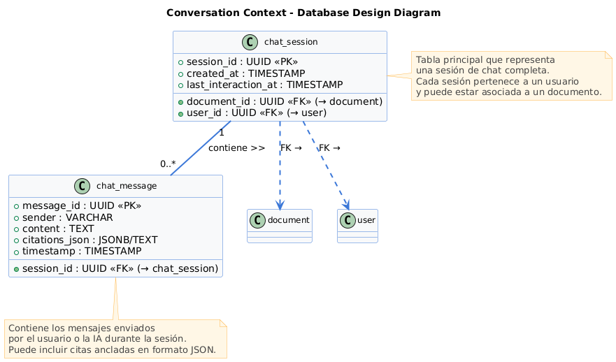

# CAPÍTULO V: TACTICAL-LEVEL SOFTWARE DESIGN

## 5.1. BOUNDED CONTEXT: DOCUMENT MANAGEMENT

El contexto delimitado de **DOCUMENT MANAGEMENT** es responsable de gestionar el ciclo de vida de los archivos, desde la **Carga** (US001) hasta la confirmación de su persistencia, y la emisión del evento que dispara el procesamiento por parte del AI Service, garantizando la **Escalabilidad** y el **Rendimiento** mediante el flujo asíncrono.

### 5.1.1. DOMAIN LAYER

La Capa de Dominio encapsula la identidad, el estado y las reglas de negocio primarias de un documento.

| Elemento | Descripción |
| :--- | :--- |
| **ENTIDAD (AGREGADO RAÍZ)** | **Documento:** La entidad principal que representa el archivo cargado. Contiene metadatos, estado y referencia de ubicación. |
| **OBJETOS DE VALOR** | **DocumentoId**: Identificador único e inmutable del documento. **OwnerId**: Referencia al usuario que realizó la carga. **StoragePath**: URL/URI que apunta a la ubicación física del archivo en el Cloud Storage. **Status**: Enum que define el estado actual del documento (`CARGADO`, `PROCESANDO`, `LISTO`, `FALLIDO`). |
| **AGREGADO** | **DocumentAggregate**: Agregado raíz que garantiza la consistencia transaccional del `Documento`. |
| **REPOSITORIO (INTERFACE)** | **IDocumentoRepository**: Define el contrato para persistir, actualizar y recuperar el estado de un `Documento` de la base de datos. |
| **SERVICIOS DE DOMINIO** | **IStorageProvider**: Interfaz para abstraer la interacción con el servicio de almacenamiento externo (Cloud Storage), clave para la **Confiabilidad** del almacenamiento. |

### 5.1.2. INTERFACE LAYER

Esta capa expone la funcionalidad de carga y gestión de metadatos del documento.

| Elemento | Descripción |
| :--- | :--- |
| **CONTROLADOR** | **DocumentController**: Controlador REST que gestiona las peticiones de los clientes. |
| **ENDPOINTS REST** | `POST /documents/upload`: Inicia el flujo de carga de un nuevo documento (US001). `GET /documents/{id}`: Consulta los metadatos y el estado de un documento específico. `GET /documents`: Lista los documentos asociados al `OwnerId`. |
| **DTOS (DATA TRANSFER OBJECTS)** | **UploadDocumentRequest**: Datos de entrada para la carga (ej. `file`, `source`). **DocumentMetadataResponse**: Estructura de salida que incluye `DocumentoId`, `FileName`, `Status` y `UploadDate`. |

### 5.1.3. APPLICATION LAYER

Esta capa orquesta el caso de uso de la Carga de Documentos, asegurando la persistencia y la emisión del evento clave para el procesamiento asíncrono.

| Elemento | Descripción |
| :--- | :--- |
| **COMANDO** | **UploadDocumentCommand**: Contiene la información necesaria (`OwnerId`, `FileName`, `FileLocation`) para el proceso de carga. |
| **MANEJADOR DE COMANDO** | **UploadDocumentHandler**: Procesa el comando. Utiliza el `IStorageProvider` para almacenar el archivo, crea y persiste el `DocumentAggregate` vía `IDocumentoRepository`. Si es exitoso, **emite el evento de dominio**. |
| **EVENTO DE DOMINIO** | **DocumentUploadedEvent**: Evento crucial de integración. Se emite tras la persistencia exitosa del documento y contiene el `DocumentoId` y el `StoragePath`. **Este evento es consumido por el AI Service.** |

### 5.1.4. INFRASTRUCTURE LAYER

La capa de infraestructura implementa los detalles técnicos para soportar la lógica de negocio, incluyendo la persistencia y la comunicación asíncrona.

| Elemento | Descripción |
| :--- | :--- |
| **IMPLEMENTACIÓN DE REPOSITORIO** | **PostgresDocumentoRepository**: Implementación concreta de `IDocumentoRepository` utilizando PostgreSQL. |
| **IMPLEMENTACIÓN DE ALMACENAMIENTO** | **CloudStorageProvider**: Implementación de `IStorageProvider` que maneja la comunicación con el servicio de almacenamiento en la nube (ej. AWS S3 o GCS). |
| **BROKER DE EVENTOS** | **KafkaEventBroker** (o equivalente): Componente para publicar el `DocumentUploadedEvent` en un canal asíncrono, desacoplando el **DOCUMENT MANAGEMENT** del **AI SERVICE** (Patrón Event-Driven). |

### 5.1.6. BOUNDED CONTEXT SOFTWARE ARCHITECTURE COMPONENT LEVEL DIAGRAMS

Este diagrama de componentes ilustra la arquitectura de alto nivel del contexto delimitado, con énfasis en la secuencia de carga y la emisión del evento.

### 5.1.7. BOUNDED CONTEXT SOFTWARE ARCHITECTURE CODE LEVEL DIAGRAMS

#### 5.1.7.1. BOUNDED CONTEXT DOMAIN LAYER CLASS DIAGRAMS

Este diagrama de clases se centra en la estructura del Agregado Raíz `Documento` y sus componentes internos.

#### 5.1.7.2. BOUNDED CONTEXT DATABASE DESIGN DIAGRAM

Este diagrama se centra en la tabla de persistencia clave para la gestión de documentos.

## 5.2. BOUNDED CONTEXT: CHAT SERVICE

El contexto delimitado de **CHAT SERVICE** maneja la interactividad del usuario (**Chat** y **Consulta**), el mantenimiento del **Contexto Conversacional** (memoria) y la comunicación **síncrona** con el servicio de IA para obtener **Respuestas Contextuales** con citas ancladas (US007). Se inicia asíncronamente al recibir el evento de documento procesado.

### 5.2.1. DOMAIN LAYER

La capa de dominio representa las reglas de negocio y las entidades relacionadas con la conversación sobre un documento.

| Elemento | Descripción |
| :--- | :--- |
| **ENTIDAD (AGREGADO RAÍZ)** | **SesionChat:** Entidad principal que representa una conversación única sobre un documento. Contiene la referencia al documento y gestiona el historial de interacciones. |
| **OBJETOS DE VALOR** | **SesionId**: Identificador único e inmutable de la sesión. **DocumentoId**: Referencia al documento que se está consultando. **UserId**: Identificador del usuario. **CitaAnclada**: Objeto de valor que incluye la referencia exacta al texto fuente (`pageNumber`, `snippetText`) (US007). |
| **AGREGADO** | **ChatSessionAggregate**: Agregado raíz que garantiza la consistencia del historial de la sesión, incluyendo la lista de mensajes. |
| **REPOSITORIO (INTERFACE)** | **IChatSessionRepository**: Define el contrato para persistir, recuperar y actualizar el estado de una `SesionChat`. |
| **SERVICIOS DE DOMINIO** | **IMembershipCheckService**: Abstracción para consultar el nivel de membresía del `UserId` (Epic de Pagos) y aplicar límites o extender la memoria de contexto (US007, US021). |

### 5.2.2. INTERFACE LAYER

Esta capa expone los *endpoints* necesarios para que la interfaz de usuario interactúe en tiempo real con la sesión de chat.

| Elemento | Descripción |
| :--- | :--- |
| **CONTROLADOR** | **ChatController**: Controlador REST que gestiona las peticiones del cliente relativas a la interacción conversacional. |
| **ENDPOINTS REST** | `POST /chat/sessions/{id}/query`: Envía una nueva consulta del usuario a la sesión específica. `GET /chat/sessions/{id}`: Recupera el historial completo de la sesión. `GET /chat/sessions`: Lista las sesiones activas del usuario. |
| **DTOS (DATA TRANSFER OBJECTS)** | **NewQueryRequest**: Datos de entrada para una nueva pregunta (ej. `queryText`). **ChatExchangeResponse**: Estructura de salida con la respuesta de la IA y la lista de `CitaAnclada`. |

### 5.2.3. APPLICATION LAYER

Esta capa maneja la orquestación, coordinando la creación de sesiones por eventos y el flujo de consulta/respuesta síncrono.

| Elemento | Descripción |
| :--- | :--- |
| **MANEJADOR DE EVENTOS** | **DocumentReadyEventHandler**: **Se suscribe** al `DocumentReadyEvent` (emitido por el AI Service). Al recibirlo, crea y persiste una nueva instancia de `SesionChat` lista para ser usada. |
| **COMANDO** | **ProcessUserQueryCommand**: Contiene la `SesionId`, el `queryText` y los datos necesarios para invocar al servicio de IA. |
| **MANEJADOR DE COMANDO** | **ProcessUserQueryHandler**: Orquesta la respuesta. Utiliza el `IChatSessionRepository` para recuperar la sesión (contexto), llama al `IAIQueryService` (Infraestructura) y, tras obtener la respuesta, actualiza el `ChatSessionAggregate` con la nueva interacción antes de devolver la respuesta al controlador. |
| **CONSULTAS (QUERIES)** | **GetChatHistoryQuery**: Solicita el historial de mensajes de una sesión específica. |

### 5.2.4. INFRASTRUCTURE LAYER

Implementa los mecanismos técnicos como la persistencia de sesiones y la comunicación con el servicio externo de IA/RAG.

| Elemento | Descripción |
| :--- | :--- |
| **IMPLEMENTACIÓN DE REPOSITORIO** | **PostgresChatSessionRepository**: Implementación concreta de `IChatSessionRepository` que gestiona las tablas `chat_session` y `chat_message` en PostgreSQL. |
| **SERVICIO DE CONSULTA EXTERNA (LLM)** | **IAIQueryService**: Implementa una interfaz para realizar la llamada **síncrona** al servicio de IA/RAG. Es el punto de contacto con el modelo LLM para obtener la `Respuesta Contextual` y las `CitasAncladas`. |
| **BROKER DE EVENTOS (CONSUMO)** | **KafkaEventConsumer**: Componente que se conecta al `KafkaEventBroker` para consumir el `DocumentReadyEvent` y pasarlo al `DocumentReadyEventHandler`. |

### 5.2.6. BOUNDED CONTEXT SOFTWARE ARCHITECTURE COMPONENT LEVEL DIAGRAMS

Este diagrama ilustra el flujo de creación de la sesión (asíncrono) y el flujo de consulta del usuario (síncrono).

### 5.2.7. BOUNDED CONTEXT SOFTWARE ARCHITECTURE CODE LEVEL DIAGRAMS

#### 5.2.7.1. BOUNDED CONTEXT DOMAIN LAYER CLASS DIAGRAMS

Este diagrama de clases se centra en la estructura del Agregado Raíz y el historial de mensajes.

#### 5.2.7.2. BOUNDED CONTEXT DATABASE DESIGN DIAGRAM

Este diagrama ilustra las tablas necesarias para persistir el historial de la conversación.

